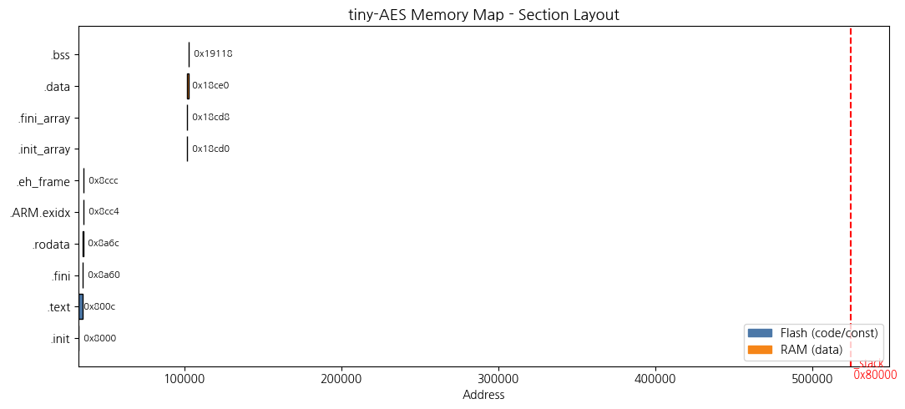
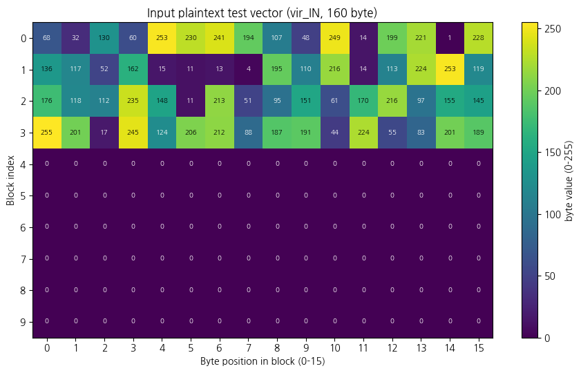
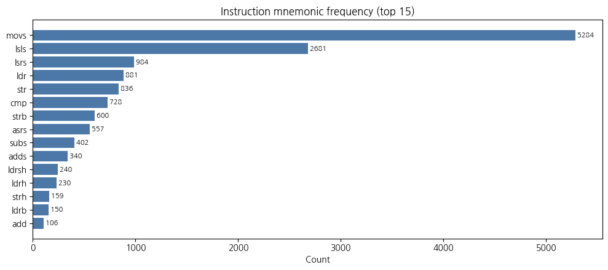
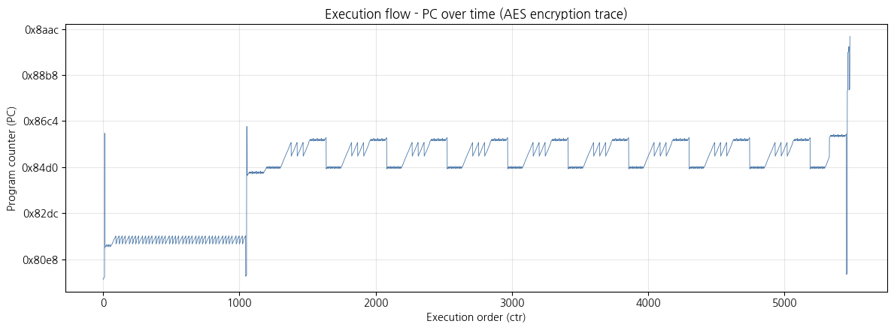
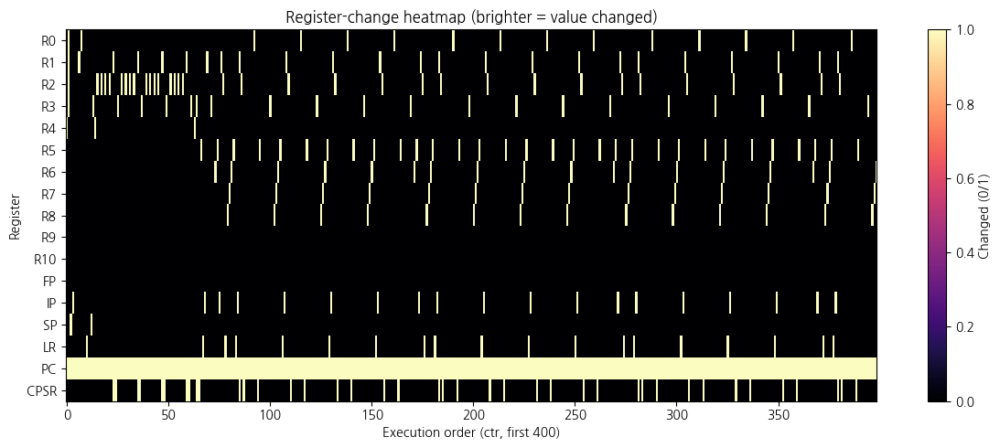
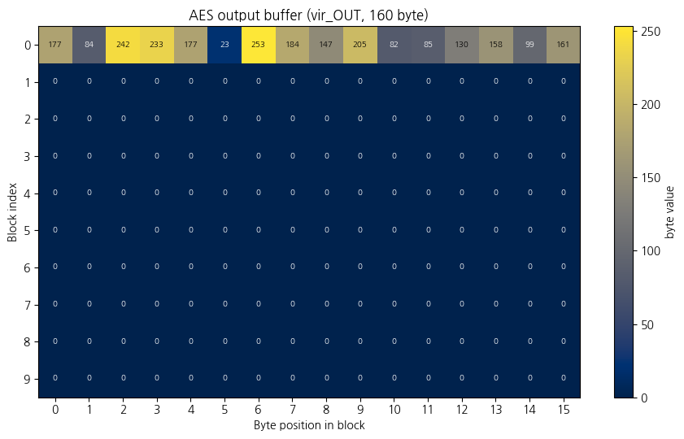
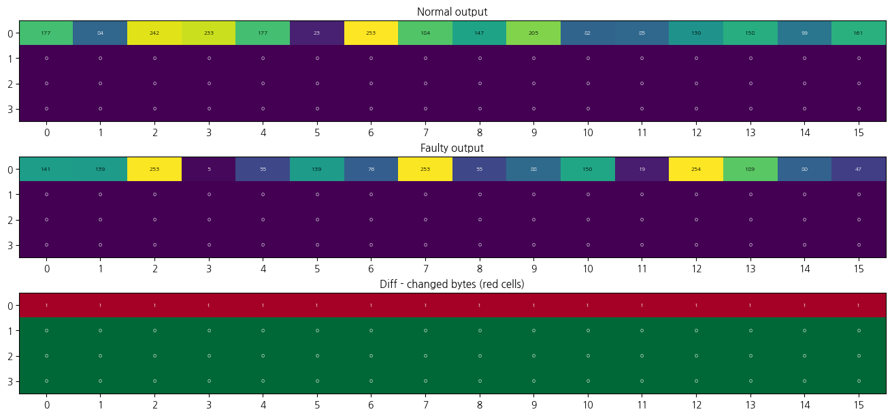

<!-- _class: lead -->
# PRE-SCA 에뮬레이터 개발 및 분석
### ARM 펌웨어 명령어 단위 트레이싱 & 오류주입(Fault Injection) 분석

**발표자:** 김한빛  
**날짜:** 2026년 6월 25일

---

## 목차 (Contents)

1. **서론** — PRE-SCA 개요 및 분석 파이프라인
2. **2부** — ELF 파싱 및 메모리·코드 매핑
3. **3부** — 에뮬레이션 실행 및 레지스터 트레이싱
4. **4부** — 오류주입(Fault Injection) 시뮬레이션
5. **결론** — 재현성 검증 및 향후 과제

---

<!-- _class: lead divider -->
# 1부 · PRE-SCA 개요 및 분석 파이프라인

---

## 서론 (Introduction)

**PRE-SCA (Pre-silicon Side-Channel / fault Analysis)**
* 실제 하드웨어 칩(실리콘)이 설계·제작되기 *전에*, 에뮬레이터를 통해 펌웨어의 보안 취약점을 사전 검증하는 시스템입니다.

**분석 목적**
* **부채널 분석(SCA)**: 펌웨어의 기계어 명령 실행에 따른 레지스터 값 변화를 기록하여 "가상 부채널 정보 누설"을 사전 분석합니다.
* **오류분석(FIA)**: 암호 연산 중 특정 명령어 시점에 비트 오류나 명령 건너뛰기(NOP)를 모사해 암호 알고리즘의 강인성을 검증합니다.

---

## 전체 분석 파이프라인 (Pipeline)

노트북은 환경 구성부터 검증까지 총 13단계의 유기적 흐름으로 구성됩니다.

| 단계 | 주요 작업 내용 | 핵심 중간 산출물 |
| :---: | :--- | :--- |
| **0 ~ 1** | 라이브러리 및 전역 파라미터 구성 | `unicorn`, `capstone`, `lief` 로드 |
| **2 ~ 3** | ELF 파싱 및 실행 컨텍스트 확정 | 함수 심볼 주소, Flash/RAM 맵 |
| **4 ~ 5** | 입력 평문 생성 및 디스어셈블 캐시 구축 | `LogVirIN.csv`, `disassembly.txt` |
| **6 ~ 8** | 로거 정의, 시나리오 구성, 에뮬레이터 준비 | `TraceLogger`, NOP/레지스터 조작 훅 |
| **9 ~ 10**| 정상 실행 및 트레이스 시각화 | `LogReg.csv`, PC 흐름/히트맵 시각화 |
| **11 ~ 12**| 오류주입 에뮬레이션 및 결정성 검증 | `LogReg_Faulty.csv`, 파일 비교 |

---

<!-- _class: lead divider -->
# 2부 · ELF 파싱 및 메모리·코드 매핑

---

## ELF 파싱 및 메모리 지도 (Memory Map)

`LIEF` 라이브러리를 이용하여 `tiny-aes` ARM ELF 바이너리 구조를 해석합니다.
* 함수 심볼 주소(`main`, `_init`, `_exit`, `_stack`) 추출
* 메모리 섹션 분류 (Flash 영역 vs RAM 영역)

---

## 입력 테스트벡터 생성 및 디스어셈블

* **테스트벡터 생성**: 결정성 있는 분석을 위해 난수 시드 고정. AES 블록 크기(16바이트)에 맞춰 10개 블록(160바이트)을 구성하고 앞 4블록(64바이트)에 난수를 할당합니다.
* **디스어셈블**: `Capstone` 엔진을 통해 기계어 바이트를 명령어 및 피연산자로 변환하여 분석에 활용합니다.

<b>입력 평문 바이트 맵</b>

<b>명령어 니모닉 빈도 분석</b>

---

<!-- _class: lead divider -->
# 3부 · 에뮬레이션 실행 및 레지스터 트레이싱

---

## 에뮬레이터 구성 및 레지스터 트레이스 로거

**Unicorn 에뮬레이터 기반 가상 머신 구성**
* 가상 메모리에 Flash 및 RAM을 매핑하고 ELF 파일의 섹션 적재.
* 레지스터 초기화: 스택 포인터 `SP = _stack`, 링크 레지스터 `LR = exit`.

**명령어별 레지스터 트레이스 로거 (`TraceLogger`)**
* 명령어 실행 직전(`UC_HOOK_CODE`)에 호출되어 모든 레지스터(17개) 값을 수집.
* 한 번의 훅 트리거로 **실행 전 상태(bR0~bCPSR)**와 **실행 후 상태(aR0~aCPSR)**를 한 행에 기록합니다. (총 38개 컬럼)

---

## PC (Program Counter) 실행 흐름 시각화

* 정상 에뮬레이션 중 수집된 5,482개 명령어의 PC 주소 궤적입니다.
* 루프 구간(평평한 톱니)과 함수 호출/복귀(수직 점프)의 진행 양상을 명확하게 파악할 수 있습니다.

---

## 레지스터 활동성 및 출력 분석

* **레지스터 히트맵**: 값의 변화 유무(0/1)를 통해 암호 연산 중 특정 시점에 어느 레지스터가 데이터를 로딩/처리하는지 분석합니다.
* **암호문 생성**: 에뮬레이션 결과로 가상 I/O 버퍼 `vir_OUT`에 누적된 암호문 바이트를 확인합니다.

<b>레지스터 변화 히트맵 (상위 400)</b>

<b>AES 암호문 결과 (vir_OUT)</b>

---

<!-- _class: lead divider -->
# 4부 · 오류주입(Fault Injection) 시뮬레이션

---

## 오류주입 시나리오 로더

* **오류주입 정의**: 임의의 연산 단계(`ctr`)를 타깃으로 정하고 해당 시점에 레지스터 오염(Flip/값 대입) 또는 명령어 건너뛰기(NOP)를 실행합니다.
* **시뮬레이션 예시**:
  * AES 암호 연산의 정중앙 지점인 `ctr = 2741` 탐색.
  * 해당 시점 명령어: `0x85aa: eor.w sb, r3, sb`
  * `LogFI.csv` 설정을 통해 해당 시점에서 `R0` 레지스터 비트 반전(`Flip`) 주입.

<b>오류주입(Fault Injection) 설정 레코드 구조</b> 
ctr: 2741 | isNOP: FALSE | R0: Flip | R1..CPSR: NaN (유지)

---

## 정상 vs 오류주입 출력 비교 (DFA 시뮬레이션)

* 오류주입(Faulty) 실행 후 생성된 출력 암호문을 정상(Normal) 암호문과 비교합니다.
* 단 1회의 비트 반전(Flip)으로 인해 에러 전파(Diffusion)가 일어나며 암호문 64바이트 중 **총 16바이트가 오염**되었음을 식별할 수 있습니다.

---

<!-- _class: lead divider -->
# 5부 · 결론 및 향후 과제

---

## 재현성 검증 및 결론

**에뮬레이터의 결정성(Deterministic) 검증**
* 동일한 입력 조건에서 여러 번 수행하더라도 트레이스 파일(`LogReg.csv`), 입력 평문(`LogVirIN.csv`), 출력 암호문(`LogVirOUT.csv`)이 바이트 단위로 100% 일치함을 확인하여 도구의 신뢰성을 보증합니다.

<b>PRE-SCA 시스템의 가치</b> 
에뮬레이션 가상 모델링을 통해 고비용의 실제 물리 부채널/오류주입 장비 없이도 펌웨어 코드의 보안성을 설계 수준에서 사전에 철저히 검증할 수 있습니다.

* **향후 연구 방향**:
  1. 다른 펌웨어 적용을 위한 심볼 및 메모리 맵핑 자동화.
  2. 다중 오류 모델(Multi-faults) 및 명령어 NOP 시뮬레이션 시나리오 다변화.
  3. CPA(전력분석공격)를 위한 레지스터 해밍 가중치 기반 누설 모델 탑재.
