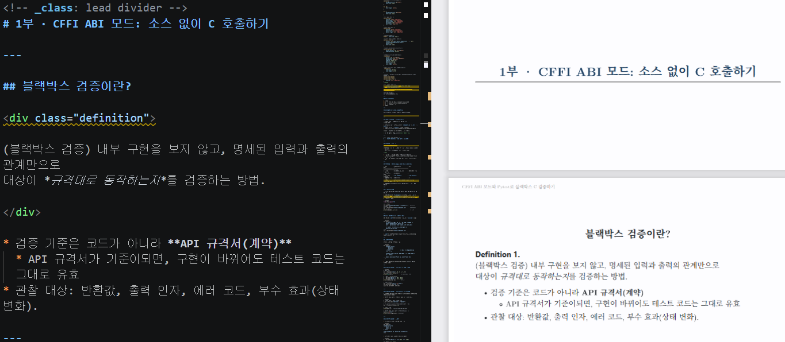
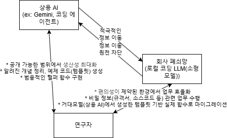

<style>
/* LaTeX.css 불러오기 */
@import url('../style.min.css');

/* 로컬 Noto Serif KR 폰트 */
@font-face {
    font-family: 'Noto Serif KR Local';
    src: url('../NotoSerifKR-Regular.ttf') format('truetype');
    font-weight: 400;
}
@font-face {
    font-family: 'Noto Serif KR Local';
    src: url('../NotoSerifKR-Bold.ttf') format('truetype');
    font-weight: 700;
}

/* 폰트 우선 적용 */
body, h1, h2, h3, h4, h5, h6, p, li, header, footer {
    font-family: 'Latin Modern', 'Noto Serif KR Local', serif !important;
}

/* Marp 슬라이드 기본 스타일 */
section {
    background-color: #fdfdff;
    font-size: 28px;
}

h1, h2 {
    text-align: center;
}

pre {
    background-color: #fffdfd;
    font-size: 24px;
}

/* 표 중앙 정렬 */
section table {
    display: table !important;
    margin-left: auto !important;
    margin-right: auto !important;
    max-width: 100% !important;
    word-break: keep-all;
}

/* 그림 중앙 정렬 */
section img {
    display: block !important;
    margin-left: auto !important;
    margin-right: auto !important;
}

/* Header 스타일 */
header { font-size: 16px; }

/* 페이지 번호 (오른쪽 하단) */
section::after {
    content: attr(data-marpit-pagination) " / " attr(data-marpit-pagination-total);
    bottom: 5px;
    font-size: 10px;
}

/* 섹션 구분(divider) 슬라이드 */
section.divider h1 {
    border-bottom: 2px solid #333;
    padding-bottom: 0.15em;
}

/* 결론 슬라이드의 강조 박스 */
.takeaway {
    border: 1px solid #888;
    border-left: 6px solid #0000ff;
    background: #f5f5ff;
    padding: 0.5em 1em;
    margin: 0.6em 0;
    font-weight: 700;
    text-align: center;
}

/* 참고문헌 목록: 작게, 줄간격 좁게 */
.references {
    font-size: 0.78em;
    line-height: 1.45;
}

/* Title / divider 슬라이드에서 header·footer·페이지번호 숨기기 */
section.lead header,
section.lead footer,
section.lead::after {
    display: none !important;
}
</style>

<!-- _class: lead -->
# C 라이브러리 검증을 위한<br>파이썬 CFFI 패키지 및<br>Pytest 프레임워크 소개

## <center>**CFFI ABI 모드와 Pytest로 블랙박스 C 검증하기**</center>

**발표자:** 김한빛  
**날짜:** 2026년 6월 17일

---

## 목차 (Contents)

0. 들어가기 전
1. 서론
2. 1부 · CFFI ABI 모드: 소스 없이 C 호출하기
3. 2부 · Pytest: 파이썬 테스트 프레임워크
4. 3부 · 블랙박스 검증
5. 결론

---

## 들어가기 전 - LaTeX.css와 Marp

본 발표자료는 Marp으로 작성되었습니다.



---

## 들어가기 전 - 외부 AI, 로컬 LLM 생산성 및 편의성 향상 전략

* 상용 AI : 공개 가능한 범위에서 "생산성 최대화", "코드 템플릿 생성", "범용 함수 구현"
* 회사 폐쇄망 : "기밀 업무 수행", "폐쇄망 내 마이그레이션", "제약된 환경에서의 효율화"

<style scoped>
.columns {
    display: flex;
    gap: 50px;
    align-items: flex-start;
}
.column { flex: 1; }
</style>

<div class="columns">
<div class="column">

**<center>draw.io</center>**



</div>
<div class="column">

**<center>Gemini</center>**


</div>
</div>


---

<!-- _class: lead divider -->
# 서 론

---

## 서론 - 블랙박스 검증 상황 (예시)

검증자는 **내부 소스코드를 볼 수 없음.**
주어진 정보:

* **컴파일된 공유 라이브러리** — `libmymath.so` (`.dll` / `.dylib`)
* **헤더 파일** — `mymath.h` (함수 시그니처)
* **API 규격서** — 입력·출력·반환 코드·사후조건의 *계약*

제공되지 **않는** 것: C 소스코드, 빌드 시스템.

> **관찰 가능한 동작만으로** 규격 준수를 검증.

---

<!-- _class: lead divider -->
# 1부 · CFFI ABI 모드: 소스 없이 C 호출하기

---

## 블랙박스 검증이란?

<div class="definition">

(블랙박스 검증) 내부 구현을 보지 않고, 명세된 입력과 출력의 관계만으로
대상이 *규격대로 동작하는지*를 검증하는 방법.

</div>

* 검증 기준은 코드가 아니라 **API 규격서(계약)**
  * API 규격서가 기준이되면, 구현이 바뀌어도 테스트 코드는 그대로 유효
* 관찰 대상: 반환값, 출력 인자, 에러 코드, 부수 효과(상태 변화).

---

## 블랙박스 관점 모드 비교 : ABI 모드 vs API 모드

| 항목          | **ABI 모드**            | API 모드               |
|:-------------:|:------------------------|:-----------------------|
| C 소스        | **불필요(.so만)**       | 필요(또는 링크 대상)   |
| C 컴파일러    | **불필요**              | 필요                   |
| 로드 방식     | `ffi.dlopen()`          | `set_source()`+compile |
| 블랙박스 적합 | **◎ 최적**              | △ 부적합               |
| 주의점        | 인터페이스를 *정확히 일치* 시켜야 | 컴파일러가 타입 검증   |

* 블랙박스(.so + 헤더 + 규격서) 환경의 **표준 선택은 ABI 모드**

---

## 왜 ABI 모드인가

빌드 도구가 없으니 **컴파일을 전제로 하는 API 모드는 쓸 수 없음**

* **ABI 모드** — `ffi.dlopen()`으로 *이미 빌드된 `.so`를 직접 로드* <br> → **소스·컴파일러 불필요**
* **API 모드** — `set_source()`로 *래퍼를 컴파일·링크* <br> → C 컴파일러 필요

```python
from cffi import FFI

ffi = FFI()
ffi.cdef("double add(double a, double b);")   # 규격서/헤더에서 전사
lib = ffi.dlopen("vendor/libmymath.so")       # 바이너리 그대로 로드
print(lib.add(2.0, 3.0))                       # 5.0
```

---

## 핵심: 헤더·규격서를 `cdef`로 전사

ABI 모드의 `cdef`에는 **순수 C 선언만** (`#include` 불가)

```python
ffi.cdef("""
    /* 헤더/규격서에서 그대로 옮긴 함수 시그니처 */
    double add(double a, double b);
    int    parse(const char *input, int *out_len);

    /* 상수는 '명시값'으로만 정의 가능 */
    #define MAX_LEN 256
""")
lib = ffi.dlopen("vendor/libmymath.so")
```

* `cdef`는 **인터페이스** 그 자체 — C라이브러리의 헤더와 *완전 일치*해야 함

---

## 구조체·열거형

CFFI는 구조체와 열거형도 지원

```python
ffi.cdef("""
    typedef struct {
        double x;
        double y;
    } Point;                 /* 필드 순서·타입·정렬을 규격대로 */

    typedef enum { OK = 0, ERR_INPUT = -1, ERR_RANGE = -2 } Status;

    double dist(const Point *a, const Point *b);
""")
```

* 구조체 레이아웃이 바이너리와 어긋나면 **잘못된 값**을 읽거나 크래시

---

## C 데이터 다루기 - `ffi.new()`로 인자 만들기

```python
# 배열 전달
arr = ffi.new("int[]", [5, 3, 1, 4, 2])
lib.c_sort(arr, len(arr))
print(list(arr))               # 정렬 결과 관찰

# 구조체 + out-parameter
a = ffi.new("Point *", [0.0, 0.0])
b = ffi.new("Point *", [3.0, 4.0])
print(lib.dist(a, b))          # 5.0

# 문자열(char*)
buf = ffi.new("char[]", b"input")
out_len = ffi.new("int *")
rc = lib.parse(buf, out_len)
```

---

## C 데이터 다루기 - `ffi.buffer()`로 읽어오기

C 포인터가 가리키는 원본 메모리를 파이썬의 버퍼 인터페이스(Memoryview)로 래핑

* 데이터 복사 없이 C 메모리를 직접 읽고 쓸 수 있음

```python
# 크기가 10인 C 배열 포인터 생성
c_buf = ffi.new("char[10]", b"abcdef")

# ffi.buffer를 사용해 메모리 참조 (길이 지정)
buf = ffi.buffer(c_buf, 10)

# 메모리 읽기
print(buf[:]) # b'abcdef\x00\x00\x00\x00'

# 데이터 수정 (복사 없이 C 메모리에 직접 씀)
buf[:3] = b"XYZ"
print(ffi.string(c_buf)) # b'XYZdef'
```

---

## C 데이터 다루기 - 구조체

* ffi.cdef()로 C의 구조체와 함수 선언

```python
ffi.cdef("""
typedef struct {
    double x;
    double y;
} Point;

void move(Point *p, double dx, double dy);
""")
```

* 파이썬에서 p.x, p.y처럼 필드 접근 가능

```python
p = ffi.new("Point *", {"x": 0.0, "y": 0.0})

lib.move(p, 1.0, 2.0)
print(p.x, p.y)           # 1.0 2.0
```

---

## ABI 모드 주의사항

* **ABI 불일치 = 조용한 오류** : 타입, 구조체를 규격과 *정확히* 일치시키기.
* **매크로·인라인 함수는 심볼이 없음** : 바이너리에 없으므로 `dlopen` 대상이 아님.
  * 헤더의 상수(`#define`)는 직접 값으로 전사
* **메모리 소유권은 규격서를 따른다** : C라이브러리 vs Pytest(파이썬) *누가 해제하는가?*

---

<!-- _class: lead divider -->
# 2부 · Pytest: 파이썬 테스트 프레임워크

---

## Pytest란

Pytest는 간결한 문법과 강력한 기능을 갖춘 파이썬 테스트 프레임워크

* 설치: `pip install pytest`
* 별도 클래스 없이 **`assert` 한 줄**로 검증, 실패 시 값까지 자동 출력
* 발견 규칙: `test_*.py`의 `test_*` 함수를 자동 수집

```python
# tests/test_add.py
def test_add(api):                 # api: .so를 로드하는 fixture
    ffi, lib = api
    assert lib.add(2.0, 3.0) == 5.0
```

* VS Code 친화적

---

## Fixture - 테스트 준비물 만들기

`@pytest.fixture` 데코레이터

* 테스트 함수의 인자에 fixture 이름을 쓰면, <br> → pytest가 자동으로 fixture를 실행해서 값을 넘겨줌

```python
# 1. fixture 만들기
@pytest.fixture
def numbers():
    return [1, 2, 3, 4, 5]

# 2. 테스트에서 사용하기
def test_sum(numbers):           # 여기서 numbers가 fixture 이름
    assert sum(numbers) == 15
```

---

## Parametrize — 테스트 케이스

예제 기반 검증

* `@pytest.mark.parametrize`로 규격서의 기대 동작을 묶어 검증

```python
@pytest.mark.parametrize("a, b, expected", [
    (2.0, 3.0, 5.0),
    (-1.0, 1.0, 0.0),
    (0.0, 0.0, 0.0),       # 경계값
])
def test_add(api, a, b, expected):
    ffi, lib = api
    assert lib.add(a, b) == expected
```

* 각 케이스가 **독립 테스트**로 실행

---

## 마커 - `xfail`, `skip`

* `xfail` : 테스트를 실행하되 실패해도 테스트 결과를 실패로 처리하지 않음
* `skip` : 테스트를 아예 실행하지 않고 건너뜀

```python
# 테스트 실행은 하지만 실패해도 통과 처리
@pytest.mark.xfail(reason="개발자 수정 중")
def test_add(api): ...

# 테스트 실행 안함
@pytest.mark.skip(reason="미반영 예정")
def test_add(api): ...
```

---

## Conftest.py

* 이 파일 안에 정의한 fixture는 다른 테스트 파일에서 import 없이 바로 사용 가능
  * 여러 테스트 파일에서 공통으로 쓰는 준비물을 한 곳에 모아두는 데 가장 많이 사용

```python
# conftest.py (프로젝트 루트 또는 tests/ 폴더에 위치)
import pytest

@pytest.fixture
def api():
    # 실제로는 C라이브러리의 API 객체 등을 여기서 만듦
    ...
```

---

<!-- _class: lead divider -->
# 3부 · 블랙박스 통합 검증

---

## C라이브러리 검증 워크플로우

1. **제공물 수령** — `.so` + 헤더 + API 규격서
2. **계약 전사** — 헤더/규격서 → `cdef.h` (CFFI가 이해할 수 있는 순수 C 선언)
3. **`ffi.dlopen`으로 `.so` 로드** — 컴파일 단계 없음
4. **Fixture**로 핸들·자원 준비/정리
5. **예제 기반(Parametrize) / 속성 기반** 테스트로 규격 준수 검증

> 구현이 바뀐 새 `.so`가 와도, *계약(cdef.h)이 같으면* 테스트를 그대로 재사용

---

## 프로젝트 디렉토리 구조

소스가 없는 블랙박스 검증에 맞춘 레이아웃 예제

```text
blackbox-tests/
├── vendor/
│   ├── api_spec.md       # 제공된 API 규격서 (오라클)
│   ├── mymath.h          # 제공된 헤더
│   └── libmymath.so      # 제공된 바이너리 (소스 없음)
├── tests/
│   ├── test_add.py
│   └── test_errors.py
├── pytest.ini
├── cdef.h                # 헤더/규격서에서 전사한 선언
└── conftest.py           # cdef 전사 + dlopen fixture
```

---

## 속성·경계값·에러 경로

규격이 보장하는 *성질*과 *실패 동작*까지 검증합니다.

라운드트립 속성: $\text{decode}(\text{encode}(x)) = x$

```python
def test_roundtrip(api, x):
    ffi, lib = api
    assert lib.decode(lib.encode(x)) == x

def test_invalid_input_returns_error(api):
    ffi, lib = api
    rc = lib.parse(ffi.NULL, ffi.new("int *"))
    assert rc == -1                 # 규격: 잘못된 입력 → ERR_INPUT
```

* 동등 분할, 경계값(0, 최댓값, 빈/NULL)과 **에러 경로**를 빠짐없이 검증

---

## 입력 매개변수 예외 처리 검증 체크리스트 - 기본 원칙

기존 체크리스트의 연장선

* **외부 접점 함수(Public API)** : 신뢰할 수 없는 입력에 대한 *방어적 검증* 책임 (NULL·범위·유효성 등)
  * 악의적인 입력에 의한 라이브러리의 크래시는 외부 접점 함수에서만 일어나도록 설계되었나 확인
* **내부 함수** : 검증 완료된 데이터만 전달받도록 설계
  * 단일 변수 또는 안전한 구조체 래퍼만 인자로 허용
* 검증은 **Public API 경계에서 집중** 수행, 내부에서는 가정(assumption) 기반으로 동작
  * 안전한 구조체 인자(ex: 배열 길이)를 임의로 수정하는 검증은 후순위로
  * 단, 안전한 구조체를 수정, 확장 함수로 변경이 가능한 부분은 중점 검증

---

## 검증 대상 매개변수 (1) - 크기 · 범위 · 열거형

* **길이·크기 매개변수**(`size_t`, `len`, `count`) : 0·논리적 일관성(버퍼와의 관계) 검증
  * 부호 없는 타입(`size_t`)은 음수 검사 대신 **상한·일관성**으로 비정상 거대값(음수 전달 시 wrap-around) 검출
  * 음수 검사는 **부호 있는** `len`/`count`에만 적용
  * 경계 검사는 오버플로우에 안전하게 — `offset + size ≤ capacity` 대신 <br> `offset ≤ capacity && size ≤ capacity − offset`
* **숫자형 범위 매개변수** : 최소/최대값, 경계값 초과 여부 (signed/unsigned 불일치 포함)
* **Enum / 플래그 / Bitmask** : 정의된 값 범위 포함 여부, 미정의 비트 설정 여부

---

## 검증 대상 매개변수 (2) - 포인터 · 구조체 · 리소스

* **출력 전용 포인터(Out parameter)** : NULL 허용 정책에 따른 명확한 체크
* **구조체 내부 필드** : magic number/version 필드 존재 및 내부 필드 간 논리적 일관성
* **문자열/버퍼 매개변수** : NULL 외 최대 길이 제한, `length` 매개변수와의 일치성
* **콜백 함수 포인터** : NULL 허용 여부 명확화 및 체크
* **리소스 식별자**(`fd`, `handle` 등) : 무효 값(`-1`, `INVALID_HANDLE` 등) 검증

---

## 검증 식별 포인트 & CFFI + Pytest 트리비얼 검증

**검증 식별 시 확인 포인트**

* Public API 함수의 시그니처와 문서화된 precondition 일치 여부
* 다중 매개변수 간 의존성 존재 여부
* 검증 로직이 디버그 빌드 전용(`assert`)인지, 릴리스에서도 동작하는지

**CFFI + Pytest 트리비얼 검증 개념**

* **대상** : Public API 함수만 테스트 (내부 함수 직접 호출 금지)
* **기법** : 경계값 분석(BVA) + 동등 분할(EP)
* **확인** : invalid 입력마다 문서화된 에러 코드 반환 (반환값 + `errno`/error state 동시 확인)
* **효과** : `parametrize`로 invalid case 커버리지 확보 — 트리비얼하지만 높은 효율

---

<!-- _class: lead divider -->
# 결 론

---

## 발표 3줄 요약

1. **소스 없는 환경의 검증 경로** — ABI 모드(`dlopen`)로 컴파일러 없이 `.so`를 검증.
2. **계약 전사 절차 정리** — 헤더·API 규격서를 `cdef`로 옮길 때의 매크로·구조체 주의점.
3. **규격 준수의 체계적 검증** — Pytest로 답안지 비교·에러 경로·메모리까지.

<div class="takeaway">

라이브러리 · 헤더 · 규격서 대상 CFFI&Pytest로 계약 준수를 검증

</div>

**향후 연구(?):** Valgrind 또는 ASan 위에서 `pytest` 실행하여 메모리 오류/누수 검증 기술
