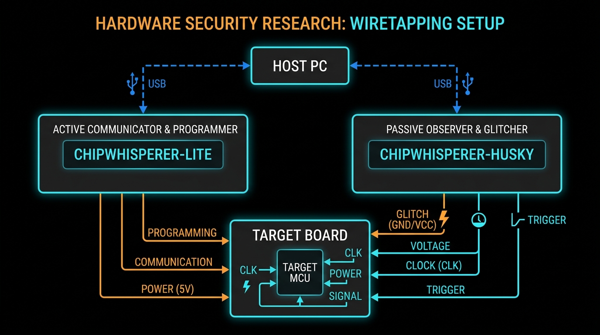
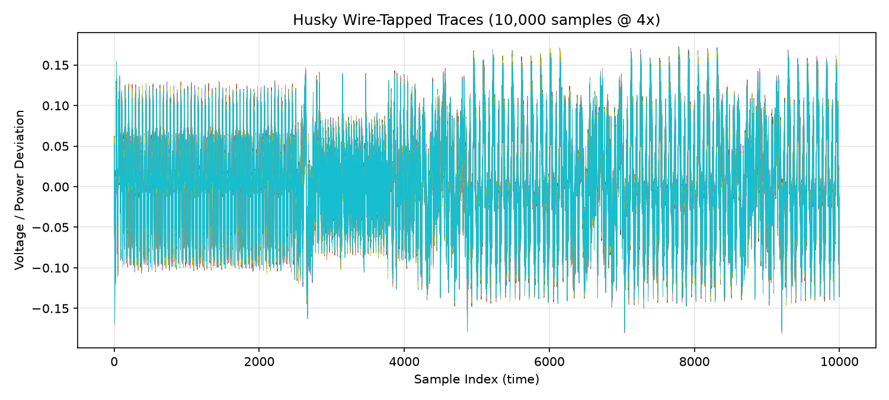
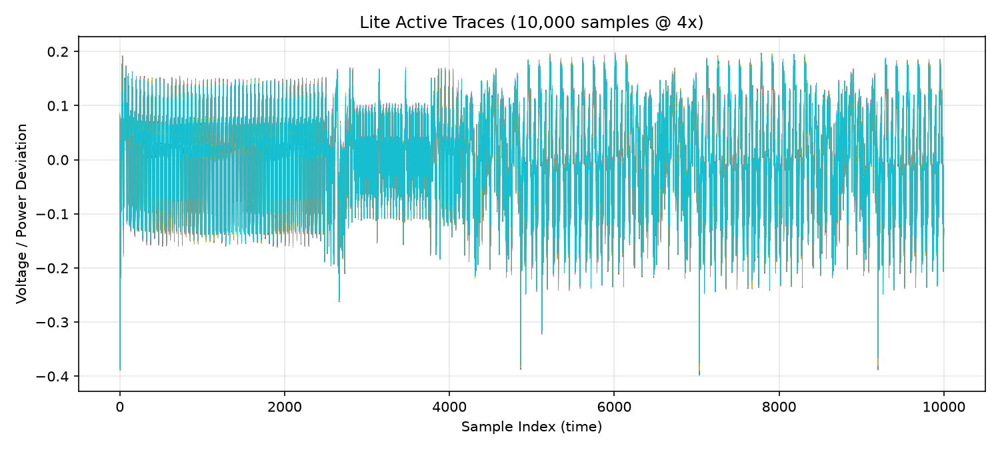
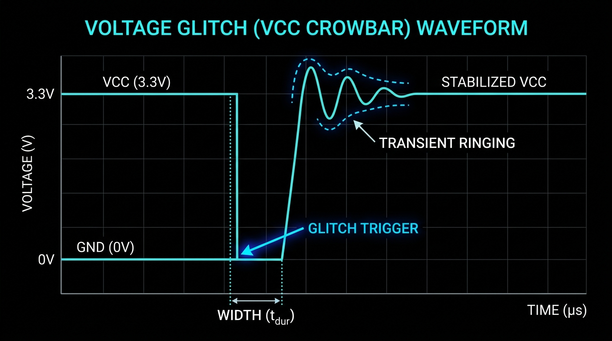

<style>
/* LaTeX.css 불러오기 */
@import url('../style.min.css');

/* 로컬 Noto Serif KR 폰트 */
@font-face {
    font-family: 'Noto Serif KR Local';
    src: url('../NotoSerifKR-Regular.ttf') format('truetype');
    font-weight: 400;
}
@font-face {
    font-family: 'Noto Serif KR Local';
    src: url('../NotoSerifKR-Bold.ttf') format('truetype');
    font-weight: 700;
}

/* 폰트 우선 적용 */
body, h1, h2, h3, h4, h5, h6, p, li, header, footer {
    font-family: 'Latin Modern', 'Noto Serif KR Local', serif !important;
}

/* Marp 슬라이드 기본 스타일 */
section {
    background-color: #fdfdff;
    font-size: 28px;
}

h1, h2 {
    text-align: center;
}

pre {
    background-color: #fffdfd;
    font-size: 24px;
}

/* 표 중앙 정렬 */
section table {
    display: table !important;
    margin-left: auto !important;
    margin-right: auto !important;
    max-width: 100% !important;
    word-break: keep-all;
}

/* 그림 중앙 정렬 */
section img {
    display: block !important;
    margin-left: auto !important;
    margin-right: auto !important;
}

/* Header 스타일 */
header { font-size: 16px; }

/* 페이지 번호 (오른쪽 하단) */
section::after {
    content: attr(data-marpit-pagination) " / " attr(data-marpit-pagination-total);
    bottom: 5px;
    font-size: 10px;
}

/* 섹션 구분(divider) 슬라이드 */
section.divider h1 {
    border-bottom: 2px solid #333;
    padding-bottom: 0.15em;
}

/* 결론 슬라이드의 강조 박스 */
.takeaway {
    border: 1px solid #888;
    border-left: 6px solid #0000ff;
    background: #f5f5ff;
    padding: 0.5em 1em;
    margin: 0.6em 0;
    font-weight: 700;
    text-align: center;
}

/* 참고문헌 목록: 작게, 줄간격 좁게 */
.references {
    font-size: 0.78em;
    line-height: 1.45;
}

/* Title / divider 슬라이드에서 header·footer·페이지번호 숨기기 */
section.lead header,
section.lead footer,
section.lead::after {
    display: none !important;
}

/* 두 컬럼 레이아웃 */
.columns {
    display: flex;
    gap: 40px;
    align-items: flex-start;
}
.column { flex: 1; }
</style>

<!-- _class: lead -->
# 와이어태핑(Wire-Tapping) 기반 부채널 및 오류 분석
## 두 ChipWhisperer 장치의 역할 분리 시나리오 연구

**발표자:** 김한빛
**날짜:** 2026년 6월 25일

---

## 목차 (Contents)

1. **서론** — 와이어태핑 개요 및 다중 장치 환경 구성
2. **2부** — 1.0.Wiretapping4SCA: 부채널 수동 관측 및 검증
3. **3부** — 2.0.Wiretapping4FA: 전압 글리치 오류주입 분석
4. **결론** — 실무 시사점 및 마무리 자원 해제

---

<!-- _class: lead divider -->
# 1부 · 와이어태핑 개요 및 다중 장치 환경 구성

---

## 와이어태핑 (Wire-Tapping) 개요

**수동적 측정(Passive Measurement) 시나리오 구현**

* 기존의 단일 장치 실습은 측정 장비가 통신 제어, 프로그래밍, 전력 측정을 독점하여 실제 공격 환경에 비해 매우 협조적인 구조였습니다.
* 실제 환경을 모사하기 위해 <b>통신을 주도하는 사용자(Lite)</b>와 <b>수동 관측 및 공격을 행하는 도청자(Husky)</b> 로 역할을 분리합니다.

```
┌─────────────────────────────────────────────────────────────────────────┐
│ [정상 사용자: ChipWhisperer-Lite]                                        │
│   - 타겟과 UART 통신 (SimpleSerial2), 펌웨어 플래싱, 시스템 클럭 공급(HS2) │
│                                                                         │
│ [은밀한 공격자: ChipWhisperer-Husky]                                     │
│   - 트리거/클럭/전원선만 분기받아 수동 측정 및 전압 글리치(FIA) 주입         │
└─────────────────────────────────────────────────────────────────────────┘
```

---

## 와이어태핑 하드웨어 연결 및 구성

호스트 PC에 연결된 두 대의 ChipWhisperer 장치를 USB 시리얼 넘버로 식별해 개별 통제합니다.



---

<!-- _class: lead divider -->
# 2부 · Wiretapping for SCA

## 부채널 수동 관측 및 검증

---

## 와이어태핑의 클럭 동기화 전략 (SCA)

부채널 신호의 지터를 최소화하기 위해 외부 타겟 클럭에 동기화합니다.
1. **PLL 입력 소스 전환**: PLL 클럭 소스를 전면 AUX MCX(`extclk_aux_io`)로 변경합니다.
2. **외부 주파수 실시간 탐색**: 내장 주파수 카운터(`freq_ctr`)를 통해 외부에서 유입되는 타겟 주파수(약 7.38 MHz)를 실시간 계측합니다.
3. **PLL 잠금(Lock)**: 탐색된 최빈값 주파수를 PLL의 기준점으로 입력해 동기화합니다.
4. **오버샘플링**: `adc_mul = 4` 설정을 통해 1 target clock당 4 ADC sample을 수집하여 미세 전력 누설 분석 정밀도를 확보합니다.

---

## 동시 Arm 캡처 루프 및 검증

**트리거 타이밍 정렬을 위한 Arm/Capture 프로토콜**
* 두 장치가 동일 트리거 엣지에 작동해야 하므로 arm 순서가 중요합니다.
* `husky.arm() → lite.arm() → Encrypt() → husky.capture() → lite.capture()`

**와이어태핑 충실도 검증 (수동 vs 정상)**

<div class="columns">
<div class="column">
<center><b>Husky 와이어태핑 파형 (수동 측정)</b></center>

</div>
<div class="column">
<center><b>Lite 액티브 파형 (정상 측정)</b></center>

</div>
</div>

* 두 스코프가 동시 수집한 파형을 비교해 형태적·물리적 동일성을 확인합니다.

---

<!-- _class: lead divider -->
# 3부 · Wiretapping for FA

## 전압 글리치 오류주입 분석

---

## 전압 글리치 (Voltage Glitch) 아키텍처

* **클럭 글리치(Clock Glitch)**: 타겟의 시스템 클럭 라인 자체를 공격자가 제어해야 펄스 삽입이 가능하므로 와이어태핑 시나리오에 적합하지 않습니다.
* **전압 글리치(Voltage Glitch)**: VCC 라인에 순간적인 단락 펄스를 가해 외란을 주입하므로, 도청선과 전원 인젝터만 물리는 와이어태핑 셋업에 완벽하게 부합합니다.

**Husky 오류 주입 사양**
* **트랜지스터**: HP(High-Power) + LP(Low-Power) 크로우바 트랜지스터 동시 활성화 (`both`).
* **동기화 정렬**: `adc_mul = 1` (1 sample = 1 target clock)을 설정하여, 트리거 시작 후 몇 번째 클럭에 글리치가 발사될지 (`ext_offset`) 클럭 레벨의 정밀 직관적 매핑을 달성합니다.

---

## 전압 글리치 파형 개념도

전압 글리치는 VCC 라인을 짧게 단락시켜 순간적인 전압 강하를 유도합니다.



* 탐색 파라미터: `(ext_offset, offset, width)`
* 타겟 암호화 루프의 연산 중반부 (`ext_offset` = 152~154 클럭) 정밀 스윕 진행.

---

## 글리치 결과 분류 및 데이터 수집

**오류 주입 결과 4-way 분류**
1. **`fail_Encrypt`**: 통신 타임아웃 오류 (칩 크래시 / 타겟 리셋 필요)
2. **`fail_Encrypt_Infinite_loop`**: 펌웨어가 무한 루프에 빠진 오류 (`0x33 0x00` 반환)
3. **`fail_normal`**: 영향 없음 (정상 골든 모델 출력 반환)
4. **`success_FA`**: **오류 주입 성공** (변조된 암호문 획득 → 차분오류분석 DFA용)

* 효과가 확률적으로 발현되므로 조합당 1,000회 반복을 거쳐 성공 확률을 계산합니다.
* `success_FA`인 시행에 대해서만 당시의 키, 평문, 오염된 출력값, 글리치 물리 파라미터 및 와이어태핑 파형을 상호 동기화하여 다차원 리스트로 적재합니다.

---

<!-- _class: lead divider -->
# 4부 · 결론

## 와이어태핑 취약점 연구의 적용 가능성

<div class="takeaway">
클럭 동기화 메커니즘을 통해, 실제 침투 시나리오(와이어태핑)에 기반한<br>
부채널 및 오류주입 취약점 분석기술 타당성을 검증
</div>
