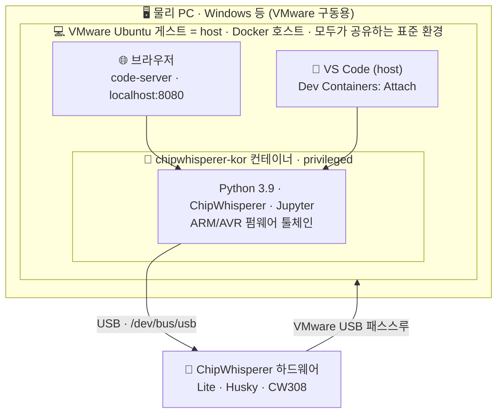
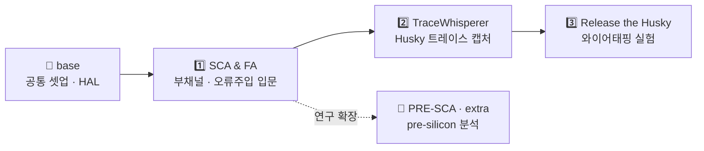

<div align="center">

# 🔬 ChipWhisperer-KOR

**부채널 분석(SCA) · 오류주입(FA)을 위한 올인원 한국어 실습 환경**

설치 한 번으로 — 브라우저에서도, VS Code에서도 — 바로 시작하는
ChipWhisperer 한국어 튜토리얼 & Docker 개발 환경

<br/>


[**저장소 바로가기 → github.com/chipwhisperer-kor/chipwhisperer-kor**](https://github.com/chipwhisperer-kor/chipwhisperer-kor)

</div>

---

> [!NOTE]
> **이 저장소가 제공하는 것**
> - ✅ **한국어 Jupyter 노트북** — 부채널 분석·오류주입을 단계별로 따라가는 실습 자료
> - ✅ **설치 한 번** — Python·ChipWhisperer·Jupyter·펌웨어 툴체인을 Docker 한 방에
> - ✅ **두 가지 개발 방식** — 브라우저(code-server) 또는 host VS Code(Dev Containers)
> - ✅ **하드웨어 + 에뮬레이션** — 실장비 실습은 물론, 장비가 없어도 맛볼 수 있는 연구 예제 포함

### 📑 목차

| | 대분류 | 내용 |
|---|---|---|
| **1** | [프로젝트 소개](#1-프로젝트-소개) | 저장소가 무엇이고, 무엇을 배우는지 |
| **2** | [도커 세팅 및 프로젝트 실행](#2-도커-세팅-및-프로젝트-실행) | 흥미를 느꼈다면 — 바로 데모 가능한 환경 구성 |
| **3** | [기타 팁](#3-기타-팁) | VMware·한글 입력·Git 등 개발자·방문자 공용 꿀팁 |

---

## 1. 프로젝트 소개

**ChipWhisperer-KOR**은 [ChipWhisperer](https://www.chipwhisperer.com/) 분석 플랫폼을 **한국어**로 학습·실습하기 위한 저장소입니다. 부채널 분석(SCA)과 오류주입(FA) 실습용 **한국어 노트북**, 재현 가능한 **Docker 개발 환경**, 타겟 보드 **펌웨어·HAL 자료**, 발표용 **Marp 슬라이드**를 한곳에 모았습니다.

기본 워크플로는 *VMware Ubuntu 게스트에 ChipWhisperer 하드웨어를 USB로 연결하고, 그 게스트 안의 컨테이너를 브라우저나 VS Code로 다루며 노트북을 실행*하는 방식입니다.

> [!IMPORTANT]
> **왜 VMware Ubuntu 환경인가? — 환경 통일과 재현성**
>
> 많은 연구자가 Windows를 선호하지만, 이 프로젝트는 **Ubuntu 환경에서 개발**됩니다. 개발자와 외부 연구자가 모두 **VMware에 동일한 Ubuntu 환경**을 구성하면, 외부 요인을 최소화 하여 **동일한 결과를 재현**할 수 있습니다. 따라서 이 저장소의 **모든 데모·연구 결과는 VMware Ubuntu 환경을 기준**으로 시연된다는 점을 서로 전제합니다.
>
> 또한 이 문서에서 **"host"** 는 물리 PC(Windows 등)가 아니라 **VMware Ubuntu 게스트 = Docker가 동작하는 호스트**를 가리킵니다. 즉 *"host VS Code"* 는 **Ubuntu 게스트 안에서 실행하는 VS Code**를 뜻합니다.

> [!TIP]
> 이름에 **`[extra]`** 가 붙은 디렉터리는 공식 ChipWhisperer 튜토리얼과 **무관한 연구·실험 프로젝트**입니다. 학습 경로와 구분해서 참고하세요.

### 🧩 주요 구성

| 구성 요소 | 설명 |
|-----------|------|
| 🇰🇷 **한국어 튜토리얼** | SCA·FA·TraceWhisperer·Husky 와이어태핑 등 단계별 Jupyter 노트북 |
| 🐳 **Docker 환경** | Python 3.9 + ChipWhisperer + Jupyter + code-server 일괄 제공 |
| 🔧 **펌웨어·HAL** | `workspace/base/` — STM32F3, XMEGA, AVR 등 타겟 보드 빌드 자료 |
| 📊 **발표 자료** | `Marp with LaTeX.css/` — Marp + LaTeX.css 기반 한국어 슬라이드 |
| 🔬 **연구 프로젝트** | `[extra] PRE-SCA/` — Unicorn 에뮬레이션 기반 사전(pre-silicon) 분석 실험 |

### 🗺 아키텍처 한눈에 보기



### 📚 학습 로드맵



<details>
<summary><b>📂 튜토리얼 상세 — 노트북 목록과 대상</b></summary>

<br/>

**① SCA and FA — 입문**

| 노트북 | 주제 | 대상 |
|--------|------|------|
| `1.0.SCA_main.ipynb` | 부채널 분석(SCA) — 파형 수집부터 HDF5 저장까지 | ChipWhisperer 초심자 |
| `2.0.FA_main.ipynb` | 오류주입 공격(Fault Injection) 입문 | SCA 1강 완료 후 |

> SimpleSerial 통신 검증 → 트리거·샘플 설정 → 파형 수집 → `*.h5` DB 저장·분석

**② TraceWhisperer**

| 노트북 | 주제 | 대상 |
|--------|------|------|
| `1.0.TraceWhisperer_main.ipynb` | TraceWhisperer 종합 실습 | Husky + CW308/STM32F3 |

> Husky 기반 하드웨어 트레이스 캡처·분석

**③ Release the Husky — 와이어태핑**

| 노트북 | 주제 | 대상 |
|--------|------|------|
| `1.0.Wiretapping4SCA.ipynb` | 와이어태핑을 통한 SCA 파형 수집 | ChipWhisperer 2대 (Lite + Husky) |
| `2.0.Wiretapping4FA .ipynb` | 와이어태핑을 통한 FIA 파형 수집 | 1.0 완료 후 |

> Lite(통신·프로그래밍) + Husky(수동 관측) 역할 분리 실험

**base/ — 공통 자료**

| 경로 | 설명 |
|------|------|
| `Setup_Generic.ipynb` | scope·target 연결 및 기본 설정 |
| `My_Setup.ipynb` | 타겟 보드 바이너리 빌드 환경 초기화 |
| `hal/`, `crypto/`, `simpleserial/` | 펌웨어 컴파일용 HAL·암호 라이브러리 |

**[extra] PRE-SCA — 연구 프로젝트**

| 노트북 | 설명 |
|--------|------|
| `PRE-SCA.ipynb` | Unicorn 기반 ARM 펌웨어 명령어 단위 트레이싱 및 오류주입 실험 (tiny-AES 대상) |

> 공식 학습 경로와 별도이며, 결과 CSV는 `nb_output/`에 저장됩니다. **실하드웨어 없이 실행 가능합니다.**

**Marp with LaTeX.css/ — 발표 자료**

Marp + LaTeX.css + Noto Serif KR 폰트 기반 한국어 슬라이드. VS Code/code-server의 Marp 확장에서 미리보기·PDF 내보내기가 가능합니다.

- `cw kor/presentation_Wiretapping.md` — 와이어태핑 발표
- `0. Template/presentation.md` — 슬라이드 작성 템플릿

</details>

---

## 2. 도커 세팅 및 프로젝트 실행

> 🎯 **목표:** 소개를 보고 흥미를 느낀 연구자가 **바로 데모 가능한 환경**을 구성하기.

### 🧰 사전 요구사항

| 항목 | 내용 |
|------|------|
| **물리 PC** | VMware Workstation/Player를 실행할 머신 (Windows 등 — VMware 구동용) |
| **개발 환경 (host)** | VMware **Ubuntu 게스트** — 모든 개발·데모가 이뤄지는 표준 환경. Docker도 여기서 동작 (아래 명령어는 Ubuntu 기준) |
| **하드웨어** | ChipWhisperer 장비 (Lite, Husky, CW308 등 — 튜토리얼별 상이) |
| **USB 패스스루** | 가상 머신에 ChipWhisperer USB 장치가 연결되어야 함 |
| **네트워크** | 이미지 빌드·패키지 설치를 위한 인터넷 연결 |

> [!TIP]
> **하드웨어가 아직 없으세요?** `[extra] PRE-SCA`는 Unicorn **에뮬레이션** 기반이라 장비 없이도 컨테이너 안에서 바로 실행해 볼 수 있습니다. SCA가 처음이라면 이걸로 감을 잡아보세요.

### ⚡ 빠른 시작 (Quick Start)

> 모든 상대경로 명령어는 **저장소 루트**에서 실행합니다.

```bash
# 1) 저장소 클론
git clone https://github.com/chipwhisperer-kor/chipwhisperer-kor.git
cd chipwhisperer-kor

# 2) USB udev 규칙 + 그룹 권한 (최초 1회) → 재부팅 필요
sudo cp ./setup/50-newae.rules /etc/udev/rules.d/50-newae.rules
sudo udevadm control --reload-rules
sudo groupadd -fr chipwhisperer
sudo usermod -aG chipwhisperer,plugdev,docker $USER
sudo reboot

# 3) 컨테이너 빌드·실행 (재부팅 후, ChipWhisperer USB 연결 상태에서)
cd ./setup/
docker compose up -d --build
```

실행이 끝나면 아래 **두 가지 방법 중 하나**로 접속합니다 → [접속 방법](#-접속-방법-2가지)

```text
🌐 브라우저            http://localhost:8080
🧩 host VS Code        Dev Containers: Attach to Running Container
```

> [!NOTE]
> 빠른 시작은 ChipWhisperer와 Docker를 이미 활용 중인 연구 환경에서 동작합니다.
> **Ubuntu 설치 후에 첫 부팅이라면, 아래 상세 절차(▶클릭)를 먼저 진행**하세요.
> 첫 빌드는 패키지·확장 설치로 **수 분 이상** 걸릴 수 있습니다. 

### 📦 상세 절차

<details>
<summary><b>1) Docker 설치 (Ubuntu)</b></summary>

<br/>

```bash
# 1-1. 기존 패키지 제거
sudo apt-get remove docker docker-engine docker.io containerd runc

# 1-2. 필수 패키지 설치
sudo apt-get update
sudo apt-get upgrade
sudo apt-get install -y ca-certificates curl gnupg
sudo apt update
sudo apt upgrade
sudo apt install util-linux-extra


# 1-3. Docker 공식 GPG 키 추가
sudo install -m 0755 -d /etc/apt/keyrings
curl -fsSL https://download.docker.com/linux/ubuntu/gpg | sudo gpg --dearmor -o /etc/apt/keyrings/docker.gpg
sudo chmod a+r /etc/apt/keyrings/docker.gpg

# 1-4. Docker 저장소 추가
echo \
  "deb [arch=$(dpkg --print-architecture) signed-by=/etc/apt/keyrings/docker.gpg] https://download.docker.com/linux/ubuntu \
  $(. /etc/os-release && echo $VERSION_CODENAME) stable" | \
  sudo tee /etc/apt/sources.list.d/docker.list > /dev/null

# 1-5. Docker 엔진 설치
sudo apt-get update
sudo apt-get install -y docker-ce docker-ce-cli containerd.io docker-buildx-plugin docker-compose-plugin

# 1-6. sudo 없이 Docker 사용
sudo usermod -aG docker $USER
newgrp docker
```

> `newgrp docker`는 현재 터미널에만 즉시 적용됩니다. 모든 터미널에 적용하려면 로그아웃 후 재로그인하세요.

</details>

<details>
<summary><b>2) ChipWhisperer 하드웨어 설정 (udev + 그룹)</b></summary>

<br/>

ChipWhisperer 장비를 USB로 연결했을 때 권한 없이 접근할 수 있도록 설정합니다. **컨테이너 실행 전에 먼저 적용해야 합니다.**

> `./setup/50-newae.rules`는 ChipWhisperer 공식 저장소 Commit `f618563` 기준입니다.

```bash
sudo cp ./setup/50-newae.rules /etc/udev/rules.d/50-newae.rules
sudo udevadm control --reload-rules
sudo groupadd -fr chipwhisperer
sudo usermod -aG chipwhisperer $USER
sudo usermod -aG plugdev $USER
sudo reboot
```

재부팅 후 USB 장치 인식 확인:

```bash
lsusb | grep -i "2b3e\|NewAE"
ls -l /dev/cw_serial* 2>/dev/null
```

</details>

<details>
<summary><b>3) 컨테이너 빌드 · 실행 · 운영</b></summary>

<br/>

```bash
cd ./setup/

# 빌드 + 백그라운드 실행
docker compose up -d --build

```

```bash
# 상태 확인
docker compose ps

# 로그 실시간 확인
docker compose logs -f

# 중지
docker compose down

# 재시작 (이미지 재빌드 없이)
docker compose restart

# 컨테이너 내부 셸 접속
docker exec -it chipwhisperer-kor bash
```

> `requirements.txt` 또는 `extensions.txt`를 수정한 경우 `docker compose up -d --build`로 다시 빌드해야 반영됩니다.

</details>

### 🔌 접속 방법 (2가지)

**모두 VMware Ubuntu 게스트 안에서** 같은 컨테이너에 접속하는 방법입니다. **브라우저**와 **host VS Code**(= 게스트의 VS Code) 양쪽을 동시에 사용할 수 있습니다.

#### A. 🌐 브라우저 (code-server)

별도 설치 없이 브라우저만으로 개발합니다. Chromium 계열을 권장합니다.

```text
http://localhost:8080
```

접속 후 `workspace/` 폴더에서 노트북(`.ipynb`)을 열고 **Run All** 또는 셀 단위로 실행합니다.

#### B. 🧩 host VS Code (Dev Containers)

**Ubuntu 게스트(host)에 설치한 VS Code**에서 같은 게스트의 컨테이너에 직접 붙어 개발합니다.

1. **Ubuntu 게스트의 VS Code**에 **Dev Containers** 확장(`ms-vscode-remote.remote-containers`)을 설치합니다.
2. 컨테이너가 실행 중인 상태에서 명령 팔레트(`F1`) → **`Dev Containers: Attach to Running Container`** 선택
3. 목록에서 **`chipwhisperer-kor`** 선택 → 새 창이 열립니다.
4. `File > Open Folder` → **`/workspace`** 를 엽니다.
5. 컨테이너 이미지에 내장된 설정에 따라 Python·Jupyter·C/C++ 등 개발용 확장이 원격 세션에 자동 설치됩니다.

> [!NOTE]
> 여기서 **host = VMware Ubuntu 게스트(Docker 호스트)** 입니다. 게스트에 설치한 VS Code에서 **같은 게스트의 컨테이너**에 attach하며, 브라우저 접속(`localhost:8080`)도 게스트 안에서 이뤄집니다. 두 방식 모두 **동일한 VMware Ubuntu 환경**에서 동작하므로, 개발자와 외부 연구자 누구나 같은 환경에서 같은 결과를 재현할 수 있습니다.

> [!WARNING]
> **보안:** code-server는 `--auth none`으로, 컨테이너는 `privileged`로 동작합니다. **로컬 개발·실습 전용**이며 외부 네트워크에 노출하지 마세요. 자세한 내용은 [보안 주의사항](#-보안-주의사항)을 참고하세요.

---

## 3. 기타 팁

> 개발자(저장소 운영자)와 방문자 모두에게 유용한 환경 설정·운영 노하우 모음입니다. 명령어는 Ubuntu 게스트 OS 기준입니다.

<details>
<summary><b>🛠 VMware Tools 설치 (클립보드 공유·해상도 자동 조정)</b></summary>

<br/>

```bash
sudo apt update
sudo apt install open-vm-tools
sudo apt install open-vm-tools-desktop
sudo reboot
```

</details>

<details>
<summary><b>📁 공유 폴더 설정 (물리 PC ↔ Ubuntu 게스트)</b></summary>

<br/>

**VMware 설정 (GUI)**

```text
VM → Settings → Options → Shared Folders
→ Always enabled 선택 → 공유할 폴더 추가
```

**Ubuntu 마운트 (터미널)**

```bash
sudo mkdir -p /mnt/hgfs
sudo vmhgfs-fuse .host:/ /mnt/hgfs -o allow_other
ls /mnt/hgfs
ln -s /mnt/hgfs ~/Desktop/hgfs
```

> [!WARNING]
> 위 마운트는 재부팅 시 초기화됩니다. 재부팅 후 `sudo vmhgfs-fuse .host:/ /mnt/hgfs -o allow_other`를 다시 실행하거나 `/etc/fstab`에 영구 마운트를 추가하세요.

</details>

<details>
<summary><b>⌨️ 한글 입력기 설치 (ibus-hangul)</b></summary>

<br/>

```bash
sudo apt update
sudo apt install ibus ibus-hangul
ibus restart
```

**시스템 설정 (GUI)**

```text
설정 → 키보드 → 입력 소스 → '+' → Korean → Korean (Hangul) 추가
```

> [!TIP]
> 단축키 충돌 방지를 위해 기존 입력 소스를 제거하고 기본 단축키 `Shift + Space`만 남기는 것을 권장합니다.

</details>

<details>
<summary><b>🧹 유틸리티 (권한·네트워크 응급 처치)</b></summary>

<br/>

**파일·폴더 권한 일괄 설정** — 접근 권한 문제가 생겼을 때만:

```bash
sudo chmod -R 777 ~
```

> [!CAUTION]
> 홈 디렉터리 **전체**의 권한을 777로 바꿉니다. SSH 키·인증 파일 등 민감한 파일도 포함되므로 **꼭 필요한 경우에만** 사용하세요.

**네트워크 IP 갱신** — 연결이 끊기거나 IP 할당에 문제가 생겼을 때:

```bash
sudo dhclient
```

</details>

<details>
<summary><b>🔄 깃허브 활용 (백업·복원)</b></summary>

<br/>

**백업 (Push)** — 로컬 변경 사항을 GitHub에 업로드:

```bash
git add . && git commit -m "backup $(date '+%F_%T')" && git push
```

**복원 (Pull)** — GitHub 최신 내용을 로컬로:

```bash
git pull
```

> [!TIP]
> `workspace/traces/`의 대용량 `.h5` 파일이나 `[extra]` 실험 출력물은 저장소 크기를 키울 수 있습니다. 필요 시 `.gitignore`로 제외하세요.

</details>

<details>
<summary><b>🔧 문제 해결 (Troubleshooting)</b></summary>

<br/>

**ChipWhisperer가 인식되지 않음**

```bash
# VMware에서 USB 장치가 게스트에 연결됐는지 먼저 확인
groups | grep -E 'chipwhisperer|plugdev'   # 그룹 멤버십 확인
lsusb | grep 2b3e                          # 장치 인식 확인
sudo udevadm control --reload-rules && sudo udevadm trigger   # 규칙 재적용 후 USB 재연결
```

**컨테이너 내부에서 USB 접근 실패**

- 컨테이너가 `privileged: true`로 실행 중인지 확인합니다.
- 게스트 OS에서 먼저 `lsusb`로 장치가 보이는지 확인한 뒤 `cd ./setup/ && docker compose restart`.

**`http://localhost:8080` 접속 불가**

```bash
docker compose ps          # 포트 8080 매핑 확인
docker compose logs        # code-server 기동 오류 확인
ss -tlnp | grep 8080       # 포트 점유 여부 확인
```

**노트북에서 `scope` 연결 오류**

- `workspace/base/Setup_Generic.ipynb`의 연결 셀을 먼저 실행합니다.
- USB가 일시적으로 끊긴 경우 노트북 안내대로 scope를 재연결합니다.

```python
import chipwhisperer as cw
scope = cw.scope()
```

</details>

### 🔒 보안 주의사항

| 항목 | 설명 |
|------|------|
| **code-server 인증 없음** | `--auth none`으로 실행됩니다. **로컬 개발·실습 전용**이며 외부 네트워크에 노출 금지. |
| **privileged 컨테이너** | USB 접근을 위해 호스트(Ubuntu 게스트)의 장치에 대한 광범위한 권한을 사용합니다. |
| **chmod 777** | 권한 일괄 변경은 보안상 위험하므로 최후의 수단으로만 사용합니다. |

---

## 📄 라이선스 및 참고 자료

- **이 저장소:** [Apache License 2.0](LICENSE)
- **ChipWhisperer 공식:** [chipwhisperer.com](https://www.chipwhisperer.com/) · [GitHub — newaetech/chipwhisperer](https://github.com/newaetech/chipwhisperer)
- **TraceWhisperer:** [GitHub — newaetech/chipwhisperer-trace](https://github.com/newaetech/chipwhisperer-trace)
- **udev 규칙 출처:** ChipWhisperer 공식 저장소 Commit `f618563`

<div align="center">

---

**⭐ 유용했다면 Star로 응원해 주세요!**  ·  부채널 분석의 세계에 오신 것을 환영합니다 🔬

</div>
