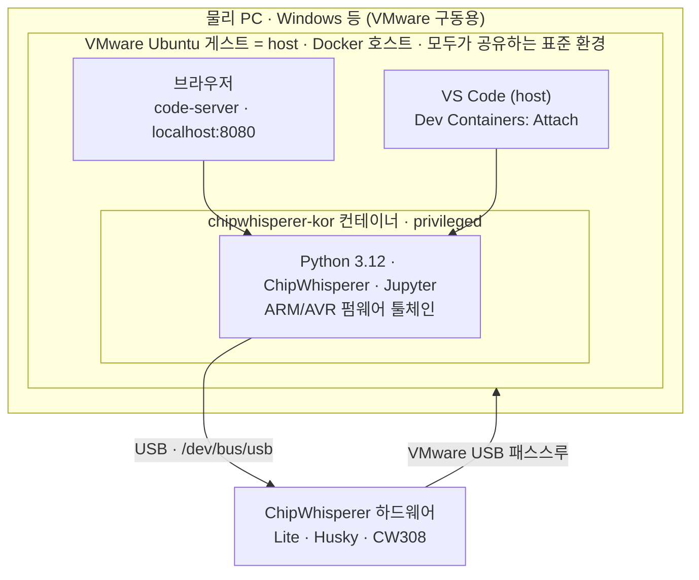
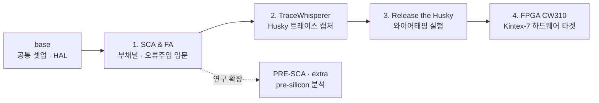

<div align="center">

# ChipWhisperer-KOR

**부채널 분석(SCA)과 오류주입(FA)을 위한 한국어 실습 환경**

한 번 설치하면 브라우저와 VS Code 어느 쪽에서도 바로 시작할 수 있는
ChipWhisperer 한국어 튜토리얼과 Docker 개발 환경이다.

<br/>


[**저장소 바로가기 → github.com/chipwhisperer-kor/chipwhisperer-kor**](https://github.com/chipwhisperer-kor/chipwhisperer-kor)

</div>

---

> [!NOTE]
> 이 저장소는 다음 네 가지를 제공한다.
> - 한국어 Jupyter 노트북. 부채널 분석과 오류주입을 단계별로 따라가는 실습 자료다.
> - 한 번의 설치. Python, ChipWhisperer, Jupyter, 펌웨어 툴체인을 Docker 이미지 하나에 담았다.
> - 두 가지 개발 방식. 브라우저(code-server) 또는 host VS Code(Dev Containers)로 같은 컨테이너에 붙는다.
> - 하드웨어 실습과 에뮬레이션. 실장비 실습 외에 장비 없이 실행할 수 있는 연구 예제를 포함한다.

### 목차

| | 대분류 | 내용 |
|---|---|---|
| **1** | [프로젝트 소개](#1-프로젝트-소개) | 저장소가 무엇이고 무엇을 배우는지 |
| **2** | [도커 세팅 및 프로젝트 실행](#2-도커-세팅-및-프로젝트-실행) | 데모를 바로 실행할 수 있는 환경 구성 |
| **3** | [기타 팁](#3-기타-팁) | VMware·한글 입력·Git 등 개발자와 방문자가 함께 쓰는 환경 설정 |

---

## 1. 프로젝트 소개

ChipWhisperer-KOR은 [ChipWhisperer](https://www.chipwhisperer.com/) 분석 플랫폼을 한국어로 학습하고 실습하기 위한 저장소다. 부채널 분석(SCA)과 오류주입(FA) 실습용 한국어 노트북, 재현 가능한 Docker 개발 환경, 타겟 보드 펌웨어와 HAL 자료를 한곳에 모았다.

기본 워크플로는 VMware Ubuntu 게스트에 ChipWhisperer 하드웨어를 USB로 연결하고, 그 게스트 안의 컨테이너를 브라우저나 VS Code로 다루며 노트북을 실행하는 방식이다.

> [!IMPORTANT]
> VMware Ubuntu 환경을 기준으로 삼는 이유는 환경 통일과 재현성이다.
>
> 많은 연구자가 Windows를 선호하지만 이 프로젝트는 Ubuntu 환경에서 개발한다. 개발자와 외부 연구자가 모두 VMware에 같은 Ubuntu 환경을 구성하면 외부 요인이 줄어 같은 결과를 재현할 수 있다. 이 저장소의 모든 데모와 연구 결과는 VMware Ubuntu 환경에서 시연된다는 것을 서로 전제한다.
>
> 이 문서에서 "host"는 물리 PC(Windows 등)가 아니라 VMware Ubuntu 게스트, 곧 Docker가 동작하는 호스트를 가리킨다. "host VS Code"는 Ubuntu 게스트 안에서 실행하는 VS Code를 뜻한다.

> [!TIP]
> 이름에 `[extra]`가 붙은 디렉터리는 공식 ChipWhisperer 튜토리얼과 무관한 연구·실험 프로젝트다. 정규 학습 경로와 분리해 사용한다.

### 주요 구성

| 구성 요소 | 설명 |
|-----------|------|
| 한국어 튜토리얼 | SCA·FA·TraceWhisperer·Husky 와이어태핑·FPGA(CW310) 등 단계별 Jupyter 노트북 |
| Docker 환경 | Python 3.12, ChipWhisperer, Jupyter, code-server를 한 이미지로 제공 |
| 펌웨어·HAL | `workspace/base/`. STM32F3, XMEGA, AVR 등 타겟 보드 빌드 자료 |
| 연구 프로젝트 | `[extra] PRE-SCA/`. Unicorn 에뮬레이션 기반 사전(pre-silicon) 분석 실험 |
| SCALib 예제 | `[extra] SCALib/`. 비마스킹 ∥ 마스킹 AES 이중 타겟 분석 노트북 |
| AI 사전 진단 | `[extra] Physical-AI-SCA/`. AI가 실험 설계·수집·분석·보고를 나누어 수행하는 환경 |
| 테스트 대상 구현(IUT) | `workspace/iut/`. 암호 라이브러리 한 벌이며, 펌웨어와 에뮬레이션이 같은 소스를 컴파일한다 |
| 공용 정의 | `workspace/lib/`. 스키마 검증기와 AES 참조 계산. 서로 다른 관측 경로가 같은 스키마를 쓰게 한다 |
| Dataset(데이터셋) 스키마 | `GLOSSARY.md`·`SCHEMA.md`. 부채널 용어와 Trace(트레이스) Dataset 스키마 |

### AI 기반 사전 진단 환경 (`[extra] Physical-AI-SCA/`)

에뮬레이션과 실물 전력 관측을 하나의 판정 규칙으로 비교하는 사전 진단 환경이다.
Git 저장소에는 통합 데모 노트북과 보고서를 추적하고, `runs/`·`traces/`의 생성 증거
번들은 용량과 재생성 가능성 때문에 제외한다. 이 때문에 로컬 증거가 존재한다는 것만으로
결과를 인용하지 않고, `verify`의 해시·스키마 검증을 통과한 번들만 현재 증거로 사용한다.
AI는 실험 명세를 작성하고 결과를 해석하며, 도구가 수치·판정·해시와 요건 대조표를
결정적으로 생성한다. 산출물은 수집 전 실험 계획, 분석 보고서, 제3자가 재현할 수 있는
증거 번들이다. ISO/IEC 17825:2024를 준용하지만 적합성 평가가 아니라 사전 진단이다.
실행 순서와 판정 근거는
[`workspace/[extra] Physical-AI-SCA/README.md`](workspace/%5Bextra%5D%20Physical-AI-SCA/README.md)에
다른 문서 없이 읽을 수 있도록 정리되어 있다.

실행은 서브프로젝트 디렉터리에서 `collect` → `analyze` → `report` → `verify` 순서다.

```bash
python3 -m physai.collect --spec exp/<id>.yaml
python3 -m physai.analyze --spec exp/<id>.yaml
python3 -m physai.report --run <id>
python3 -m physai.verify --run <id>
```

`collect` 전에 명세의 판정 기준을 고정한다. 결과를 본 뒤 기준을 바꿔야 한다면 기존 명세를
덮어쓰지 않고 새 실험 id를 만든다. Trace 수가 기준에 못 미치면 `inconclusive`이며, 실물
새 수집 도구나 변경된 실장비 코드는 실행 증거가 생기기 전까지 동작·준수 주장의 근거로 사용하지 않는다.

### 용어와 데이터셋 스키마

이 저장소가 만드는 Trace Dataset은 모두 같은 스키마를 따른다. 부채널 분야에는 아직 공표된
표준 Dataset 스키마가 없어, [OPTIMIST](https://optimist-ose.org/) 워크숍의 용어·평가 기준과
ISO/IEC 17825:2024의 시험 요건을 근거로 직접 정의했다.

| 문서 | 내용 |
|------|------|
| [`GLOSSARY.md`](GLOSSARY.md) | 용어 기준 문서. OPTIMIST·ISO/IEC 17825 용어와 이 저장소가 정한 용어를 출처별로 구분해 정의한다. 정의는 원문 뉘앙스를 보존하기 위해 영문으로 쓰고, 표제는 `English(한글)`로 병기한다 |
| [`SCHEMA.md`](SCHEMA.md) | Trace Dataset의 HDF5 스키마. 레이아웃, 필수 Metadata, 이름 규칙과 각 필드가 필요한 근거 |

구조를 요약하면 HDF5 파일 하나가 Dataset(데이터셋) 한 벌이다. 측정 조건은 루트
HDF5 attrs에, 데이터는 `/<subset>/` 아래 `trace`·`key`·`plaintext`·`ciphertext`
HDF5 dataset(배열)에 들어간다.
준수 여부는 `workspace/lib/sca_schema.py`의 `validate_dataset(path=…)`로 검사한다.
`[extra] SCALib`의 `scalib_common`이 이 함수를 같은 이름으로 다시 제공하므로 그 프로젝트의
노트북은 종전대로 `validate_dataset(target=…)`를 쓴다.

현재 판번호와 판별 호환 규칙은 `SCHEMA.md` §0에서만 정의한다. 검증기는
각 파일에 적힌 판번호의 규칙을 적용하므로 기존 Dataset을 나중 규칙으로 소급 판정하지
않는다.

### 아키텍처


```mermaid
flowchart TB
    subgraph PC["물리 PC · Windows 등 (VMware 구동용)"]
      subgraph GUEST["VMware Ubuntu 게스트 = host · Docker 호스트 · 모두가 공유하는 표준 환경"]
        B["브라우저<br/>code-server · localhost:8080"]
        V["VS Code (host)<br/>Dev Containers: Attach"]
        subgraph CONTAINER["chipwhisperer-kor 컨테이너 · privileged"]
          APP["Python 3.12 · ChipWhisperer · Jupyter<br/>ARM/AVR 펌웨어 툴체인"]
        end
      end
    end

    HW["ChipWhisperer 하드웨어<br/>Lite · Husky · CW308"]

    B --> APP
    V --> APP
    APP -->|USB · /dev/bus/usb| HW
    HW -->|VMware USB 패스스루| GUEST
```

### 학습 순서


```mermaid
flowchart LR
    S["base<br/>공통 셋업 · HAL"] --> A["1. SCA & FA<br/>부채널 · 오류주입 입문"]
    A --> T["2. TraceWhisperer<br/>Husky 트레이스 캡처"]
    T --> H["3. Release the Husky<br/>와이어태핑 실험"]
    H --> F["4. FPGA CW310<br/>Kintex-7 하드웨어 타겟"]
    A -. 연구 확장 .-> E["PRE-SCA · extra<br/>pre-silicon 분석"]
```

<details>
<summary><b>튜토리얼 상세: 노트북 목록과 대상</b></summary>

<br/>

**1. SCA and FA (입문)**

| 노트북 | 주제 | 대상 |
|--------|------|------|
| `1.0.SCA_main.ipynb` | 부채널 분석(SCA). 트레이스 수집부터 HDF5 저장까지 | ChipWhisperer 초심자 |
| `2.0.FA_main.ipynb` | 오류주입 공격(Fault Injection) 입문 | SCA 1강 완료 후 |

> SimpleSerial 통신 검증 → 트리거·샘플 설정 → 트레이스 수집 → `*.h5` Dataset 저장·분석

**2. TraceWhisperer**

| 노트북 | 주제 | 대상 |
|--------|------|------|
| `1.0.TraceWhisperer_main.ipynb` | TraceWhisperer 종합 실습 | Husky + CW308/STM32F3 |

> Husky 기반 하드웨어 트레이스 캡처·분석

> 위 세 입문 노트북은 필요한 펌웨어 빌드·프로그래밍·연결 코드를 각각 포함한다. 각 노트북은 자기 설정 셀의 `HUSKY_SERIAL_NUMBER`로 지정된 Husky Plus만 열며, 연결에 실패해도 다른 장비로 전환하지 않는다.

**3. Release the Husky (와이어태핑)**

| 노트북 | 주제 | 대상 |
|--------|------|------|
| `1.0.Wiretapping4SCA.ipynb` | 와이어태핑을 통한 SCA 트레이스 수집 | ChipWhisperer 2대 (Lite + Husky) |
| `2.0.Wiretapping4FA .ipynb` | 와이어태핑을 통한 FIA 트레이스 수집 | 1.0 완료 후 |

> Lite(통신·프로그래밍)와 Husky(수동 관측)의 역할 분리 실험

> 두 와이어태핑 노트북도 필요한 헬퍼와 빌드·프로그래밍 절차를 직접 포함한다. 각 노트북은 `HUSKY_SERIAL_NUMBER`와 `LITE_SERIAL_NUMBER`로 지정한 두 장비만 열며, 연결에 실패해도 다른 장비로 전환하지 않는다.

**4. FPGA CW310 (하드웨어 타겟)**

| 노트북 | 주제 | 대상 |
|--------|------|------|
| `1.0.CW310_AES_main.ipynb` | CW310 Kintex-7 위의 AES-128 하드웨어. 비트스트림 확인, 레지스터 I/O, PLL 클럭, 골든 검증, HDF5 수집 | CW1200(Pro) + CW310, 1강 완료 후 |
| `2.0.CW310_WideReg_main.ipynb` | 1024-bit 와이드 레지스터와 사용자 코어 자리. 128바이트 I/O와 더미 코어(XOR) Trace 수집 | 1.0 완료 후 |

> 비트스트림 2개(`fpga/build/{aes,wide}/cw310_top.bit`)와 레지스터 맵 `fpga/common/cw310_defines.v`는 저장소에 포함되어 있어 Vivado 없이 노트북을 실행할 수 있다. HDL·제약·빌드 스크립트(Vivado 2018.2, 유료)는 로컬 연구용이며 git에 넣지 않는다. 두 노트북은 `CW1200_SERIAL_NUMBER`·`CW310_SERIAL_NUMBER`로 지정된 두 장비만 열고, 연결에 실패해도 다른 장비로 전환하지 않는다. 크립토 클럭은 CW310의 PLL이 만들어 HS1으로 CW1200에 공급되고(`scope.clock.adc_src='extclk_x4'`), 트리거는 코어의 `busy`(IO4)다. CW310의 USB-C 전원 포트에는 PD 공급기(15 V 또는 20 V, 1 A 이상)가 필요하다. 일반 5 V USB 전원으로는 K410T가 설정 직후 브라운아웃되어 DONE이 떨어진다.

**base/ (공통 자료)**

| 경로 | 설명 |
|------|------|
| `Setup_Generic.ipynb` | 공용 연결·기본 설정이 필요한 다른 노트북용 자료 |
| `My_Setup.ipynb` | 공용 펌웨어 빌드·프로그래밍이 필요한 다른 노트북용 자료 |
| `hal/`, `crypto/`, `simpleserial/` | 펌웨어 컴파일용 HAL·암호 라이브러리 |

**[extra] PRE-SCA (연구 프로젝트)**

| 노트북 | 설명 |
|--------|------|
| `PRE-SCA.ipynb` | Unicorn 기반 ARM 펌웨어 명령어 단위 트레이싱 및 오류주입 실험 (tiny-AES 대상) |

> 공식 학습 경로와 별도이며, 결과 CSV는 `nb_output/`에 저장된다. 분석 대상 `source/tiny-aes`는
> `source/target-firmware/`에서 만들며, AES 구현은 공용 기준 소스 `workspace/iut/tiny-AES-c`를 직접
> 컴파일한다. 실제 하드웨어 없이 실행할 수 있다.

</details>

---

## 2. 도커 세팅 및 프로젝트 실행

> 이 절의 목표는 소개를 읽은 연구자가 데모를 바로 실행할 수 있는 환경을 구성하는 것이다.

### 사전 요구사항

| 항목 | 내용 |
|------|------|
| **물리 PC** | VMware Workstation/Player를 실행할 머신 (Windows 등, VMware 구동용) |
| **개발 환경 (host)** | VMware Ubuntu 게스트. 모든 개발과 데모가 이뤄지는 표준 환경이며 Docker도 여기서 동작한다 (아래 명령어는 Ubuntu 기준) |
| **하드웨어** | ChipWhisperer 장비 (Lite, Husky, CW308, CW1200 + CW310 등, 튜토리얼마다 다르다) |
| **USB 패스스루** | 가상 머신에 ChipWhisperer USB 장치가 연결되어야 한다 |
| **네트워크** | 이미지 빌드와 패키지 설치를 위한 인터넷 연결 |

> [!TIP]
> 하드웨어가 아직 없다면 `[extra] PRE-SCA`부터 실행할 수 있다. Unicorn 에뮬레이션 기반이라 장비 없이 컨테이너 안에서 바로 돌아간다. SCA가 처음이라면 이 노트북으로 전체 흐름을 먼저 익힌다.

### 빠른 시작 (Quick Start)

> 모든 상대경로 명령어는 저장소 루트에서 실행한다.

```bash
# 1) 저장소 클론
git clone https://github.com/chipwhisperer-kor/chipwhisperer-kor.git
cd chipwhisperer-kor

# 2) USB udev 규칙 + 그룹 권한 (최초 1회) → 재부팅 필요
sudo cp ./setup/50-newae.rules /etc/udev/rules.d/50-newae.rules
sudo udevadm control --reload-rules
sudo groupadd -fr chipwhisperer
sudo usermod -aG chipwhisperer,plugdev,docker $USER
sudo reboot

# 3) 컨테이너 빌드·실행 (재부팅 후, ChipWhisperer USB 연결 상태에서)
cd ./setup/
docker compose up -d --build
```

실행이 끝나면 아래 두 가지 방법 중 하나로 접속한다 → [접속 방법](#접속-방법-2가지)

```text
브라우저            http://localhost:8080
host VS Code        Dev Containers: Attach to Running Container
```

> [!NOTE]
> 빠른 시작은 ChipWhisperer와 Docker를 이미 사용 중인 연구 환경을 전제한다.
> Ubuntu를 설치하고 처음 부팅했다면 아래 상세 절차(▶클릭)를 먼저 진행한다.
> 첫 빌드는 패키지와 확장 설치 때문에 수 분 이상 걸릴 수 있다.

### 상세 절차

<details>
<summary><b>1) Docker 설치 (Ubuntu)</b></summary>

<br/>

```bash
# 1-1. 기존 패키지 제거
sudo apt-get remove docker docker-engine docker.io containerd runc

# 1-2. 필수 패키지 설치
sudo apt-get update
sudo apt-get upgrade
sudo apt-get install -y ca-certificates curl gnupg
sudo apt update
sudo apt upgrade
sudo apt install util-linux-extra


# 1-3. Docker 공식 GPG 키 추가
sudo install -m 0755 -d /etc/apt/keyrings
curl -fsSL https://download.docker.com/linux/ubuntu/gpg | sudo gpg --dearmor -o /etc/apt/keyrings/docker.gpg
sudo chmod a+r /etc/apt/keyrings/docker.gpg

# 1-4. Docker 저장소 추가
echo \
  "deb [arch=$(dpkg --print-architecture) signed-by=/etc/apt/keyrings/docker.gpg] https://download.docker.com/linux/ubuntu \
  $(. /etc/os-release && echo $VERSION_CODENAME) stable" | \
  sudo tee /etc/apt/sources.list.d/docker.list > /dev/null

# 1-5. Docker 엔진 설치
sudo apt-get update
sudo apt-get install -y docker-ce docker-ce-cli containerd.io docker-buildx-plugin docker-compose-plugin

# 1-6. sudo 없이 Docker 사용
sudo usermod -aG docker $USER
newgrp docker
```

> `newgrp docker`는 현재 터미널에만 바로 적용된다. 모든 터미널에 적용하려면 로그아웃 후 다시 로그인한다.

</details>

<details>
<summary><b>2) ChipWhisperer 하드웨어 설정 (udev + 그룹)</b></summary>

<br/>

ChipWhisperer 장비를 USB로 연결했을 때 권한 없이 접근할 수 있도록 설정한다. 컨테이너를 실행하기 전에 먼저 적용해야 한다.

> `./setup/50-newae.rules`는 ChipWhisperer 공식 저장소 Commit `f618563` 기준이다.

```bash
sudo cp ./setup/50-newae.rules /etc/udev/rules.d/50-newae.rules
sudo udevadm control --reload-rules
sudo groupadd -fr chipwhisperer
sudo usermod -aG chipwhisperer $USER
sudo usermod -aG plugdev $USER
sudo reboot
```

재부팅 후 USB 장치 인식을 확인한다.

```bash
lsusb | grep -i "2b3e\|NewAE"
ls -l /dev/cw_serial* 2>/dev/null
```

</details>

<details>
<summary><b>3) 컨테이너 빌드 · 실행 · 운영</b></summary>

<br/>

```bash
cd ./setup/

# 빌드 + 백그라운드 실행
docker compose up -d --build

# 상태 확인
docker compose ps

```

그 밖의 Docker 컨테이너 운영 명령어는 다음과 같다.

```bash

# 로그 실시간 확인
docker compose logs -f

# 중지
docker compose down

# 재시작 (이미지 재빌드 없이)
docker compose restart

# 컨테이너 내부 셸 접속
docker exec -it chipwhisperer-kor bash
```

> `requirements.txt` 또는 `extensions.txt`를 수정한 경우 `docker compose up -d --build`로 다시 빌드해야 반영된다.

</details>

### 접속 방법 (2가지)

두 방법 모두 VMware Ubuntu 게스트 안에서 같은 컨테이너에 접속한다. 브라우저와 host VS Code(게스트의 VS Code) 양쪽을 동시에 사용할 수 있다.

#### A. 브라우저 (code-server)

별도 설치 없이 브라우저만으로 개발한다. Chromium 계열을 권장한다.

```text
http://localhost:8080
```

접속 후 `workspace/` 폴더에서 노트북(`.ipynb`)을 열고 **Run All** 또는 셀 단위로 실행한다.

#### B. host VS Code (Dev Containers)

Ubuntu 게스트(host)에 설치한 VS Code에서 같은 게스트의 컨테이너에 직접 붙어 개발한다.

1. Ubuntu 게스트의 VS Code에 Dev Containers 확장(`ms-vscode-remote.remote-containers`)을 설치한다.
2. 컨테이너가 실행 중인 상태에서 명령 팔레트(`F1`)를 열고 `Dev Containers: Attach to Running Container`를 선택한다.
3. 목록에서 `chipwhisperer-kor`를 선택하면 새 창이 열린다.
4. `File > Open Folder`에서 `/workspace`를 연다.
5. 컨테이너 이미지에 내장된 설정에 따라 Python·Jupyter·C/C++ 등 개발용 확장이 원격 세션에 자동 설치된다.

> [!NOTE]
> 여기서 host는 VMware Ubuntu 게스트(Docker 호스트)다. 게스트에 설치한 VS Code에서 같은 게스트의 컨테이너에 attach하며, 브라우저 접속(`localhost:8080`)도 게스트 안에서 이뤄진다. 두 방식 모두 같은 VMware Ubuntu 환경에서 동작하므로 개발자와 외부 연구자 누구나 같은 환경에서 같은 결과를 재현할 수 있다.

> [!WARNING]
> code-server는 `--auth none`으로, 컨테이너는 `privileged`로 동작한다. 로컬 개발·실습 전용으로 사용하고 포트 8080을 외부 네트워크에 노출하지 않는다.

---

## 3. 기타 팁

> 개발자(저장소 운영자)와 방문자 모두에게 필요한 환경 설정과 운영 방법을 모았다. 명령어는 Ubuntu 게스트 OS 기준이다.

<details>
<summary><b>VMware Tools 설치 (클립보드 공유·해상도 자동 조정)</b></summary>

<br/>

```bash
sudo apt update
sudo apt install open-vm-tools
sudo apt install open-vm-tools-desktop
sudo reboot
```

</details>

<details>
<summary><b>공유 폴더 설정 (물리 PC ↔ Ubuntu 게스트)</b></summary>

<br/>

**VMware 설정 (GUI)**

```text
VM → Settings → Options → Shared Folders
→ Always enabled 선택 → 공유할 폴더 추가
```

**Ubuntu 마운트 (터미널)**

```bash
sudo mkdir -p /mnt/hgfs
sudo vmhgfs-fuse .host:/ /mnt/hgfs -o allow_other
ls /mnt/hgfs
ln -s /mnt/hgfs ~/Desktop/hgfs
```

> [!WARNING]
> 위 마운트는 재부팅하면 초기화된다. 재부팅 후 `sudo vmhgfs-fuse .host:/ /mnt/hgfs -o allow_other`를 다시 실행하거나 `/etc/fstab`에 영구 마운트를 추가한다.

</details>

<details>
<summary><b>한글 입력기 설치 (ibus-hangul)</b></summary>

<br/>

```bash
sudo apt update
sudo apt install ibus ibus-hangul
ibus restart
```

**시스템 설정 (GUI)**

```text
설정 → 키보드 → 입력 소스 → '+' → Korean → Korean (Hangul) 추가
```

> [!TIP]
> 단축키 충돌을 막기 위해 기존 입력 소스를 제거하고 기본 단축키 `Shift + Space`만 남기는 것을 권장한다.

</details>

<details>
<summary><b>유틸리티 (권한·네트워크 응급 처치)</b></summary>

<br/>

**프로젝트 파일 소유권 복구.** 컨테이너가 만든 파일이 root 소유라 편집할 수 없을 때만 실행한다.

```bash
ls -ld /path/to/affected/project
sudo chown -R "$USER":"$(id -gn)" /path/to/affected/project
```

> [!CAUTION]
> `/path/to/affected/project`를 문제가 생긴 프로젝트 디렉터리로 바꾼다. 홈 디렉터리
> 전체나 저장소 밖 경로에 재귀 명령을 실행하면 SSH 키와 인증 파일까지 영향을 받을 수 있다.

**네트워크 IP 갱신.** 연결이 끊기거나 IP 할당에 문제가 생겼을 때 실행한다.

```bash
sudo dhclient
```

</details>

<details>
<summary><b>GitHub 백업·복원</b></summary>

<br/>

**백업 (Push).** 올릴 변경을 확인한 뒤 필요한 파일만 GitHub에 올린다.

```bash
git status --short
git add <올릴-경로>
git diff --cached
git commit -m "변경 내용을 설명하는 메시지"
git push
```

```bash
git add . && git commit -m "backup $(date '+%F_%T')" && git push
```

**복원 (Pull).** GitHub의 최신 내용을 로컬로 가져온다.

```bash
git pull
```

> [!TIP]
> `workspace/traces/`의 대용량 `.h5` 파일이나 `[extra]` 실험 출력물은 저장소 크기를 키울 수 있다. 필요하면 `.gitignore`로 제외한다.

</details>

<details>
<summary><b>문제 해결 (Troubleshooting)</b></summary>

<br/>

**ChipWhisperer가 인식되지 않을 때**

```bash
# VMware에서 USB 장치가 게스트에 연결됐는지 먼저 확인
groups | grep -E 'chipwhisperer|plugdev'   # 그룹 멤버십 확인
lsusb | grep 2b3e                          # 장치 인식 확인
sudo udevadm control --reload-rules && sudo udevadm trigger   # 규칙 재적용 후 USB 재연결
```

**컨테이너 내부에서 USB 접근에 실패할 때**

- 컨테이너가 `privileged: true`로 실행 중인지 확인한다.
- 게스트 OS에서 먼저 `lsusb`로 장치가 보이는지 확인한 뒤 `cd ./setup/ && docker compose restart`를 실행한다.

**`http://localhost:8080`에 접속되지 않을 때**

```bash
docker compose ps          # 포트 8080 매핑 확인
docker compose logs        # code-server 기동 오류 확인
ss -tlnp | grep 8080       # 포트 점유 여부 확인
```

**노트북에서 `scope` 연결 오류가 날 때**

- SCA·FA·TraceWhisperer·FPGA CW310 입문 노트북은 맨 위의 설정 셀부터 순서대로 실행한다.
- `HUSKY_SERIAL_NUMBER`가 해당 강의용 장비인지 확인한다. 지정 장비 연결에 실패해도 다른 장비로 자동 전환하지 않는다.
- USB가 일시적으로 끊긴 경우 기존 커널의 연결을 해제하거나 커널을 다시 시작한 뒤 설정 셀을 다시 실행한다.

```python
import chipwhisperer as cw
scope = cw.scope(sn=HUSKY_SERIAL_NUMBER)
```

</details>

### 보안 주의사항

| 항목 | 설명 |
|------|------|
| **code-server 인증 없음** | `--auth none`으로 실행된다. 로컬 개발·실습 전용이며 외부 네트워크에 노출하지 않는다. |
| **privileged 컨테이너** | USB 접근을 위해 호스트(Ubuntu 게스트)의 장치에 대한 광범위한 권한을 사용한다. |
| **chmod 777** | 권한 일괄 변경은 보안상 위험하므로 최후의 수단으로만 사용한다. |

---

## 라이선스 및 참고 자료

- **이 저장소:** [Apache License 2.0](LICENSE)
- **ChipWhisperer 공식:** [chipwhisperer.com](https://www.chipwhisperer.com/) · [GitHub: newaetech/chipwhisperer](https://github.com/newaetech/chipwhisperer)
- **TraceWhisperer:** [GitHub: newaetech/chipwhisperer-trace](https://github.com/newaetech/chipwhisperer-trace)
- **udev 규칙 출처:** ChipWhisperer 공식 저장소 Commit `f618563`
