# 양자 내성 암호 HAETAE에 대한 오류 주입 공격 및 대응 기법

> 결정론적 기계 파생본을 source PDF 14쪽과 수동 대조하여 수식·알고리즘·표·시각 자산을 교정한 Markdown 전사본입니다. 요약·보완·해석은 포함하지 않으며, 최종 인용 기준은 source PDF입니다.

<!-- PDF_TO_MARKDOWN_METADATA
converter: "Papers/tools/pdf_to_markdown.py"
profile: "deterministic-bbox-v1+manual-structure-v1"
pdftotext: "pdftotext version 26.01.0"
converted_at: "2026-07-24"
source_asset_id: "HAETAE-FIA-TARGET"
derived_asset_id: "HAETAE-FIA-TARGET-MD"
source_path: "Papers/양자 내성 암호 HAETAE에 대한 오류 주입 공격 및 대응 기법.pdf"
source_sha256: "6d8f77eb064b893efaad577d4c3a46d7a9ff0323053ba4b0e5d10205adfa82cf"
pages: 14
bbox_words: 6239
consumed_bbox_words: 6239
numeric_tokens: 398
consumed_numeric_tokens: 398
source_blocks: 292
consumed_source_blocks: 292
emitted_blocks: 268
embedded_raster_images: 12
linked_visual_assets: 19
manual_reviewed_pages: 14
conversion_issues: 0
glyph_issue_chars: 0
verification: "verified"
-->

<!-- PDF_PAGE: 1 -->

## PDF page 1

Journal of The Korea Institute of Information Security &amp; Cryptology

VOL.36, NO.2, Apr. 2026

429

ISSN 1598-3986(Print) ISSN 2288-2715(Online)

https://doi.org/10.13089/JKIISC.2026.36.2.429

양자 내성 암호 HAETAE에 대한 오류 주입 공격 및 대응 기법*

이 1,2 상 원, 1† 김 윤 성, 1 하 재 철 2‡ 호서대학교 (대학원생, 교수)

Fault Injection Attacks on Post-Quantum Cryptography Algorithm HAETAE and Their Countermeasures*

Sangwon Lee, 1† Yunsung Kim, 1 Jaecheol Ha 2‡ 1,2 Hoseo University (Graduated Student, Professor)

### 요 약

양자 위협에 대응해 경량화와 부채널 내성을 목표로 제안된 격자 기반 서명 스킴 HAETAE는 수학적 안전성과 별개로 실제 구현 시 오류 주입 공격에 취약할 수 있다. 특히 Fiat-Shamir with Aborts 기반의 Dilithium과 구조적으로 유사함에도, 전체 서명 구조 대상의 공격 지점 도출 및 하드웨어 실증 연구는 아직 학계에 보고된 바 없 다. 본 논문에서는 HAETAE의 결정론적 서명 구조를 분석하여 LSB, 공개 행렬 언패킹, 부호 비트, 샘플링 시드 생성에 대한 오류 주입 공격 지점을 제시한다. 또한, 소프트웨어 및 하드웨어 실험을 통해 단일 또는 소수의 오류 주입만으로도 비밀 키 복구가 가능함을 확인하였으며, 본 연구에서 제시한 대응 기법이 5% 미만의 오버헤드로 이러 한 공격을 효과적으로 완화할 수 있음을 입증한다.

—

### ABSTRACT

—

A lattice-based signature scheme HAETAE, proposed to counter quantum threats with lightweight implementation and side-channel resistance, can be vulnerable to fault injection attacks in practical implementations regardless of mathematical security. In particular, despite its structural similarity to Dilithium which is based on the Fiat-Shamir with Aborts framework no studies have yet been reported in academia that systematically identify attack points across the entire signing structure and demonstrate them at the hardware level. In this paper, we analyze the deterministic signing structure of HAETAE and identify fault injection attack points targeting LSB processing, public matrix unpacking, sign-bit generation, and sampling-seed generation. Furthermore, through software and hardware experiments, we verify that secret-key recovery is achievable with only a single or a few fault injections. Finally, we demonstrate that the proposed countermeasures effectively mitigate these attacks with less than 5% overhead. Keywords: Hardware security, Fault injection Attack, KpqC

### I. 서 론 *

양자컴퓨팅 기술의 발전은 소인수분해 및 이산로

Received(12. 31. 2025), Modified(02. 09. 2026), Accepted(02. 09. 2026) * 이 논문은 2026년도 정부(과학기술정보통신부)의 재원으로 정 보통신기획평가원의 지원을 받아 수행된 연구 결과임(RS-202

그 문제에 기반한 † 기존 공개키 암호체계의 안전성을 근본적으로 위협하고 있다. 이에 따라 미국 국립표준 기술연구소(NIST)는 2016년부터 양자 내성 암호

4-00396269, IC Chip에 대한 오류주입 보안 검증 및 취약 성 분석 시스템 개발) †주저자, sangone9629@naver.com ‡교신저자, jcha@hoseo.edu(Corresponding author)

<!-- PDF_PAGE: 2 -->

## PDF page 2

양자 내성 암호 HAETAE에 대한 오류 주입 공격 및 대응 기법

430

(Post-Quantum Cryptography, PQC) 표준화 를 추진하였으며, 2024년 8월 디지털 서명 표준 알 고리즘으로 CRYSTALS-Dilithium(ML-DSA)을 최종 선정하였다[1]. 국내에서도 자체 PQC 기술 확 보를 위해 KpqC (Korean Post-Quantum Cryptography) 공모전이 진행되었고, 2025년 전 자서명 부문에서 HAETAE가 AIMer와 함께 최종 후보 알고리즘으로 선정되었다. HAETAE[2]는 Module-LWE 및 Bimodal Self-Target MSIS 격자 문제를 기반으로 한 서명 스킴으로, Bimodal hyperball rejection sampling, 고정소수점 최적화 등을 통해 서명 및 키 크기를 줄이면서도 효율성을 확보한 것이 특징이 다. 특히 수동적 공격, 즉 부채널 공격에 대한 내성 을 목표로 설계되었다는 점에서 실용적 활용 가능성 이 높다. 그러나 암호 알고리즘의 수학적 안전성은 실제 하 드웨어 구현 환경에서 그대로 보장되지 않는다. 성능 최적화 및 구현 제약으로 인해 새로운 공격 표면이 발생할 수 있으며, 이는 클럭 글리치[3], 전압 글리 치[4], 레이저[5], 전자기파[6] 등을 이용한 오류 주입 공격(Fault Injection Attack, FI)에 취약 해질 수 있으며, 이러한 공격의 위험성은 기존 암호 체계 전반에서 이미 확인된 바 있다[7,8]. 이러한 공격은 암호 연산의 흐름이나 내부 데이터를 왜곡하 여 비밀 정보를 추출하거나 검증을 우회할 수 있는 강력한 능동적 공격 기법이다. 실제로 NIST PQC 격자 서명 알고리즘인 Dilithium에 대해서는 다양한 오류 주입 공격이 제 안되었으며, 단일 또는 다중 오류를 통해 비밀 키 벡 터 전체를 복구할 수 있음이 실험적으로 입증되었다 [9–12]. 반면, HAETAE에 대한 오류 주입 공격 연구는 매우 제한적이다. HAETAE는 구조적으로 Dilithium과 유사함에도 불구하고, 전체 서명 과정 을 대상으로 한 종합적인 오류 주입 공격 분석은 아 직 보고되지 않았다. 특히 온라인/오프라인 기반 랜덤 화 서명 방식은 공식 구현 및 하드웨어 검증이 충분 히 이루어지지 않아 현실적 분석에 제약이 존재한다. 이에 본 논문에서는 결정론적 HAETAE를 대상 으로 하드웨어 구현 환경에서 발생 가능한 오류 주입 공격을 체계적으로 분석하고 대응 방안을 제시한다. 서명 내부 연산을 분석하여 LSB, 공개 행렬 언패 킹, 부호 비트, 샘플링 시드의 네 가지 주요 공격 지 점을 도출하였으며, 이를 통해 위조 서명에 필요한

비밀 키 벡터 복구가 가능함을 확인하였다. 또한 소 프트웨어 기반 오류 삽입과 ChipWhisperer -Husky 및 STM32F4 환경에서의 실제 클럭 글리 치 실험을 통해 공격의 현실성을 검증하고, 알고리즘 및 구현 수준에서 적용 가능한 경량 대응 기법을 제 시하였다.

### II. 관련 연구 및 배경 지식

### 2.1 KpqC HAETAE 서명 알고리즘

HAETAE(Hyperball bimodAl modulE rejecTion signAture schemE)는 서명 및 검증 키 크기를 줄이기 위해 Bimodal hyperball rejection sampling 기법과 고정소수점 연산 기반 구현을 결합하여 최대 39%까지 줄여 서명이 하나의 TCP, UDP에 포함되며 높은 보안성 유지를 목표로 한다. 키 생성 알고리즘은 모듈러 격자 기반 문제(MLWE)에 근거하여, 작은 노름을 갖는 비밀 벡터와 이에 대응하는 공개 검증키를 생성하는 과정으로 구성된다. 기본적인 키 생성 아이디어는 먼저 MLWE 샘플

$$
b=A_{\mathrm{gen}}s_{\mathrm{gen}}+e_{\mathrm{gen}}\pmod q
$$

를 얻으며, 검증키를 더 짧게 만들기 위해 추가적인 벡터 $a_{\mathrm{gen}}$을 도입하고 상위비트 $b_1$과 하위비트 $b_0$으로 분해하는 Truncation algorithm을 적용하였다. 비밀 키는 $s_1,s_2$ 두 벡터로 구성되며, 이후 도전값 $c$와 곱해질 비밀 키의 크기를 최소화하기 위해 노름 조건을 검사하여 만족하지 못할 시 샘플링 과정을 반복한다. 서명 알고리즘은 Fiat–Shamir with aborts 구조를 기반으로 하며, Bimodal 분포에서의 서명 구조와 하이퍼볼 균등분포에서 샘플링 방식을 사용하여 서명 크기를 줄이는 것을 목표로 한다. 서명에서 가장 중요한 요소는 난수 벡터 $y$를 생성하는 과정이다. HAETAE는 메시지 독립 난수 대신 비밀키의 $K$와 메시지의 해시값 $\mu$를 조합하여 생성한 시드 $seed_{ybb}$를 기반으로 expandYbb 함수를 통해 난수 $y$를 샘플링한다. 이때 난수 $y$는 다음 Fig. 1과 같이 Bimodal 이산 하이퍼볼 균등 분포에서 생성하게 된다. 이는 부채널 공격 방지로 $cs$를 마스킹하기 위함이며 하나의 큰 하이퍼볼을 쓰는 대신, 중심을 두 개 두어 리젝션 샘플링 비용을 줄인다. 난수 $y$가 커지면 서명 $z$도 커지기 때문에, 하이퍼

<!-- PDF_PAGE: 3 -->

## PDF page 3

정보보호학회논문지 (2026. 4)

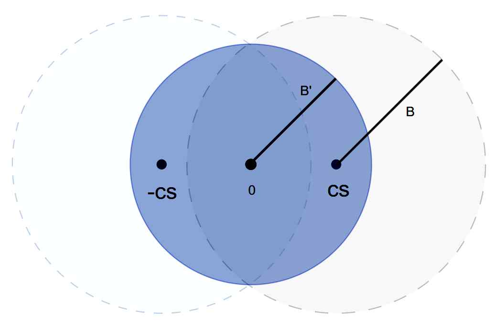

볼 내에서 생성된 $y$만 채택하도록 한다. 이후 메시지와 공개 파라미터로부터 충분히 랜덤하도록 도전값 $c$를 계산하고, 서명 벡터는

$$
z=(z_1,z_2)=y+(-1)^b\cdot cs_1
$$

로 정의된다. HAETAE의 서명 알고리즘은 다음 Fig. 2에서 나타난다. 서명 검증 단계에서는 공개 파라미터를 이용하여 서명 벡터 $z$와 도전값 $c$를 재계산한다. 서명에서 전달된 $z_1$은 상위비트와 하위비트로 분해된 형태이므로, 원래 정수 다항식으로 복원해야 한다. 또한 서명 압축을 위해 하위 비트를 제거했기 때문에

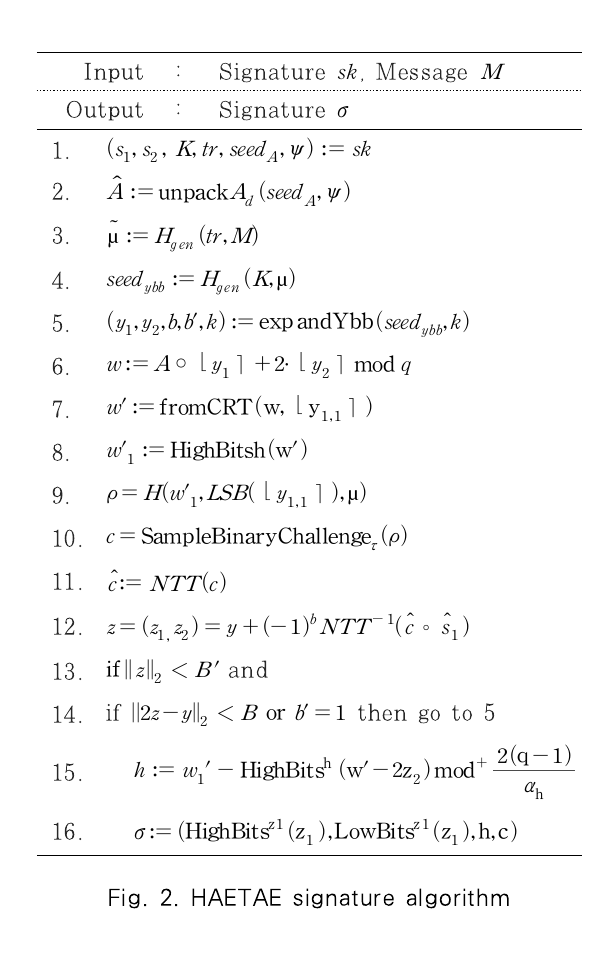

**Fig. 2 전사**

```text
Input : Signature sk, Message M
Output: Signature σ
1.  (s₁, s₂, K, tr, seed_A, ψ) := sk
2.  Â := unpackA_d(seed_A, ψ)
3.  μ̃ := H_gen(tr, M)
4.  seed_ybb := H_gen(K, μ)
5.  (y₁, y₂, b, b′, k) := expandYbb(seed_ybb, k)
6.  w := A ∘ ⌊y₁⌉ + 2·⌊y₂⌉ mod q
7.  w′ := fromCRT(w, ⌊y₁,₁⌉)
8.  w′₁ := HighBits_h(w′)
9.  ρ := H(w′₁, LSB(⌊y₁,₁⌉), μ)
10. c := SampleBinaryChallenge_τ(ρ)
11. ĉ := NTT(c)
12. z=(z₁,z₂) := y + (−1)^b NTT⁻¹(ĉ ∘ ŝ₁)
13. if ‖z‖₂ < B′ and
14. if ‖2z−y‖₂ < B or b′=1 then go to 5
15. h := w′₁ − HighBits^h(w′−2z₂) mod⁺ [2(q−1)/α_h]
16. σ := (HighBits^z₁(z₁), LowBits^z₁(z₁), h, c)
```

431

검증자는 힌트 $h$를 이용해 제거된 부분을 보정해야 한다. 이후, 복구된 서명 벡터가 충분히 작은지를 검사하고 복구된 도전값 $c$는 원본 $c$와 비교 검증한다.

### 2.2 오류 주입 공격

### 2.2.1 오류 주입 공격 개요

오류 주입 공격은 보안 디바이스나 암호 모듈의 정상 동작을 의도적으로 교란하여 잘못된 중간 값 또 는 최종 결과값을 유도한 뒤, 이를 기반으로 비밀 정 보를 추출하는 능동적 공격이다. 오류 주입 공격은 1996년 Bellcore 연구진이 RSA에 대한 준침투형 공격 기법을 제시하면서 그 위험성이 처음 부각되었 다[7]. 이 공격은 암호 장치가 비밀 키를 사용해 연 산을 수행하는 과정에서 의도적으로 연산 오류를 유 발하고, 그 결과로 얻은 잘못된 출력을 분석해 비밀 키를 복원하는 방식으로, 이후 AES[13-14], ARIA[15] 등 대칭키 알고리즘과 RSA[7,16], ECC[17-18] 등 공개키 알고리즘 전반에서 그 취약 성이 실험적으로 확인되었다. 최근에는 이러한 공격 기법이 CRYSTALS-Dilithium[9-12] 등 다양한 양자 내성 암호 알고리즘에서 오류 유발을 통한 키 복구 시나리오가 지속적으로 연구되고 있다. 오류는 장치의 동작 환경을 비정상적인 조건으로 설정하거나 또는 클럭, 전압, 레이저, 전자기 펄스와 같은 다양한 물리적 수단을 이용하여 일시적 또는 지 속적 연산 이상을 유도함으로써 발생시킬 수 있다. 이 과정에서 유발된 오류는 비밀 키 유출, 인증 절차 우 회, 오동작 유도 등의 보안 취약점을 일으킬 수 있다.

### 2.2.2 오류 주입 공격 기법

오류 주입 공격은 단순히 시스템에 오류를 발생시 키는 것이 아니라, 그로 인해 변화된 출력 값을 해석 하여 내부의 비밀 정보를 역추론하는 데 있다. 해석 하기 위한 다양한 분석 기법들[19-22]이 존재하지만 본 논문에서 사용될 기법에 대해 소개한다.

### 2.2.2.1 스킵 오류 공격

스킵 오류 공격(Skipping Fault Attack)은 공 격자가 특정 명령어의 실행을 건너뛰게 만들어, 프로 그램의 정상 제어 흐름을 우회하거나 중요한 연산을

<!-- PDF_PAGE: 4 -->

## PDF page 4

양자 내성 암호 HAETAE에 대한 오류 주입 공격 및 대응 기법

432

생략시키는 공격이다. 스킵 오류는 연산 생략, 메모 리 로딩 누락, 조건문 우회의 형태로 나타난다. 격자 기반 서명에서는 스킵 오류가 매우 치명적이다. 난수 샘플링 루프 일부가 스킵되면 랜덤 벡터 $y$가 고정되 거나, 공개 행렬 관련 샘플링 과정을 스킵하게 되면 공개 행렬의 일부가 잘못된 값으로 대체된다. HAETAE의 경우 핵심 연산 등이 단일 명령어 또는 짧은 루프 기반으로 구성되어 있기 때문에, 스킵 오 류 공격에 취약한 구조적 특성을 가진다.

### 2.2.2.2 차분 오류 분석

차분 오류 분석(Differential Fault Analysis, DFA)은 정상 암호문과 오류 암호문의 차분을 분석 하여 비밀 키를 복구하는 대표적인 오류 기반 암호해 독 기법이다. DES에서 처음 제안된 후 AES, RSA 및 PQC 등 다양한 알고리즘에 적용되며 그 범용성 이 확인되었다[9, 13-15]. DFA 방법은 다음과 같 다. 정상 출력 $O$와 오류 출력 $O'$의 차분 $\Delta O=O-O'$를 계산한다. 이 차분은 내부 연산식과 비밀 값이 선형 또는 준선형 관계를 가질 때, 비밀 값의 일부(또는 전체)를 직접적으로 노출한다.

### III. HAETAE 서명 알고리즘 오류 주입 공격

### 3.1 공격 모델

본 절에서는 HAETAE 서명 과정에 대한 오류 주입 공격에서 고려하는 공격 모델을 정의한다. 본 논문에서 고려하는 공격 모델은 다음과 같다.

∎ 공격자 가정 및 능력

- 공격자는 공격 대상 장치에 물리적으로 접근 가능하고, 서명 알고리즘 내 특정 지점을 목표로 오류를 주입할 수 있는 장비와 오류 제어 능력을 가진다.
- 특정 연산에 대해 오류를 주입하여 명령어 스킵 또는 비트 플립 등을 일으킬 수 있다.
- 동일 메시지에 대해 정상 서명 $\sigma$와 오류 서명 $\sigma_{\mathrm{fault}}$를 반복적으로 획득할 수 있다.

∎ 공격 목표

- 서명 $z=y+(-1)^bcs_1$에서 오류 주입을 통한 오류 서명으로 비밀 키 벡터 $s_1$을 복구하여 임의 메시지에 대한 유효한 위조 서명을 생성하는 것이 최종 목표이다.
- Fiat–Shamir with Aborts 구조를 가지므로, $s_1$이 복구되면 공격자는 임의 메시지에 대해 서명 알고리즘과 동일한 식으로 검증을 통과하는 유효한 $(z,c)$ 쌍을 직접 생성할 수 있다.

정리 3.1. ($s_1$ 노출 시 위조 서명 가능성) 서명 $z=y+(-1)^bcs_1$에서 공격자가 비밀 벡터 $s_1$을 완전히 복구했다고 가정하면, 추가적인 비밀 정보 $(s_2,K,tr,\psi)$에 접근하지 않고도 임의의 메시지에 대해 유효한 서명을 생성할 수 있다.

증명. HAETAE 검증 알고리즘은 서명 검증 과정에서 다음 관계식 1을 이용한다.

$$
Az-qcj\equiv Ay\pmod{2q}. \tag{1}
$$

이는 비밀키에 대한 의존성을 제거하고 검증 과정을 $(y,c)$의 선택에만 의존하도록 만든다. 공격자가 $s_1$을 알고 있다고 가정하고, 임의의 메시지 $M$에 대해 유효한 서명을 구성하는 방법을 보인다.

$$
\begin{aligned}
\mu &= H_{\mathrm{gen}}(seed_A,\psi,M),\\
w &:= A\circ\lfloor y_1\rceil+2\cdot\lfloor y_2\rceil\pmod q,\\
\rho &= H(\operatorname{HighBits}(w),\operatorname{LSB}(\lfloor y_{1,1}\rceil),\mu),\\
c &= \operatorname{SampleBinaryChallenge}_{\tau}(\rho),\\
z &= y+(-1)^bcs_1.
\end{aligned}\tag{2}
$$

여기서 $b\in\{0,1\}$는 임의로 선택 가능하며, 만약 $\lVert z\rVert\ge B''$ 등의 노름 제약이나 리젝션 조건을 만족하지 못하면, 새로운 $y$를 샘플링하여 위 과정을 반복함으로써 정상 서명 알고리즘과 동일한 리젝션 규칙을 모사할 수 있다. 힌트 벡터 $h$를 계산하기 위해 다음 수식 3과 같이 구성할 수 있다.

$$
\begin{aligned}
w' &= \operatorname{fromCRT}(A\circ\operatorname{NTT}(z_1),\operatorname{LSB}(z_1-c)),\\
w'_1 &= \operatorname{HighBits}^{h}(w'),\\
h &= w'_1-\operatorname{HighBits}^{h}(w'-2z_2).
\end{aligned}\tag{3}
$$

<!-- PDF_PAGE: 5 -->

## PDF page 5

정보보호학회논문지 (2026. 4)

이 과정에서 사용되는 모든 값은 공개키와 공격자가 스스로 생성한 $(z,c)$로부터 재구성 가능하며, 재구성한 $z_2$에 대한 일관된 힌트 벡터 $h$만 제공하면 되므로 비밀값 $s_2$는 필요하지 않다. 즉, 힌트 벡터 $h$는 비밀키 보호를 위한 암호학적 태그가 아니라, 비트 분해 과정에서 손실된 정보를 보정하기 위한 보조 정보로 기능한다.

### 3.2 HAETAE에 대한 오류 주입 공격

본 절의 모든 오류 주입 공격 시나리오는 결정론 적(Deterministic) HAETAE 서명 방식을 대상 으로 수행되었다. 최근 HAETAE에 대해 온라인/오 프라인 기반 확률적 서명 방식이 제안되고 있으나, 현재 표준화 및 공식 구현이 제공되지 않아 실제 하 드웨어 환경에서의 동작과 오류 주입 타이밍을 정밀 하게 분석하기 어렵다. 이에 따라 본 연구에서는 표 준 스펙과 구현이 명확히 정의된 결정론적 HAETAE를 기반으로 공격을 설계하였다. HAETAE의 내부 연산 구조는 크게 (1) 난수 생성 경로와 (2) 도전값 생성 경로로 구분된다. 난수 생성 경로는 부호 비트 결정과 서명용 샘플링 시드 확장 과정을 포함하며 도전값 생성 경로는 $w,m$ 등으로 구성된 해시 입력 구조에 의해 결정된다.

### 3.2.1 LSB 공격

HAETAE 서명 알고리즘은 서명 크기를 줄이고 검증 효율성을 높이기 위해, 커밋먼트 $w$의 전체 데이터를 전송하는 대신 상위 비트(HighBits)와 최하위 비트(LSB)로 분해하여 처리하는 구조를 가진다. 특히, HAETAE는 검증 키 행렬에 2가 곱해진 구조를 가지므로, 검증 과정에서의 나눗셈 연산에 따른 홀짝 보정을 위해 전체 값의 LSB가 필수적으로 사용된다. 우선, 결정론적인 HAETAE 서명 환경에서, 정상적인 서명 과정은 다음과 같이 표현된다. 이 중 메시지 $M$에 대해 서명 벡터 $z$ 생성 과정은 다음 수식 4와 같다.

$$
\begin{aligned}
\rho &= H(w'_1,\operatorname{LSB}(\lfloor y_{1,1}\rceil),\mu),\\
c &= \operatorname{SampleBinaryChallenge}_{\tau}(\rho),\\
z_{\mathrm{normal}} &= y+(-1)^bcs_1.
\end{aligned}\tag{4}
$$

433

여기서 도전값 $c$는 커밋먼트 $w$의 상위 비트와 LSB, 그리고 메시지 해시 $\mu$를 입력으로 샘플링된 값이다. 공격자는 LSB 생성 과정에 무작위 오류 또는 명령어 스킵 등의 오류를 발생시켜 다른 도전값 $\Delta c$가 샘플링되게 유도한다. 이 경우 오류가 주입된 서명은 $z_{\mathrm{fault}}=y+(-1)^b\Delta c\,s_1$로 정의한다. 정상 및 오류 서명의 차분을 구하여 비밀 키 벡터 $s_1$에 대해 식을 정리하면 다음 수식 5와 같다.

$$
\begin{aligned}
z_{\mathrm{normal}}-z_{\mathrm{fault}}
&=y+(-1)^bcs_1-\left(y+(-1)^b\Delta c\,s_1\right)\\
&=(c-\Delta c)s_1,\\
s_1&=(z_{\mathrm{normal}}-z_{\mathrm{fault}})\cdot(c-\Delta c)^{-1}.
\end{aligned}\tag{5}
$$

즉, $s_1$을 제외한 다른 값들은 모두 공개 정보이므로 공격자는 충분히 값을 얻을 수 있으므로 $s_1$을 복구할 수 있다.

### 3.2.2 언패킹 공격

서명 알고리즘은 공개키의 크기를 최소화하고 메모리 효율성을 높이기 위해, 공개키 행렬 $A$ 전체를 저장하는 대신 이를 생성할 수 있는 시드 $seed_A$와 일부 보조 정보만을 저장한다. 따라서 서명 생성 과정이 수행될 때마다 메모리 상에서 행렬 $A$를 동적으로 복원해야 하며, 이 과정은 unpackA 함수를 통해 수행된다. 정상적인 서명 생성 절차에서, 서명자는 비밀 키 벡터 $s_1$에 포함된 $seed_A$를 입력으로 하여 행렬 $A$를 복원한다. 이후 Bimodal 하이퍼볼 분포에서 샘플링된 난수 벡터 $y$와 복원된 행렬 $A$를 연산하여 커밋먼트 $w$를 산출한다. 이후 해시 함수를 통해 도전값 $c$를 생성하게 된다. 이때, 공격자는 unpackA 함수에서 오류 $\Delta A$를 발생시켜 잘못된 행렬이 복원되도록 한다. 이때 오류는 명령어 스킵, 비트플립 등의 모든 오류가 주입될 수 있다. 서명 절차 중 오류가 주입된 커밋먼트는

$$
w_{\mathrm{fault}}=\Delta A\circ y_1+2y_2\pmod q
$$

로 나타낸다. 이후 오류는 도전값까지 전파되어 오류 도전값 $c_{\mathrm{fault}}$로 인한 오류 서명 $z_{\mathrm{fault}}$와 정상 서명을 이용하여 위의 수식 (3–5)를 이용하여 키 복구를 시도할 수 있다.

<!-- PDF_PAGE: 6 -->

## PDF page 6

양자 내성 암호 HAETAE에 대한 오류 주입 공격 및 대응 기법

434

### 3.2.3 서명 부호 비트 공격

HAETAE는 서명 크기를 줄이고 보안성을 강화 하기 위해 Bimodal 가우시안 분포를 채택한 Fiat-Shamir with Aborts 구조를 따른다. 이를 구현하기 위해 서명 생성 과정에서 서명 부호 비트 $b\in\{0,1\}$를 무작위로 샘플링하여 비밀키 항의 부호를 결정한다. 여기서 $b$는 통계적 분포를 대칭적으로 만들어 비밀 키 벡터 $s_1$의 유출을 방지한다. 정상적인 서명 생성 절차에서 $b$는 시드와 카운터를 입력으로 하는 확장 함수(expandYbb)를 통해 결정론적으로 생성되거나 난수 생성기에 의해 무작위로 선택된다. 공격자는 서명 생성 과정 중 $b$가 결정되는 시점에 오류를 주입하여, $b$의 값이 반전되거나 특정 값으로 고정되도록 유도한다. 공격자가 동일한 입력값에 대해 정상 서명과 오류 서명을 획득했다고 가정한다. 이때 각 서명에 포함된 서명 벡터 $z_{\mathrm{normal}}$과 $z_{\mathrm{fault}}$는 다음과 같은 수식 6을 만족한다. 여기서 편의상 정상 실행 시 $b=0$, 오류 실행 시 $b=1$이라고 가정한다.

$$
\begin{aligned}
z_{\mathrm{normal}}&=y+(-1)^0cs_1=y+cs_1,\\
z_{\mathrm{fault}}&=y+(-1)^1cs_1=y-cs_1.
\end{aligned}\tag{6}
$$

공격자는 두 서명 벡터의 차분을 계산함으로써, 매 서명마다 바뀌어 비밀키 복구를 방해하는 난수 벡터 $y$를 소거할 수 있다. 두 식의 차분은 다음 수식 7과 같다.

$$
z_{\mathrm{normal}}-z_{\mathrm{fault}}
=y+cs_1-\left(y+(-1)cs_1\right)
=2cs_1. \tag{7}
$$

위 수식에서 $z_{\mathrm{normal}}$과 $z_{\mathrm{fault}}$는 공격자가 획득한 값이며, 도전값 $c$는 서명에 포함되어 있거나 검증 과정을 통해 복원할 수 있는 공개 정보이다. 또한, HAETAE가 사용하는 다항식 환 $R_q$에서 계수 2와 도전값 $c$는 높은 확률로 역원을 가진다. 따라서 공격자는 다음과 같은 수식 8을 통해 비밀키 벡터 $s_1$을 복구할 수 있다.

$$
s_1=(2c)^{-1}\cdot(z_{\mathrm{normal}}-z_{\mathrm{fault}}). \tag{8}
$$

### 3.2.4 난수 샘플링 시드 공격

서명 알고리즘은 격자 기반 문제의 난해성을 유지하기 위해 서명 생성 시마다 예측 불가능한 난수 벡터 $y$를 사용해야 한다. 이를 위해 HAETAE는 비밀키 $K$와 메시지 의존 값 $\mu$를 해시 함수에 입력하여 서명 샘플링 시드 $seed_{ybb}$를 생성한다. 이 시드는 확장 함수인 expandYbb에 입력되어 하이퍼볼 영역 내의 난수 벡터 $y$와 부호 비트 $b$를 생성하는 데 사용된다. 시드 $seed_{ybb}$를 생성할 때의 과정을 오류 주입을 통해 건너뛰도록 유도한다. 이 경우, $seed_{ybb}$는 초기 값 그대로 expandYbb 함수에 전달되게 되어 공격자가 예측할 수 있는 고정값이 샘플링된다. 실제로 HAETAE의 공식 구현에서 시드 $seed_{ybb}$의 초기 버퍼값은 64바이트의 0값으로 설정되어 있어 쉽게 값을 추론할 수 있다. 시드 $seed_{ybb}$ 샘플링 과정을 오류 주입으로 건너뛰어 획득한 오류 서명으로부터 비밀 키 벡터를 복구하는 과정은 Fig. 3과 같다. 공격자는 예측한 $seed_{ybb}$ 값을 입력으로 샘플링을 반복하며, 카운터 $k$를 증가

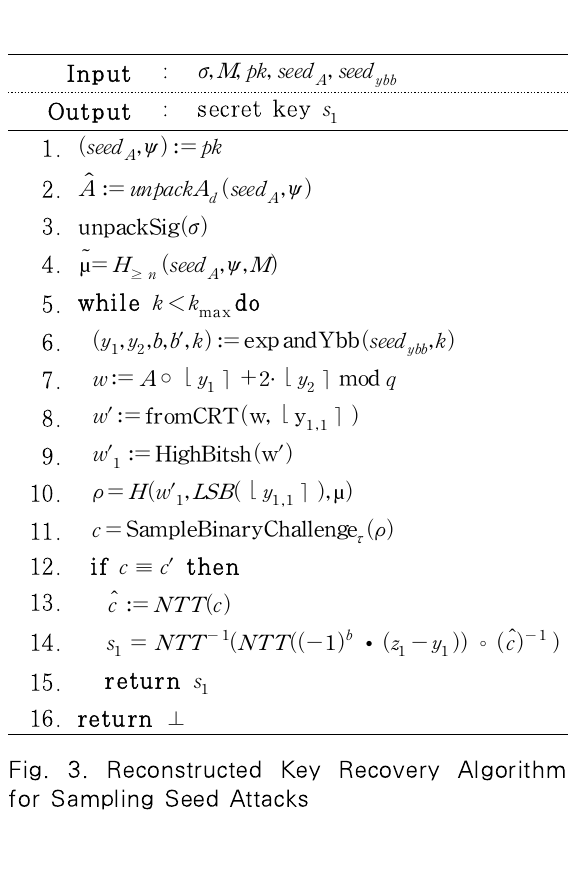

**Fig. 3 전사**

```text
Input : σ, M, pk, seed_A, seed_ybb
Output: secret key s₁
1.  (seed_A, ψ) := pk
2.  Â := unpackA_d(seed_A, ψ)
3.  unpackSig(σ)
4.  μ̃ := H_≥n(seed_A, ψ, M)
5.  while k < k_max do
6.    (y₁, y₂, b, b′, k) := expandYbb(seed_ybb, k)
7.    w := A ∘ ⌊y₁⌉ + 2·⌊y₂⌉ mod q
8.    w′ := fromCRT(w, ⌊y₁,₁⌉)
9.    w′₁ := HighBits_h(w′)
10.   ρ := H(w′₁, LSB(⌊y₁,₁⌉), μ)
11.   c := SampleBinaryChallenge_τ(ρ)
12.   if c ≡ c′ then
13.     ĉ := NTT(c)
14.     s₁ := NTT⁻¹(NTT((−1)^b·(z₁−y₁)) ∘ (ĉ)⁻¹)
15.     return s₁
16. return ⊥
```

<!-- PDF_PAGE: 7 -->

## PDF page 7

정보보호학회논문지 (2026. 4)

시키며 도전값 $c$와 일치할 때까지 진행한다. 이후, 일치되면 동일한 $y$가 생성된 것이기 때문에 키 복구가 가능해진다.

### IV. 실험 설계 및 구현

### 4.1 오류 주입 실험 환경 구성

HAETAE 서명 알고리즘에 대한 오류 주입 공격 의 실현 가능성을 검증하기 위해 소프트웨어 기반 논 리적 오류 삽입과 하드웨어 기반 물리적 오류 주입 실험을 수행하였다. 실험 대상은 HAETAE 공식 참 조 구현(v3.0)을 기반으로 하였으며, 서명 알고리즘 전체를 단일 펌웨어로 구성하였다. 하드웨어 실험은 ARM Cortex-M4 기반의 STM32F405RGT6 마이크로컨트롤러를 탑재한 CW308 개발 보드에서 수행하였다. 오류 주입 장비 로는 ChipWhisperer-Husky를 사용하였으며, 이 는 외부 오실로스코프 없이도 고해상도 전압 글리치 및 클럭 글리치를 생성할 수 있으며, 서브-나노초 단 위의 offset 및 width 조절 기능을 제공하여 서명 알고리즘 내 특정 명령어 구간에 정밀하게 오류를 주 입할 수 있다. 본 실험에서는 클럭 글리치 기법을 통 해 명령어 스킵 및 연산 오류를 유발하였다. 전체적 인 실험환경은 다음 Fig. 4과 같다.

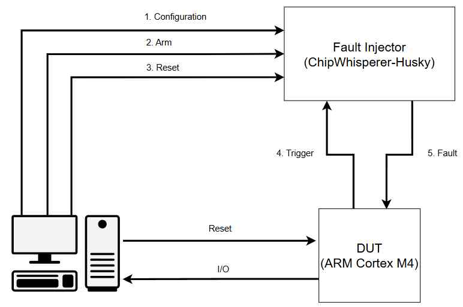

### 4.2 소프트웨어 기반 유효성 검증

소프트웨어 기반 검증 단계는 3장에서 제시한 네 가지 오류 주입 공격 시나리오가 실제 서명 구조에서 비밀 키 벡터 $s_1$을 노출시키는지를 이론적 모델과

435

동일한 조건에서 우선 검증하기 위한 절차이다. 이를 위해 C언어로 작성된 HAETAE 공식 구현(v3.0)을 기반으로 공격 모델에 해당하는 오류(명령어 스킵, 랜덤 오류)를 소프트웨어적으로 직접 삽입하였다. 소프트웨어 환경에서 오류 주입 공격 과정의 전체적인 구조는 다음 Fig. 5와 같다. 먼저, 실험의 일관성을 확보하기 위해 키 생성 단계에서는 난수 시드를 고정하여 항상 동일한 공개키와 비밀키가 생성되도록 설정하였다. 동일한 비밀키를 사용함으로써 정상 서명과 오류 서명 간의 차분 분석 시 $s_1$ 성분을 정확하게 비교할 수 있으며, 다수의 공격 시나리오를 반복적으로 적용했을 때 결과의 재현성과 통계적 안정성을 확보할 수 있다. 또한 서명 알고리즘에서 사용하는 메시지 $M$ 역시 전체 실험 동안 하나의 고정된 메시지를 사용하여 샘플링되는 난수와 도전값을 고정시켰다. LSB 공격에서는 LSB를 샘플링 하는 poly_lsb() 함수를 스킵하였으며 언패킹 공격에서는 공개 행렬 $A$에 교란을 주기 위해 임의적으로 polymatkl_double() 함수를 스킵하였다. 서명 부호 비트 공격에서는 부호 비트 $b$를 샘플링 하는 함수에서 데이터를 임의적으로 랜덤 오류를 더하는 방식으로 공격을 구현하였으며, 서명 샘플링 시드 공격에서는 난수 $y$를 샘플링하기 위한 xof256_squeeze() 함수를 스킵시켰다. 이후 3장에서 소개한 키 복구 알고리즘을 이용하여 서명 샘플링 시드 공격에서는 오류값으로 샘플링된 도전값과 일치하는 난수 $y$를 샘플링하여 성공적으로 비밀

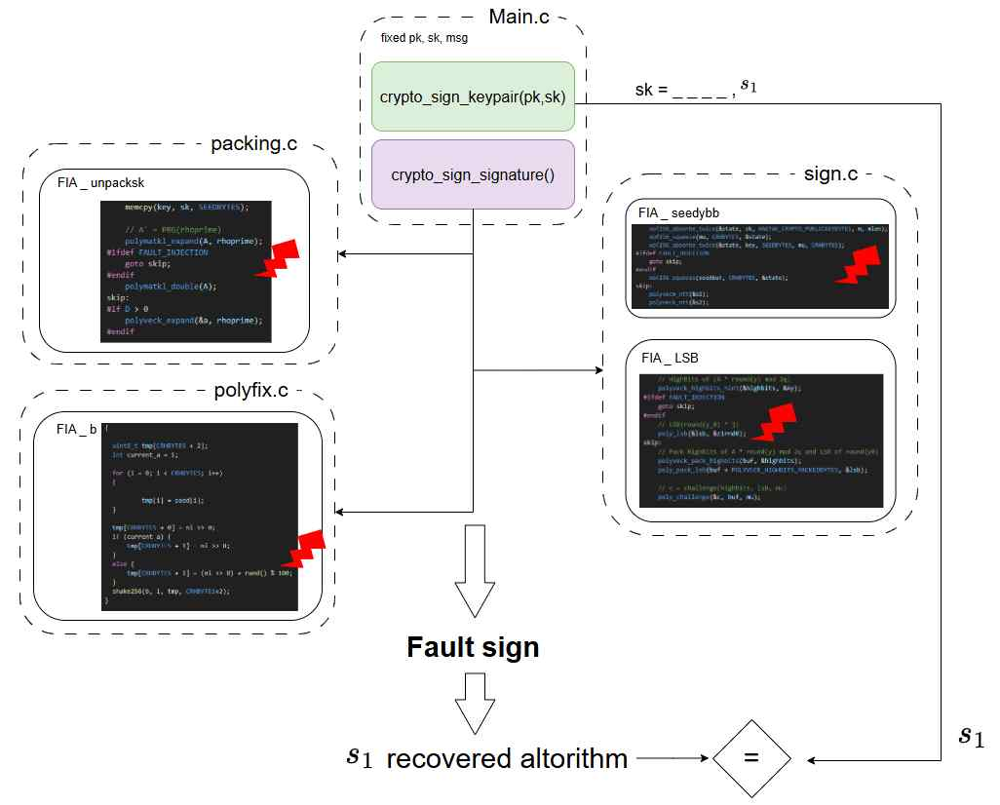

<!-- PDF_PAGE: 8 -->

## PDF page 8

양자 내성 암호 HAETAE에 대한 오류 주입 공격 및 대응 기법

436

키 벡터 $s_1$을 복구할 수 있었고 이 외의 공격도 마찬가지로 키 복구 수식을 이용하여 비밀 키 벡터 $s_1$을 복구할 수 있었다. 오류가 발생한다면 4가지 공격 모두 오류 서명으로 인해 100%로 복구에 성공하였다. 다음 절에서는 이러한 오류 모델이 실제 MCU 환경에서도 동일하게 발생할 수 있는지를 분석하기 위해 수행한 하드웨어 실험을 기술한다.

### 4.3 하드웨어 기반 유효성 검증

HAETAE 서명 알고리즘 전체는 다항식 연산, NTT(Number Theoretic Transform)연산, 리 젝션 샘플링 등 다수의 연산으로 구성되어 있어 실행 시간이 길다. 전체 서명 함수를 반복적으로 실행하면 서 글리치 공격을 할 경우 시간이 많이 소요되기 때 문에 서명 전체가 아니라 공격과 직접적으로 관련된 연산 구간만 탑재하여 독립적으로 실행하도록 하였고 이후 공격 검증 단계에서만 전체 서명 함수를 실행하 여 확인하였다. 하드웨어 오류 주입 실험에서 가장 중요한 요소는

공격자가 목표 연산 지점에 정확히 물리적 오류를 주 입할 수 있는지 여부이다. 본 연구에서는 이를 위해 ChipWhisperer-Husky의 클럭 글리치 기능을 사 용하여 특정 명령어 실행 시점의 타이밍을 교란함으 로써 명령어 스킵 또는 연산 오류를 유발하였다. 그러나 MCU는 내부 파이프라인과 클럭 도메인 구조를 가지므로, 외부에서 주입된 글리치가 실제로 어느 명령어에 영향을 미치는지는 직접적으로 제어하 기 어렵다. 이에 따라 글리치의 지속시간(width), 발생 시점(offset), 트리거 이후 지연(ext_offset) 을 조합하여 목표 연산 직전에 글리치가 삽입되도록 탐색을 수행하였다. 각 공격 지점에 대해 해당 파라미터들을 광범위하 게 변화시키며 수백에서 수천 회의 글리치를 반복 주 입하였고, STM32 계열 MCU의 실행 시점 변동성 을 고려하여 코드 내부에 트리거 명령어를 삽입하였 다. 글리치 파라미터 탐색 결과는 Fig. 6에 제시하 였으며, 공격 성공 파라미터 범위는 Table 1에 요 약하였다. 특히, 성공적으로 오류가 주입된 경우는 녹색 ‘+’ , 장치가 응답이 없으면 붉은색 ‘X’ 로 표시되

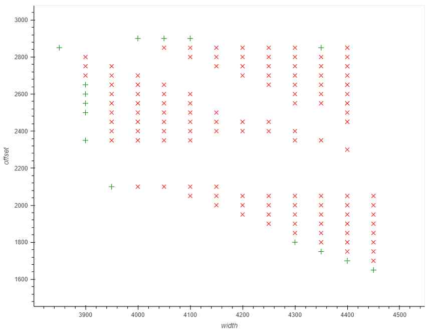

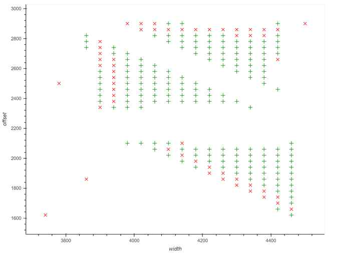

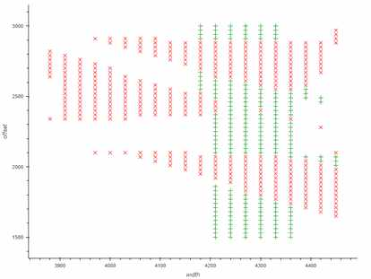

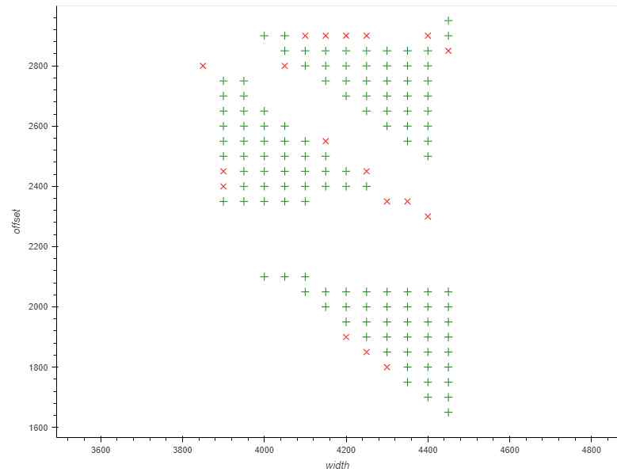

Fig. 6. Parameter distribution for attack success or failure

<!-- PDF_PAGE: 9 -->

## PDF page 9

정보보호학회논문지 (2026. 4)

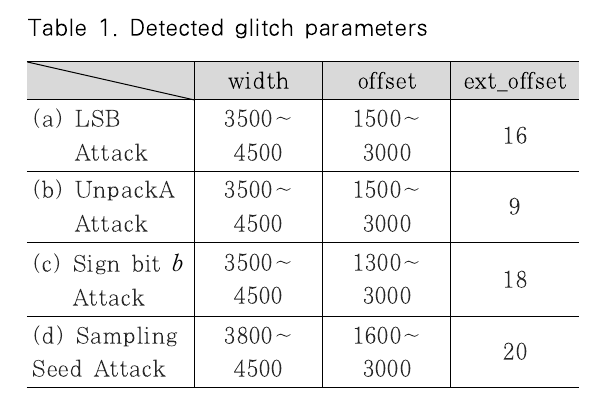

**Table 1. Detected glitch parameters**

| Attack | width | offset | ext_offset |
|---|---:|---:|---:|
| (a) LSB Attack | 3500–4500 | 1500–3000 | 16 |
| (b) UnpackA Attack | 3500–4500 | 1500–3000 | 9 |
| (c) Sign bit $b$ Attack | 3500–4500 | 1300–3000 | 18 |
| (d) Sampling Seed Attack | 3800–4500 | 1600–3000 | 20 |

며, 이를 통해 정상적으로 오류가 주입되어 공격에 필 요한 오류값이 출력되었다는 것을 확인할 수 있었다. 그림과 표에서 나타난 바와 같이, 공격 유형별로 유효 글리치 타이밍의 분포 방식이 서로 다르게 나타 났는데, 이는 HAETAE 서명 알고리즘 내 연산 구 조가 공격 지점마다 서로 다른 명령어 패턴을 갖기 때문이다. 예를 들어, LSB 관련 추출 연산의 내부 어셈블리 목록은 다음 Fig. 7과 같다. poly_lsb() 및 poly_pack_lsb() 함수는 소수의 산술 명령어로 구성된 짧은 루프 기반 연산으로, 글 리치가 영향을 미칠 수 있는 실행 구간이 매우 제한 적이다. 이에 따라 LSB 관련 공격에서는 유효 글리 치 타이밍이 좁은 범위에서만 관측되었다. 반면, 언 패킹 및 샘플링 시드 공격은 다항식 연산을 포함하는 비교적 긴 연산 구간을 가지므로, 글리치가 영향을 미칠 수 있는 범위가 넓고 실험에서도 더 높은 빈도 의 유효 오류가 관찰되었다. Table 2는 공격 유형별 오류 주입 특성과 키 복 구 성공률을 비교한 결과를 나타낸다. LSB 및 부호 비트 공격에서 관측된 약 21%의 성공률은 HAETAE의 리젝션 샘플링 조건이 단번에 충족될 확률을 실험적으로 측정하여 평균한 값이다. 오류가

437

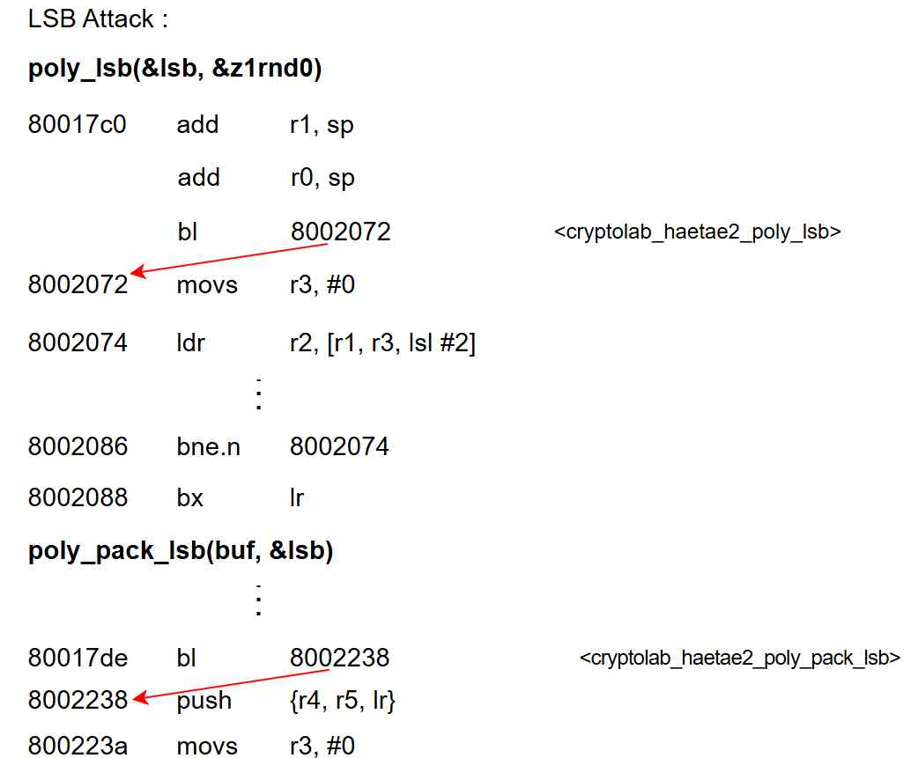

주입된 서명 벡터 $z$가 하이퍼볼 영역 내의 노름 제약 조건을 만족하지 못할 경우, 해당 서명은 리젝션되어 난수 샘플링부터 재계산된다. 따라서 본 논문에서 제시한 성공률은 주입된 오류가 리젝션 루프를 단번에 통과하여 실제 공격에 활용 가능한 유효한 오류 서명으로 도출될 확률을 의미한다. 실험 결과, 공격자는 통계적으로 약 7회의 오류 주입 시도만으로도 유효한 서명을 획득하여 비밀 키를 100% 복구할 수 있었으며, 이는 실제 하드웨어 환경에서 공격 난이도가 매우 낮음을 시사한다. 반면, 리젝션 구조의 영향을 받지 않는 구간에서 수행되는 언패킹 및 샘플링 시드 공격은 단 한 번의 오류 주입만으로도 100%의 키 복구 성공률을 기록하였다.

### V. 대응 방안

본 장에서는 HAETAE 서명 알고리즘에 대한 오 류 주입 공격을 방어하기 위한 대응 방안을 제시한

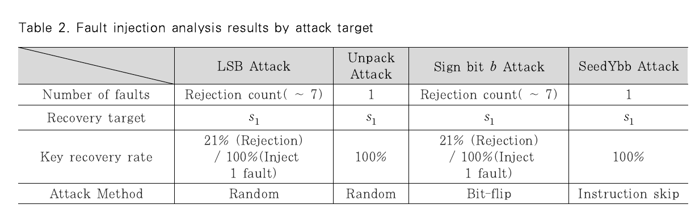

**Table 2. Fault injection analysis results by attack target**

| Metric | LSB Attack | UnpackA Attack | Sign bit $b$ Attack | SeedYbb Attack |
|---|---|---|---|---|
| Number of faults | Rejection count (~7) | 1 | Rejection count (~7) | 1 |
| Recovery target | $s_1$ | $s_1$ | $s_1$ | $s_1$ |
| Key recovery rate | 21% (Rejection) / 100% (Inject 1 fault) | 100% | 21% (Rejection) / 100% (Inject 1 fault) | 100% |
| Attack method | Random | Random | Bit-flip | Instruction skip |

<!-- PDF_PAGE: 10 -->

## PDF page 10

양자 내성 암호 HAETAE에 대한 오류 주입 공격 및 대응 기법

438

다. 오류 주입 대응 기법은 공격 탐지뿐만 아니라 정 상 동작 시의 성능 오버헤드가 낮아야 실용적으로 적 용 가능하며[23–24], 하드웨어 수준 대응은 오류 주입 자체를 차단할 수 있으나, 비용 및 구현 제약으 로 인해 모든 환경에 적용하기 어렵다. 이에 따라 본 논문에서는 대응책을 알고리즘 수준과 구현 (software) 수준으로 구분한다. 대응책의 효과는 코드 증가율(text), 전체 메모리 증가율(dec), 실행 시간(CPUCycles)을 기준으로 평가하였으며, 이는 메모리 제약 환경에서의 적용 가 능성과 정상 동작 성능에 직접적인 영향을 미친다.

### 5.1 알고리즘 수준 대응

알고리즘 수준 대응은 HAETAE 서명 알고리즘 의 기본 구조나 검증 흐름을 수정함으로써 오류 주입 공격의 성공 조건을 근본적으로 차단하는 것을 목표 로 한다.

### 5.1.1 서명 후 검증

검증 알고리즘은 입력된 서명을 이용해 도전값 $\tilde c$를 다시 계산하고 원본 $c$와 일치하는지 비교한다. 따라서 서명 생성 후 동일한 공개키로 Verify를 1회 추가 수행하는 서명 후 검증 기법을 적용하면, 도전값 $c$에 오류를 유도하는 모든 공격(LSB 공격, 언패킹 공격)을 즉시 탐지할 수 있다. 여기서 검증은 HAETAE 공식 구현의 검증 함수를 그대로 사용한다. 따라서 대응책을 도입하더라도 서명 알고리즘 자체의 내부 구조는 변경되지 않고, 단지 검증 호출이 1회 추가될 뿐이다. 이로 인해 text 증가량은 검증 코드 크기만큼 증가하고 CPUcycles는 Sign 1회 + Verify 1회 비용만큼 증가한다. Table 3은 서명 후 검증 기법에 대한 성능 지표이다.

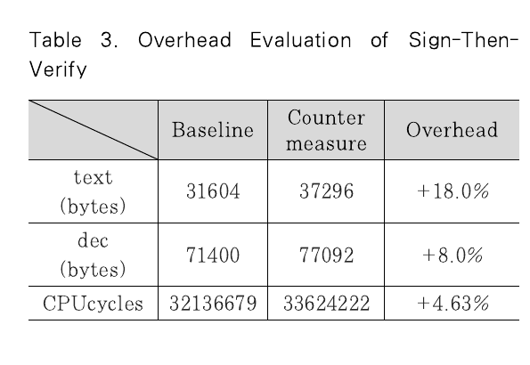

**Table 3. Overhead Evaluation of Sign-Then-Verify**

| Measure | Baseline | Countermeasure | Overhead |
|---|---:|---:|---:|
| text (bytes) | 31,604 | 37,296 | +18.0% |
| dec (bytes) | 71,400 | 77,092 | +8.0% |
| CPUcycles | 32,136,679 | 33,624,222 | +4.63% |

CPUcycles 증가율은 5% 미만으로 관측되어 실 용적으로 수용 가능한 오버헤드 수준으로 평가된다. text 및 dec 증가량은 주로 추가된 Verify 함수 코 드에 기인하며, 약 6 KB 내외의 코드 증가는 Cortex-M4 기반 환경에서 큰 부담이 되지 않는다. 다만 서명 후 검증 기법은 부호 비트 및 샘플링 시드 공격에는 대응하지 못하므로, 다른 대응책과의 병행 적용이 필요하다.

### 5.1.2 리젝션 샘플링 루프 내부 이동

서명 과정에서 사용되는 난수 샘플링 시드가 리젝션 샘플링 루프 밖에서 한 번만 생성된다. 이 구조에서는 공격자가 샘플링 시드 생성 시점에 단 한 번의 오류 주입으로 시드를 초기값 상태 그대로 강제 고정하면, 이후 리젝션 여부와 관계없이 예측 가능한 난수 $y$가 샘플링된다. 연산을 리젝션 루프 내부로 이동시키게 되면 단일 오류로 인한 공격은 어렵게 만들 수 있다. 즉, 리젝션 샘플링이 1회 이상 발생한다고 가정했을 때, 리젝션이 발생할 때마다 난수 샘플링 시드를 새로 샘플링하도록 설계함으로써, 단일 오류로 샘플링 시드를 고정시키더라도 동일 난수가 생성되는 것을 방지한다. 공격자 입장에서는 $y$에 대해 예측하기 어려워지므로, 샘플링 시드 공격의 성공 가능성이 크게 감소한다. 리젝션 루프 내부 이동 대응책 적용 전후의 오버헤드는 다음 Table 4와 같다. 기존 코드를 그대로 리젝션 루프 내부로 이동하였기 때문에 text 및 dec 증가는 무시 가능하며, CPUcycles 증가율도 약 0.2% 수준에 불과하다. 다만 리젝션 반복 횟수 증가에 따라 실행 시간 오버헤드는 더 커질 수 있다. 한편 본 대응책은 LSB 및 언패킹 공격에 대해서는 방어 효과가 없으며, 부호 비트 공격 또한 단독으로는 완전히 차단하지 못한다.

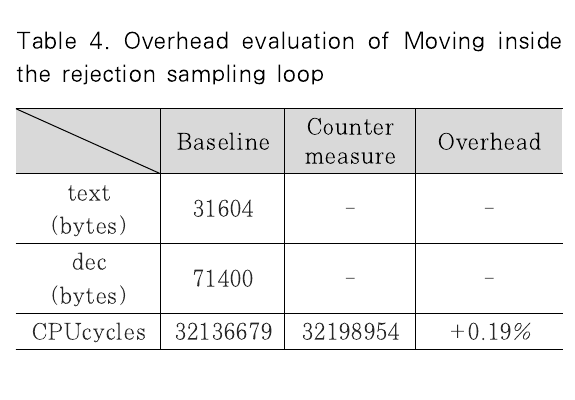

**Table 4. Overhead evaluation of moving inside the rejection sampling loop**

| Measure | Baseline | Countermeasure | Overhead |
|---|---:|---:|---:|
| text (bytes) | 31,604 | — | — |
| dec (bytes) | 71,400 | — | — |
| CPUcycles | 32,136,679 | 32,198,954 | +0.19% |

<!-- PDF_PAGE: 11 -->

## PDF page 11

정보보호학회논문지 (2026. 4)

### 5.2 구현 수준 대응

구현 수준 대응은 서명 알고리즘의 구조를 변경하 지 않고, 코드 레벨에서 연산의 무결성을 검증하거나 오류 전파를 차단함으로써 오류 주입 공격을 완화하 는 것을 목표로 한다.

### 5.2.1 부분 이중 연산

전체 서명 알고리즘을 두 번 실행하여 비교 검증 을 수행하는 전면 이중 연산 기법은 오류 검출 능력 은 높지만, 코드 크기와 실행 시간이 2배 가까이 증 가하는 치명적인 오버헤드를 유발한다. 이에 반해 부 분 이중 연산은 공격에 특히 민감한 연산만 선택적으 로 두 번 수행하여 결과를 비교함으로써, 상대적으로 작은 비용으로 오류 주입을 탐지하는 것을 목표로 한 다. 구체적으로 난수 샘플링 시드 생성 과정과 서명 부호 비트 생성 과정에 대해 독립적인 두 계산 경로 를 구성하고, 결과가 일치하지 않을 경우 해당 서명 시도를 리젝션하였다. 이를 통해 단일 글리치가 한 경로에만 영향을 미치는 경우 오류를 효과적으로 탐 지할 수 있으며, 전체 이중 연산 대비 매우 낮은 성 능 오버헤드로 높은 방어 효과를 제공한다. 두 연산에 대한 부분 이중 연산의 대응책 적용 전 후의 오버헤드는 다음 Table 5와 같다. 코드 크기 (text)는 약 0.66%, 전체 메모리(dec)는 약 0.29% 증가하는 데 그쳤으며, 서명 1회당 실행 시 간은 약 0.39% 증가하였다. 이는 매우 낮은 수준의 비용에 해당한다. 그러나 LSB 공격 및 언패킹 공격 에 대해서는 방어하지 못하며 다중 오류를 가정하는 강한 공격에서는 여전히 오류 주입 공격의 위협이 존 재한다.

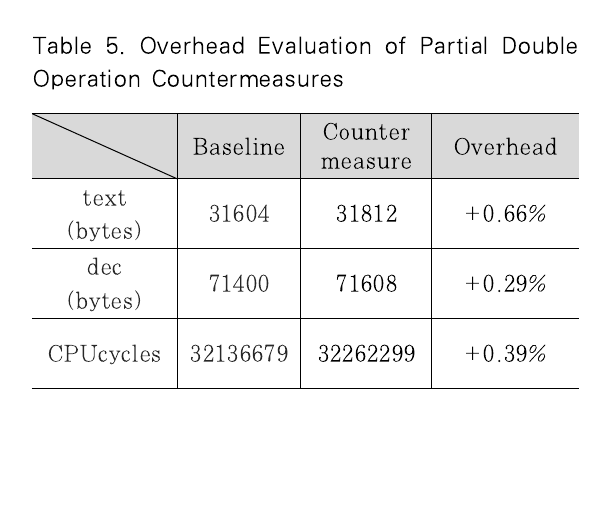

**Table 5. Overhead Evaluation of Partial Double Operation Countermeasures**

| Measure | Baseline | Countermeasure | Overhead |
|---|---:|---:|---:|
| text (bytes) | 31,604 | 31,812 | +0.66% |
| dec (bytes) | 71,400 | 71,608 | +0.29% |
| CPUcycles | 32,136,679 | 32,262,299 | +0.39% |

439

### 5.2.2 정상성 검사

정상성 검사 기법은 오류 주입으로 인해 난수 관 련 버퍼가 명백히 비정상적인 패턴을 가질 경우 이를 조기에 탐지하는 방식이다. 본 구현에서는 난수 샘플 링에 사용되는 XOF 출력 버퍼에 대해 모든 바이트 가 동일하거나 모두 0인 경우를 비정상 상태로 판단 하여 서명 생성을 중단하였다. 이러한 패턴은 정상적 인 난수 출력에서는 발생할 가능성이 극히 낮으므로, 샘플링 시드 공격과 같이 내부 상태가 초기값으로 고 정되는 오류 주입 공격을 효과적으로 차단할 수 있 다. 정상성 검사 대응책 적용 전후의 성능 지표는 Table 6과 같다. 코드 크기, 전체 메모리, 실행 시 간의 증가율은 각각 0.2%, 0.09%, 0.005% 미만 으로, 오버헤드는 사실상 무시 가능한 수준이다. 정 상성 검사 기법은 단순한 바이트 단위 검사로 구현되 어 추가 비용이 거의 없으나, 샘플링 시드 공격에만 대응 가능하므로 다른 대응책과의 병행 적용이 필요 하다.

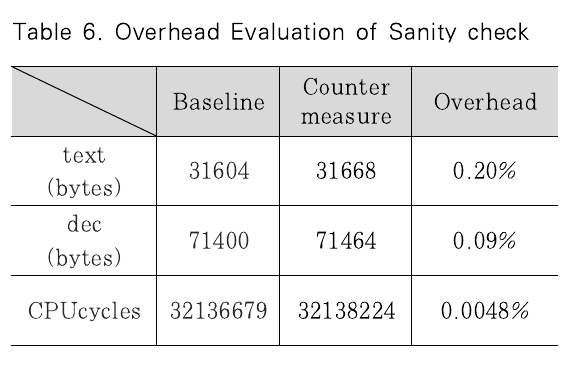

**Table 6. Overhead Evaluation of Sanity check**

| Measure | Baseline | Countermeasure | Overhead |
|---|---:|---:|---:|
| text (bytes) | 31,604 | 31,668 | 0.20% |
| dec (bytes) | 71,400 | 71,464 | 0.09% |
| CPUcycles | 32,136,679 | 32,138,224 | 0.0048% |

### VI. 결 론

본 논문에서는 국내 양자 내성 암호 최종 후보 알 고리즘 중 하나인 HAETAE 서명 스킴을 대상으로, 실제 하드웨어 환경에서 발생 가능한 오류 주입 공격 의 취약성을 분석하고 이에 대한 대응 방안을 제시하 였다. HAETAE의 결정론적 서명 구조를 기반으로 LSB, 공개 행렬 언패킹, 부호 비트, 샘플링 시드 생성 등 네 가지 주요 공격 지점을 도출하였으며, 소 프트웨어 기반 오류 삽입 실험과 STM32F405 및 ChipWhisperer-Husky 기반 하드웨어 실험을 통 해 단일 오류만으로도 비밀 키 벡터 복구가 가능함을 검증하였다. 제안된 대응 기법들은 5% 미만의 낮은

<!-- PDF_PAGE: 12 -->

## PDF page 12

양자 내성 암호 HAETAE에 대한 오류 주입 공격 및 대응 기법

440

오버헤드로 공격을 효과적으로 완화하였으나, 각 기 법의 방어 범위가 상이하므로 HAETAE 구조에 최 적화된 복합적 대응이 필수적임을 확인하였다. 특히 중복 연산을 활용한 대응책은 전력 파형의 신호 대 잡음비(SNR)를 높여 전력 분석 공격을 용 이하게 할 수 있는 단점이 존재한다. HAETAE는 마스킹 적용이 용이하도록 설계된 것이 주요 장점이 나, 제안된 중복 연산 로직이 추후 마스킹 구현과 결 합될 경우 마스킹 값 재사용 등으로 인한 부채널 취 약점이 발생할 가능성을 충분히 고려해야 한다. 따라 서 향후에는 마스킹과 오류 방어 기법이 결합된 통합 구현 환경에서의 정밀한 부채널 안전성 검증이 반드 시 병행되어야 한다.

### References

[1] National Institute of Standards and Technology, “Fips 204-module-lattice- based digital signature standard,” FIPS 204, Aug. 2023. [2] J.H. Cheon, H. Choe, J. Devevey, T. G ü neysu, D. Hong, M. Krausz, G. Land, M. M ö ller, D. Stehl é , and M. Yi, “Haetae: Shorter latticebased fiat-sha- mir signatures,” IACR Transactions on Cryptographic Hardware and Embed- ded Systems, pp. 25-75, July 2024. [3] P. Yang, F. Luo, Q. Ou, and D. Zhou, “Design and analysis of clock fault in- jection for aes,” Proceedings of International Conference on Computer Communications and Networks Security, pp. 87-91, Aug. 2020. [4] C. O’ Flynn, “Fault injection using crow- bars on embedded systems,” IACR ePrint 2016/810, 2016. [5] S. P. Skorobogatov and R. J. Anderson, “Optical fault induction attacks,” Cryptographic Hardware and Embed- ded Systems (CHES), pp. 2–12, 2002 [6] M. Dumont, M. Lisart, and P. Maurine, “Electromagnetic fault injection: How faults occur,” Proceedings of Workshop on Fault Diagnosis and Tolerance in

Cryptography, pp. 9-16, 2019. [7] D. Boneh, R.A. DeMillo, and R.J. Lipton, “On the importance of checking cryptographic protocols for faults,” Advances in Cryptology - EUROCRYPT ’ 9 7, LNCS 1233, pp. 37-51, 1997. [8] D. Toprakhisar, S. Nikova, and V. Nikov, “Sok: Parameterization of fault adversary models connecting theory and practice,” Topics in Cryptology - CT-RSA 2024, LNCS 14643, pp. 433-459, 2024. [9] M. ElGhamrawy, M. Azouaoui, O. Bronchain, J. Renes, T. Schneider, M. Sch ö nauer, O. Seker, and C. van Vredendaal, “From mlwe to rlwe: A dif- ferential fault attack on randomized &amp; deterministic dilithium,” IACR Transa- ctions on Cryptographic Hardware and Embedded Systems, vol. 2023, no. 4, pp. 262-286, 2023. [10] E. Krahmer, P. Pessl, G. Land, and T. Guneysu, “Correction fault attacks on randomized crystals-dilithium,” IACR Transactions on Cryptographic Hard- ware and Embedded Systems, pp. 174-199, 2024. [11] P. Ravi, B. Yang, S. Bhasin, and F. Zhang, “Fiddling the twiddle con- stants-fault injection analysis of the number theoretic transform,” IACR Transactions on Cryptographic Hardware and Embedded Systems, 2023. [12] S. Jendral, J. Mattsson, and E. Dubrova, “A single-trace fault injection attack on hedged module lattice digital signature algorithm (ml-dsa),” Work- shop on Fault Detection and Tolerance in Cryptography, pp. 34-43, 2024. [13] P. Dusart, G. Letourneux, and O. Vivolo, “Differential fault analysis on aes,” Cryptographic Hardware and Embedded Systems - CHES 2003, LNCS

<!-- PDF_PAGE: 13 -->

## PDF page 13

정보보호학회논문지 (2026. 4)

2846, pp. 293-306, 2003. [14] M. Tunstall and D. Mukhopadhyay, “Differential fault analysis of the ad- vanced encryption standard using a single fault,” IACR ePrint 2009/575, 2009. [15] C.H. Kim, “Differential fault analysis of aria in multi-byte fault models,” Journal of Systems and Software, vol. 85, no. 9, pp. 2096-2103, Sep. 2012. [16] A.K. Lenstra, “Memo on rsa signature generation in the presence of faults,” Technical Report, Sep. 1996. [17] I. Biehl, B. Meyer, and V. M ü ller, “Differential fault attacks on ellip- tic-curve cryptosystems,” Advances in Cryptology - CRYPTO 2000, LNCS 1880, pp. 131-146, 2000. [18] M. Ciet and M. Joye, “Elliptic curve cryptosystems in the presence of per- manent and transient faults,” Designs, Codes and Cryptography, vol. 36, no. 1, pp. 33-43, 2005. [19] S.M. Yen and M. Joye, “Checking be- fore output may not be enough against fault-based cryptanalysis,” IEEE Tran- sactions on Computers, vol. 49, pp. 967-970, 2000.

441

[20] J. Bl ö mer and V. Krummel, “Fault based collision attacks on aes,” Fault Diagnosis and Tolerance in Crypto- graphy, LNCS 4236, pp. 106-120, 2006. [21] C. Clavier, “Secret external encodings do not prevent transient fault analy- sis,” Cryptographic Hardware and Embedded Systems – CHES 2007, LNCS 4727, pp. 181-194, 2007. [22] A. Spruyt, A. Milburn, and Ł . Chmielewski, “Fault injection as an os- cilloscope: fault correlation analysis,” IACR Transactions on Cryptographic Hardware and Embedded Systems, pp. 192-216, 2021. [23] R. Boulifa, G. Di Natale, and P. Maistri, “Countermeasures against fault injection attacks in processors: A review,” Information, vol. 16, no. 4, 2025. [24] A. Barenghi, L. Breveglieri, I. Koren, G. Pelosi, and F. Regazzoni, “Low cost software countermeasures against fault attacks: implementation and perform- ances trade offs,” Proceedings of 5th Workshop on Embedded Systems Security, 2010.

<!-- PDF_PAGE: 14 -->

## PDF page 14

양자 내성 암호 HAETAE에 대한 오류 주입 공격 및 대응 기법

442

&lt;저 자 소 개 &gt;


이 상 원 (Sangwon Lee) 학생회원 2025년 2월: 호서대학교 컴퓨터공학부 학사 2026년 2월: 호서대학교 대학원 정보보호학과 석사 &lt;관심분야&gt; 부채널 공격, 하드웨어 보안, 네트워크 보안


김 윤 성 (Yunsung Kim) 학생회원 2026년 2월: 호서대학교 컴퓨터공학부 학사 2026년 3월~현재: 호서대학교 대학원 정보보호학과 석사과정 &lt;관심분야&gt; 네트워크 보안, 인공지능 보안, 부채널 공격


하 재 철 (Jaecheol Ha) 종신회원 1989년 2월: 경북대학교 전자공학과 학사 1993년 8월: 경북대학교 전자공학과 석사 1998년 2월: 경북대학교 전자공학과 박사 1998년 3월~2007년 2월: 나사렛대학교 정보통신학과 교수 2007년 3월~현재: 호서대학교 컴퓨터공학부 교수 2009년 1월~현재: 한국산학기술학회 이사 2022년 1월~현재: 국제차세대융합기술학회 부회장 1993년 1월~현재: 한국정보보호학회 명예회장 &lt;관심분야&gt; 암호학, 부채널 공격, 네트워크 보안, 정보보호
