# Public Coefficient Matters: A Practical Differential Fault Attack on ML-DSA and HAETAE

> 결정론적 기계 파생본을 source PDF 10쪽과 수동 대조하여 수식·알고리즘·표·시각 자산을 교정한 Markdown 전사본입니다. 요약·보완·해석은 포함하지 않으며, 최종 인용 기준은 source PDF입니다.

<!-- PDF_TO_MARKDOWN_METADATA
converter: "kit/tools/pdf_to_markdown.py"
profile: "deterministic-bbox-v1+manual-structure-v1"
pdftotext: "pdftotext version 26.01.0"
converted_at: "2026-07-24"
source_asset_id: "PCM-DFA-TARGET"
derived_asset_id: "PCM-DFA-TARGET-MD"
source_path: "Papers_pdf/Public Coefficient Matters A Practical Differential Fault Attack on ML-DSA and HAETAE.pdf"
source_sha256: "7b9dfdeab09968173c0769f8fd66f12c33aa24a2cffb701802e3296f283fcbb4"
pages: 10
bbox_words: 9208
consumed_bbox_words: 9208
numeric_tokens: 875
consumed_numeric_tokens: 875
source_blocks: 190
consumed_source_blocks: 190
emitted_blocks: 174
embedded_raster_images: 32
linked_visual_assets: 20
manual_reviewed_pages: 10
conversion_issues: 0
glyph_issue_chars: 0
verification: "verified"
-->

<!-- PDF_PAGE: 1 -->

## PDF page 1

1

Public Coefficient Matters: A Practical Differential Fault Attack on

ML-DSA and HAETAE

WonGeun Shin , SeungHyeon Jeon , Daehyeon Bae , Sujin Park , HeeSeok Kim

Abstract—With the standardization of post-quantum digital signature schemes and their increasing deployment in secu- rity critical applications such as firmware authentication and software distribution, implementations are expected to operate in physically accessible and potentially hostile environments. Consequently, considerable effort has been devoted to protecting these schemes against a variety of attacks, including timing side- channel attacks. However, evaluating their resilience against fault injection attacks remains equally important. Previous differential fault analysis (DFA) attacks on lattice-based signatures have primarily targeted intermediate values during signing and often relied on assumptions regarding rejection sampling or multiple fault injections. In this work, we demonstrate that the challenge sampling procedure itself constitutes a practical attack surface. Specifically, We present fault attacks against the challenge sampling proce- dures of deterministic ML-DSA, a NIST-standardized signature scheme, and HAETAE, a KpqC-selected signature scheme, show- ing that a single faulted signature is sufficient to recover the secret key required for signature forgery. To the best of our knowledge, this is the first fault attack on HAETAE achieving secret-key recovery that enables the generation of valid forged signatures. Our attack model of ML-DSA does not require direct access to faulted challenges. Using only public information, we identify intended fault injections and distinguish them from unintended fault outcomes. We evaluate the method through simulation and practical fault injection, achieving a 100% identification rate for intended faults. We further propose a countermeasure for the identified vulnerability.

Index Terms—Fault HAETAE

Attack, clock glitching, ML-DSA,

### I. INTRODUCTION

I

N modern IoT ecosystems, devices are typically deployed for long lifetimes and frequently receive remote up- dates [1]. To ensure the authenticity and integrity of firmware throughout these processes, IoT devices employ digital sig- natures in firmware authentication and secure boot, thereby preventing attackers from executing malicious code. Conse- quently, the generation and management of digital signatures have become critical components of modern firmware de- ployment infrastructures. To support firmware distribution at scale, many organizations operate dedicated firmware signing platforms [2] that manage cryptographic keys and automate the signing of firmware images.

Received 00 Month 2026; revised 00 Month 0000 and 00 Month 0000; accepted 00 Month 0000. Date of publication 00 Month 0000; date of current version 00 0000. (Corresponding authors: HeeSeok Kim.) WonGeun Shin, SeungHyeon Jeon and HeeSeok Kim are with Ko- rea University, Sejong, South Korea (e-mail: shinryan9@korea.ac.kr; jsh5167@korea.ac.kr; 80khs@korea.ac.kr). Daehyeon Bae and Sujin Park are with Korea University, Seoul 02841, South Korea (e-mail: dh bae@korea.ac.kr; lemontrees33@korea.ac.kr). Digital Object Identifier 10.0000/0000.0000.0000000

Digital signature schemes such as RSA [3] and ECDSA [4] are widely used for authentication and integrity protection. However, with the advent of quantum computing [5], the security of conventional signature schemes based on number- theoretic hardness assumptions has been significantly threat- ened. In response, NIST initiated a competition to evaluate and standardize post quantum cryptographic (PQC) algorithms that can withstand quantum threats. For digital signatures, ML- DSA [6], also known as Dilithium, has recently been standard- ized by NIST. HAETAE [7] is another lattice-based signature scheme based on the hardness of the MLWE and MSIS problems, and it was selected in the Korean Post-Quantum Cryptography (KpqC) standardization competition [8]. Both ML-DSA and HAETAE have been evaluated for timing side-channel attacks in secret dependent operations, taking into account the constraints of embedded environments. In addition, deterministic ML-DSA has also been extensively evaluated against fault attacks, including signature forgery [9]– [11] and secret key recovery attacks [12], [13]. Prior works on secret key recovery attacks primarily employ differential fault analysis (DFA). Existing DFA attacks against digital signature schemes typically target intermediate values involved in the signing procedure. One straightforward approach is to skip the addition operation used to compute the signature z = y + c · s 1 [12], [14], [15]. In [16], RowHammer fault injection is used to induce bit flips in the secret key s 1 , resulting in faulty signatures. The signing randomness y has also been targeted to generate exploitable faulty signatures [13], [17], [18]. Overall, DFA attacks on digital signatures have primarily focused on manipulating z, y, c, or s 1 to generate exploitable faulty signatures. However, the fault injections may affect the number of rejection sampling iterations by either introducing additional iterations or reducing the number of iterations. This can become a major obstacle for DFA, which relies on comparing genuine and faulty signatures. More specifically, DFA requires identifying whether the rejection sampling iteration has been modified in order to guaranty that the intended fault injection has been successfully induced. Thus, most prior studies on DFA assume that the number of rejection sampling iterations is known from side-channel traces [12], fixed iterations [18], or is not affected [14]. To address this issue, prior work has proposed fault attacks targeting computations before rejection sampling [19] and methods for distinguishing successful fault injections from a single faulty signature [13]. However, these approaches require estimating the rejection sampling iteration or rely on multiple fault injections, respectively. Our contributions are summarized as follows: • We present fault attacks against the three challenge

<!-- PDF_PAGE: 2 -->

## PDF page 2

sampling procedures in deterministic ML-DSA and HAETAE, showing that a single faulted signature is sufficient to recover the secret keys required for signa- ture forgery without any guessing. To the best of our knowledge, this is the first fault attack on HAETAE that achieves sufficient secret keys for forging valid HAETAE signatures. • We propose a method for identifying intended fault injections and distinguishing them from diverse unin- tended faulty signatures. The proposed method achieves a 100% discrimination rate, and we experimentally analyze unintended fault outcomes to evaluate its robustness. • We propose a dedicated countermeasure against the pro- posed attack. Unlike conventional approaches based on double computation or post-signature verification, the proposed countermeasure directly targets the underlying vulnerability exploited by our attack.

A. Related Work

Fault attacks targeting challenge sampling are categorized into two types depending on their objectives. One line of attack [9], [10] targets the verification and attempts to make an invalid signature pass verification. In particular, [9] induces a fault during the sampling of the challenge, causing all coefficients of the challenge to be zeroized so that the invalid signature is accepted. Likewise, [10] generates a signature corresponding to a zeroized challenge and subsequently injects a fault during verification to reproduce the same zeroized challenge, thereby bypassing the verification procedure. How- ever, these studies have been on simulations, not a real fault injection. As the first line of attack is not for secret key recovery, the second line of attack targets signature generation to extract the secret key from it. Similar to the verification fault attack, [17] zeroizes the challenge except for the first coefficient. [20] and [19] have faulted the input y or the hash function of the sampling of the challenge. The challenge value modified by the attack enables the recovery of the secret key s 1 through DFA. The work of [20] reports that a successfully faulted signature can be obtained with a probability of about 90%, while [19] requires approximately 4 guesses. These works [19], [20] fault y under the assumption that the induced fault affects only the challenge, depending on the implementation. However, in practice, the fault may also affect y itself, making it unable to perform DFA successfully. If the attacker targets the hash function inside the sampling procedure or the c itself [17] rather than y, the attacker cannot precisely determine whether the attack has succeeded since ML-DSA includes the seed of the challenge in the signature instead of the challenge itself. Therefore, we propose a fault injection that overcomes these issues.

### II. BACKGROUND

A. Notation

In this paper, every element is defined over $\mathbb{Z}_q$, and polynomials take the form $z=\sum_i z[i]X^i$, where each coefficient $z[i]\in\mathbb{Z}_q$ denotes the $i$-th component of $z$. We consider the ring $R_q=\mathbb{Z}_q[X]/(X^n+1)$, and polynomial vectors are defined over $R_q^\ell$ or $R_q^k$, where $\ell$ and $k$ denote the dimensions of the corresponding vector space. The vectors and matrices are denoted as lower and upper bold letters, respectively, $\mathbf{y}$ and $\mathbf{A}$. Vectors and matrices in the NTT domain are denoted by $\hat{\mathbf{y}}$ and $\hat{\mathbf{A}}$. Multiplication in the NTT domain is represented as $\hat{x}\cdot\hat{y}$, whereas polynomial multiplication in the standard domain is denoted by $x*y$. To discriminate between genuine and faulted values, the faulted counterpart of a polynomial vector $\mathbf{z}$ is denoted as $\mathbf{z}'$. This notation is used for both the intended and unintended faults. The difference between two values $\mathbf{z}$ and $\mathbf{z}'$ can then be expressed as $\Delta\mathbf{z}$.

2

B. ML-DSA

ML-DSA [6] is a standardized variant of Dilithium [21], which was selected in the NIST PQC standardization compe- tition. It is a digital signature scheme based on the hardness of the MLWE and MSIS problems. Given a public matrix A ∈ R and a vector t = A ∗ s 1 + s 2 , recovering the secret vectors s 1 ∈ R and s 2 ∈ R is computationally infeasible. Parameter sets vary across three security levels, namely ML-DSA-44, ML-DSA-65, and ML-DSA-87. Depending on the security level, not only the parameters but also certain implementation details are influenced, mainly due to the values of γ 1 and γ 2 [21]. The deterministic signing procedure described in Algorithm 1 generates a signature σ on a message M using the secret key sk, which includes the public key tr and ρ. The seed ρ ′ for sampling y is derived from M , tr, and key. Since tr and key are the public and secret keys, y depends solely on M . Using the sampled vector y and the matrix A generated from the seed ρ in the NTT domain, the product ŵ = Â · ŷ is computed. This value is decomposed into its high bits w 1 and low bits w 0 , which are used to derive the challenge c and the hint h, respectively. As a result, the signature σ is packed with z = y + c ∗ s1, the hint h, and the seed c̃ used to sample the challenge c. If z and h do not satisfy the required norm bounds in Line 11 and 12, the counter ctr is incremented, and the procedure repeats from Line 5 to resample y. This process is referred to as rejection sampling.

### C. HAETAE

HAETAE was a candidate in the NIST PQC Additional Digital Signature Round 1 and was selected as a winner of the KpqC competition [8]. Similar to ML-DSA, this digital signature scheme relies on the hardness of the MLWE and MSIS problems. Algorithm 2 generates the public and secret keys of HAETAE. The randomized seed seed is used to derive the seeds for sampling A and the secret vectors s 1 and s 2 . Using the sampled secret vectors and A, the algorithm computes t = A ∗ s 1 + s 2 , which follows the standard MLWE structure. The value t is decomposed into low bits t 0 and high bits t 1 . After subtracting t 0 from s 2 , the resulting vectors s 1 and s 2 are verified to ensure they satisfy the required norm bound. If not, s 1 and s 2 are repeatedly sampled with ctr. Meanwhile, A is sampled without any rejection. The public key pk stores seed A and t 1 , while the secret key sk contains

<!-- PDF_PAGE: 3 -->

## PDF page 3

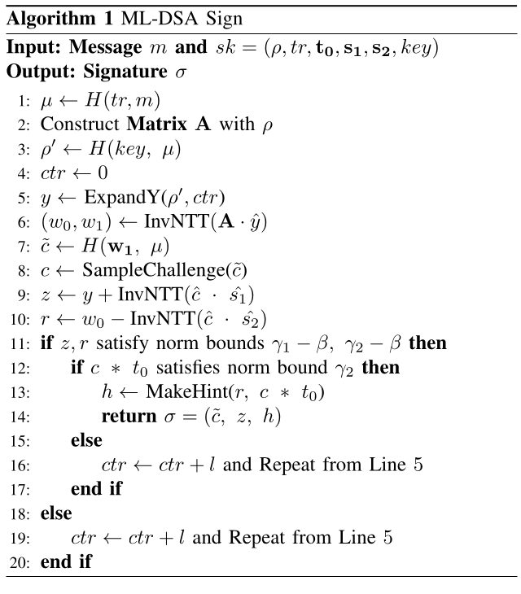

**Algorithm 1 transcription — ML-DSA Sign**

```text
Input : Message m and sk = (ρ, tr, t₀, s₁, s₂, key)
Output: Signature σ
1.  μ ← H(tr, m)
2.  Construct Matrix A with ρ
3.  ρ′ ← H(key, μ)
4.  ctr ← 0
5.  y ← ExpandY(ρ′, ctr)
6.  (w₀, w₁) ← InvNTT(A · ŷ)
7.  c̃ ← H(w₁, μ)
8.  c ← SampleChallenge(c̃)
9.  z ← y + InvNTT(ĉ · ŝ₁)
10. r ← w₀ − InvNTT(ĉ · ŝ₂)
11. if z, r satisfy norm bounds γ₁ − β, γ₂ − β then
12.   if c * t₀ satisfies norm bound γ₂ then
13.     h ← MakeHint(r, c * t₀)
14.     return σ = (c̃, z, h)
15.   else
16.     ctr ← ctr + l and Repeat from Line 5
17.   end if
18. else
19.   ctr ← ctr + l and Repeat from Line 5
20. end if
```

pk, secret vectors s 1 and s 2 , and key. Note that, key is only required for deterministic signing.

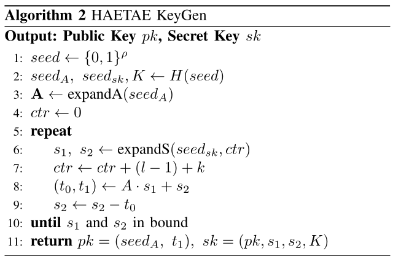

**Algorithm 2 transcription — HAETAE KeyGen**

```text
Output: Public Key pk, Secret Key sk
1.  seed ← {0,1}^ρ
2.  seed_A, seed_sk, K ← H(seed)
3.  A ← expandA(seed_A)
4.  ctr ← 0
5.  repeat
6.    s₁, s₂ ← expandS(seed_sk, ctr)
7.    ctr ← ctr + (l − 1) + k
8.    (t₀, t₁) ← A · s₁ + s₂
9.    s₂ ← s₂ − t₀
10. until s₁ and s₂ in bound
11. return pk = (seed_A, t₁), sk = (pk, s₁, s₂, K)
```

HAETAE utilizes the generated pk and sk to sign messages, as shown in Algorithm 3. Similar to ML-DSA, the signing procedure also employs rejection sampling. Specifically, the ExpandY function takes ρ ′ and the counter ctr as inputs and samples y 1 ∈ R k , y 2 ∈ R ℓ , and the bit b. The challenge c is sampled utilizing w and µ, where the challenge sampling procedure varies depending on the security level, as described in Section II-D. Both z 1 and z 2 are computed using the same c and b, while differing in the corresponding secret keys and random vectors, y 1 and y 2 . Signature σ includes z 1 , hint h, and challenge c. Unlike z 1 and c, z 2 is not included directly in the signature and is instead encoded through the hint h.

D. Sampling Challenge In this section, we introduce three types of sampling chal- lenges c. Depending on the security type, HAETAE proposes

3

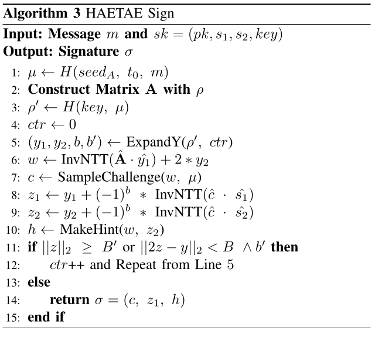

**Algorithm 3 transcription — HAETAE Sign**

```text
Input : Message m and sk = (pk, s₁, s₂, key)
Output: Signature σ
1.  μ ← H(seed_A, t₀, m)
2.  Construct Matrix A with ρ
3.  ρ′ ← H(key, μ)
4.  ctr ← 0
5.  (y₁, y₂, b, b′) ← ExpandY(ρ′, ctr)
6.  w ← InvNTT(Â · ŷ₁) + 2 * y₂
7.  c ← SampleChallenge(w, μ)
8.  z₁ ← y₁ + (−1)^b * InvNTT(ĉ · ŝ₁)
9.  z₂ ← y₂ + (−1)^b * InvNTT(ĉ · ŝ₂)
10. h ← MakeHint(w, z₂)
11. if ‖z‖₂ ≥ B′ or ‖2z − y‖₂ < B ∧ b′ then
12.   ctr++ and Repeat from Line 5
13. else
14.   return σ = (c, z₁, h)
15. end if
```

two different samplings, whereas ML-DSA employs only a single sampling. Algorithm 4 performs binary sampling, where the challenge c is generated with exactly τ values equal to 1, while the rest of the values are zero. With the input seeds w and M , hash function H generates state. Then, the coefficients of c are initially set to zero. Based on the state, the positions are selected. If the state reaches the end, NB function finds a new state and sets pos to zero. This loop repeats until τ coefficients of c are set to 1. Meanwhile, HAETAE-260 employs sampling c in units of 8 bits in Algorithm 5. The input seeds w and M are used in the hash function to generate the state array state. The mask is set to 1 when the hamming weight (HW) of the array values exceeds 128. If the HW is 128, it is computed by subtracting the least significant bit (LSB) of state[0]. This mask is used in the sampling of c, where each bit of the array is XORed with the mask. In contrast to HAETAE, the coefficients of c in ML-DSA take values in {−1, 0, 1}. In Algorithm 6, the variable sign is initialized with state to ensure that the coefficients of c lie in {−1, 0, 1}. After sign has been set to a 64-bit value, state is used in the same way as in Algorithm 4. The LSB of sign is then used to update the coefficients of c. Note that in Algorithm 4 and 6, the positions where 1’s are assigned depend on state, whereas in Algorithm 5, they are filled sequentially in groups of 8.

E. Fault Injection

Fault injection is an active attack that intentionally perturbs the physical or electrical operating conditions of a crypto- graphic implementation to induce faulty execution [22], [23]. Unlike passive attacks, which rely on observing leakage, fault injection interferes with execution and induces either incorrect computations or control-flow deviations [24]. Typ- ical examples include instruction skips and incorrect branch decisions that cause control-flow deviations [24], [25], as well as bit flips and random-byte corruptions that lead to incorrect

<!-- PDF_PAGE: 4 -->

## PDF page 4

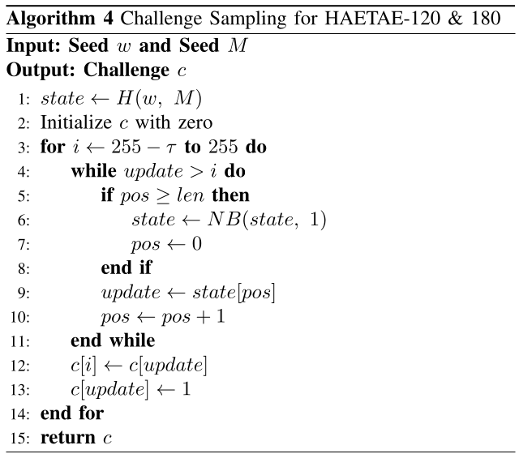

**Algorithm 4 transcription — Challenge Sampling for HAETAE-120 & 180**

```text
Input : Seed w and Seed M
Output: Challenge c
1.  state ← H(w, M)
2.  Initialize c with zero
3.  for i ← 255 − τ to 255 do
4.    while update > i do
5.      if pos ≥ len then
6.        state ← NB(state, 1)
7.        pos ← 0
8.      end if
9.      update ← state[pos]
10.     pos ← pos + 1
11.   end while
12.   c[i] ← c[update]
13.   c[update] ← 1
14. end for
15. return c
```

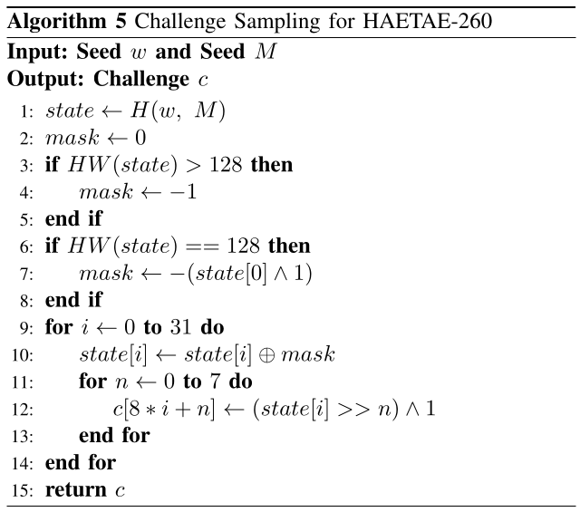

**Algorithm 5 transcription — Challenge Sampling for HAETAE-260**

```text
Input : Seed w and Seed M
Output: Challenge c
1.  state ← H(w, M)
2.  mask ← 0
3.  if HW(state) > 128 then
4.    mask ← −1
5.  end if
6.  if HW(state) == 128 then
7.    mask ← −(state[0] ∧ 1)
8.  end if
9.  for i ← 0 to 31 do
10.   state[i] ← state[i] ⊕ mask
11.   for n ← 0 to 7 do
12.     c[8 * i + n] ← (state[i] >> n) ∧ 1
13.   end for
14. end for
15. return c
```

computations [24], [26]. These effects have been widely re- ported in smart card and microcontroller based cryptographic implementations [22], [23]. Faults are induced through physical mechanisms such as clock glitching, voltage glitching, electromagnetic fault in- jection, and laser injection [22], [24], [27]. Among these, clock glitching modifies the supplied clock signal to violate the timing constraints of digital circuits [28], [29]. As inter- nal operations are synchronized to clock edges, injecting an anomalous edge or an abnormally short clock period can result in incorrect instruction execution or faulty state updates [25], [29], [30]. Unlike overclocking, which continuously drives the target above its nominal frequency, clock glitching introduces a brief perturbation at a selected instant, allowing precise control over the timing of fault injection [31]. In addition, clock glitching is relatively low-cost because it typically requires access only to the clock path, and it supports repeatable fault injection under fixed experimental conditions [29], [31], [32].

4

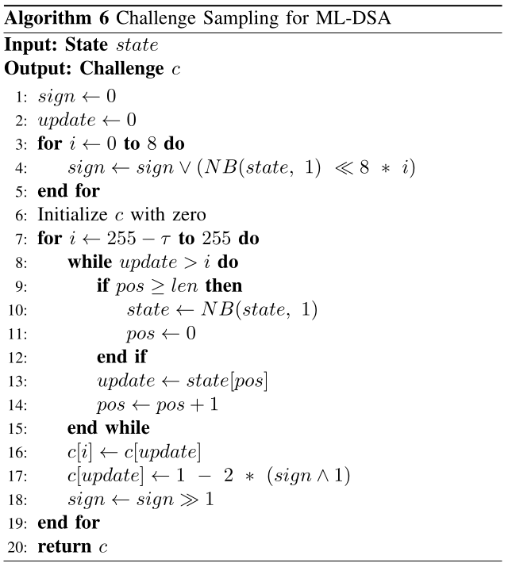

**Algorithm 6 transcription — Challenge Sampling for ML-DSA**

```text
Input : State state
Output: Challenge c
1.  sign ← 0
2.  update ← 0
3.  for i ← 0 to 8 do
4.    sign ← sign ∨ (NB(state, 1) << 8 * i)
5.  end for
6.  Initialize c with zero
7.  for i ← 255 − τ to 255 do
8.    while update > i do
9.      if pos ≥ len then
10.       state ← NB(state, 1)
11.       pos ← 0
12.     end if
13.     update ← state[pos]
14.     pos ← pos + 1
15.   end while
16.   c[i] ← c[update]
17.   c[update] ← 1 − 2 * (sign ∧ 1)
18.   sign ← sign >> 1
19. end for
20. return c
```

Due to these properties, clock glitching is widely adopted in practical fault injection scenarios. The effect of clock glitching is determined by the param- eters of the glitch waveform. In this work, we use three parameters: width, the duration of the glitch; offset, the relative position of the glitch within a clock period; and delay, the latency between the trigger event and the glitch insertion [31]. Since these parameters span a multi-dimensional space, iden- tifying combinations that induce a desired fault is challenging and often requires significant experimental effort [33], [34]. Nevertheless, once suitable parameters have been identified, clock glitching can induce the desired fault at a specific stage of the computation with high temporal precision and repeatability [25], [29], [33].

### III. FAULT ATTACK

In the following, we present the proposed fault attack and investigate how it can be applied to HAETAE and ML-DSA. Although the attack targets the same underlying function, the internal structure of the function and the corresponding recovery methodologies differ across the two schemes. There- fore, we introduce and analyze the attack separately for each scheme.

A. Fault Intuition

We illustrate the proposed loop abort attack in Figure 1, along with the corresponding code and execution graph. The loop first sets the loop counter i with an initial value. The counter i is then compared with the variable EN D. If i == END, the loop is aborted; otherwise, the operations within the loop are executed. After executing the loop, the counter i is incremented by one in this example, and the

<!-- PDF_PAGE: 5 -->

## PDF page 5

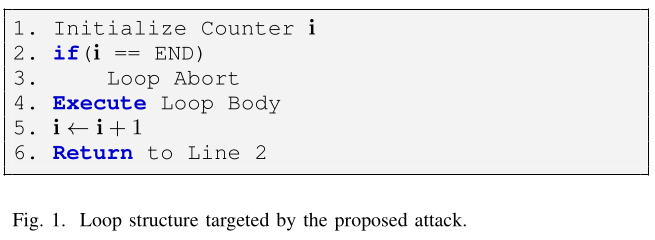

comparison step is repeated. This procedure continues until the counter reaches EN D. Our attack targets the comparison instruction and aims to corrupt its result. By doing so, we induce a loop abort even though the loop should still execute additional iterations. During the signature generation of both schemes, the pub- licly revealed values are the challenge c, the vector z 1 , and the hint h. Among these values, the challenge c directly multiplies with the secret key, computing the intermediate value for z 1 . The three variant algorithms shown in Section II-D update each coefficient subsequently in a loop according to the pa- rameter τ . Faulting the first loop-abort comparison causes the updating loop to be skipped entirely, resulting in the challenge polynomial c becoming the zero polynomial. Alternatively, fault injection in the middle of the loop leads to c being partially sampled, where HW (c) &lt; τ . Note that Algorithm 5 updates the coefficients of c without initializing them to zero. Unlike the update that modifies only τ polynomials, this loop updates all polynomials of c. Still, the same fault injection will stop the updates of the polynomials of c. From these injections, the difference between the normal z 1 = y + ĉ · s ˆ 1 and the faulted z 1 ′ = y + ĉ ′ · s ˆ 1 can be expressed as ∆z 1 = s ˆ 1 · ∆ĉ. Since z 1 , z 1 ′ , c, and c ′ are public values, we can recover the secret vector s 1 . Although the polynomial multiplication between c and s 1 is performed in the NTT domain, Equation 1 presents an equivalent computation without using the NTT domain. Depending on the target coefficient i ∈ {0, ..., n − 1}, j is used as the summation index in the negacyclic convolution. Each coefficient of sc is computed using all coefficients of c and s 1 . Therefore, by modifying only a single coefficient of c, we can observe its effect on the product sc and thereby recover all coefficients of s 1 .

$$
sc[i]=\sum_{j=0}^{i}c[j]\ast s_1[i-j]
-\sum_{j=i+1}^{n-1}c[j]\ast s_1[n+i-j]. \tag{1}
$$

To be precise about our key recovery, we show the full process in Algorithm 7. The variables sc and loc store the difference between the two input σ and σ ′ , respectively. Then, we multiply sc with loc to extract the polynomial s 1 . This algorithm demonstrates the recovery procedure for both HAETAE and ML-DSA. However, it assumes that all challenge values have already been recovered. Therefore, in the following sections, we describe how the challenge values can be recovered for each scheme. For HAETAE, DFA is utilized for recovering not only s 1 but also s 2 .

5

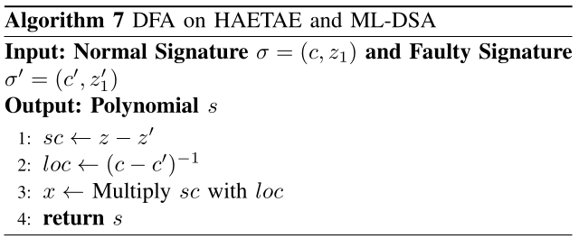

**Algorithm 7 transcription — DFA on HAETAE and ML-DSA**

```text
Input : Normal Signature σ=(c,z₁) and Faulty Signature σ′=(c′,z′₁)
Output: Polynomial s
1.  sc ← z − z′
2.  loc ← (c − c′)⁻¹
3.  x ← Multiply sc with loc
4.  return s
```

B. HAETAE

HAETAE provides two variants of the challenge sampling function, depending on the security level. In Algorithm 4, the loop deterministically updates one deterministic random coef- ficient to 1 in each iteration. Meanwhile, Algorithm 5 updates 8 coefficients sequentially in a single iteration. However, ∆c is a public value available to the attacker, and the recovery pro- cess remains the same except for differences in ∆c. Leveraging this property, we consider the fault injection successful if the HW of the faulted challenge satisfies HW (c ′ ) &lt; τ , while the positions of its remaining nonzero coefficients coincide with those of the correct challenge c. Figure 2 illustrates the framework for recovering secret keys s 1 and s 2 . The faulted signatures in step 1 are regarded as successful injections. We then recover the secret keys in two stages using post-processing of the faulted signature. We first recover the absolute values of s 1 and s 2 depending on the deterministic value b ∈ {0, 1}. To remove the dependency of b, we reconstruct t 1 assuming b = 0 from the public key. If the reconstructed t 1 is different from the public key, we can conclude that b = 1. Since b is a single bit, one candidate value is enough for this assessment. As a result, we can recover secret keys s 1 and s 2 , which are sufficient for signature forgery. The two-steps are described in detail below. The absolute value of the secret key s 2 can be recovered using the same faulted signature that was used to extract s 1 . However, the signature does not directly reveal z 2 , which depends on s 2 . Instead, we leverage the value A ∗ z̃ 1 − qcj computed in Verification [7]. Although this expression appears to involve only s 1 , it can be rewritten with a faulted signature under modulo q as illustrated in Equation 2. The subtraction of z 1 and z 1 ′ can be expressed as (−1) b s 1 ∗ ∆c, where ∆c is already known. As shown in [7], A ∗ s 1 + 2s 2 ≡ qj mod q. It therefore follows that the equation reduces to −2(−1) b s 2 ∗∆c. As we already know ∆c and the differential of A 1 ∗ z̃ 1 − qcj, we are able to recover (−1) b s 2 .

$$
\begin{aligned}
A\ast\Delta z_1-qj\Delta c
&\equiv A\ast\left((-1)^b s_1\ast\Delta c\right)-qj\Delta c\\
&\equiv(-1)^b(qj-2s_2)\ast\Delta c\\
&\equiv-2(-1)^b s_2\ast\Delta c\pmod q.
\end{aligned}\tag{2}
$$

By recovering b, the partially recovered secret key can be fully reconstructed. Since b is a single bit value shared by s 1 and s 2 , there exist only two possible candidates for (s 1 , s 2 ). The public key is generated as (t 0 , t 1 ) = A ∗ s 1 + s 2 in Algorithm 2. Under the assumption of b, we generate a new value t ′ 1 . We then apply the same decomposition procedure

<!-- PDF_PAGE: 6 -->

## PDF page 6

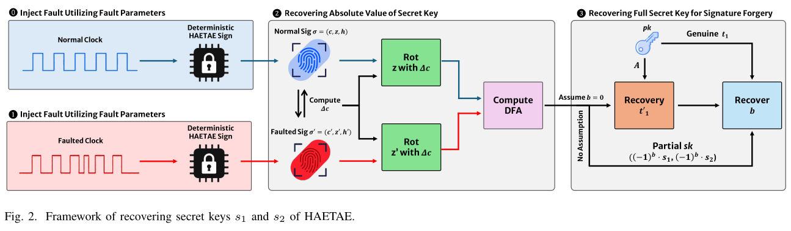

used in public key generation and compare the result with the genuine value t 1 embedded in the public key. Based on this comparison, we can determine whether b is 0 or 1. Therefore, b, s 1 , and s 2 can be recovered with only one execution of the attack shown in Algorithm 8.

The recovered s 1 and s 2 lead attackers to replace the signing with a new signing. Deterministic signing creates y and w with the secret key key. However, key is not strictly required for forgery. Without key, an attacker can generate a valid signature as long as the constructed z satisfies the required bounds checks and passes verification. In addition, [7] proposed HAETAE with Pre-computation, in which y and w are generated using only the public key. Therefore, signature forgery in HAETAE can be achieved even with knowledge of the secret key s 1 and s 2 , excluding key.

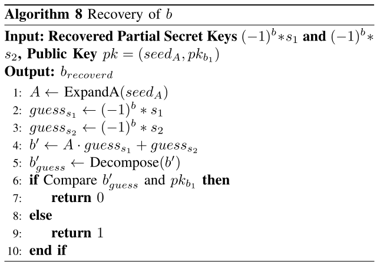

**Algorithm 8 transcription — Recovery of b**

```text
Input : Recovered Partial Secret Keys (−1)^b*s₁ and (−1)^b*s₂,
        Public Key pk=(seed_A, pk_b₁)
Output: b_recoverd
1.  A ← ExpandA(seed_A)
2.  guess_s₁ ← (−1)^b * s₁
3.  guess_s₂ ← (−1)^b * s₂
4.  b′ ← A · guess_s₁ + guess_s₂
5.  b′_guess ← Decompose(b′)
6.  if Compare b′_guess and pk_b₁ then
7.    return 0
8.  else
9.    return 1
10. end if
```

While the attack assumes successful fault injection, an at- tacker cannot determine the exact timing of the target operation in a real attack scenario. Therefore, fault injections must be performed over a wide range of delay values. During fault injection, if a modified signature yields a challenge c satisfying HW (c) &lt; τ , then the difference ∆c between the faulty and correct signatures can be derived. More precisely, our fault injection in HAETAE enables recovery whenever the condition 0 ≤ HW (c) &lt; τ is satisfied. This will be later shown in Section IV-B.

6

### C. ML-DSA

Unlike HAETAE, ML-DSA includes the seed c̃ for sampling c in the signature. This makes it challenging for an attacker to determine whether a fault injection was successful since our attack targets the coefficients of c, not the seed. Even if the attacker knows the successfully fault injected signature, the corresponding faulted coefficient of c ′ remains unknown. Therefore, we propose a novel method to determine successful fault injections and extract the secret key s 1 for sign forgery illustrated in Figure 3. Given c̃ from a genuine signature, we modify Algorithm 6 to simulate fault injection and generate a faulted challenge c ′ . Specifically, the loop iteration from 255 − τ to 255 can be modified to abort at a chosen iteration (e.g., from 255 − τ to 254), where the target iteration is carefully selected according to the attack model. Note that this fault simulation can be reproduced with only the seed for the challenge, as the algorithm is public due to the Verification. Thus, this process can be done in the pre-processing without any fault injection. In [19], [20], attacks targeting the challenge sampling procedure are described as if the resulting challenge c were fully known to the attacker. However, fault injections produce various unintended outcomes, including cases where c̃ remains unchanged while different faulty results are generated. We discuss and analyze these fault behaviors in Section IV-B. At this stage, we have now distinguished the successful fault signature and the corresponding challenge. The corresponding faulty challenge allows us to derive the difference ∆c between the faulty and normal signatures. Using this difference, we recover the secret key s 1 by applying Algorithm 7. As ML- DSA employs an identical challenge sampling function across security levels, the attack is applicable to all of them. However, this method is a clean version without any false-positive faulty signatures. A successful fault injection candidate can be spotted after the post-processing of the faulted signature. When the targeted fault is induced in the last iteration, the difference between the correct signature z and the faulted z ′ lies within [−η, η]. This approach significantly reduces the candidate space of fault- induced signatures corresponding to the intended fault model. However, unintended fault behaviors may also satisfy the same condition mentioned above. Using the identified candidates, we filter false-positive fault injections by recovering the can- didate secret key s ′ 1 . Utilizing s ′ 1 , we reconstruct the determin-

<!-- PDF_PAGE: 7 -->

## PDF page 7

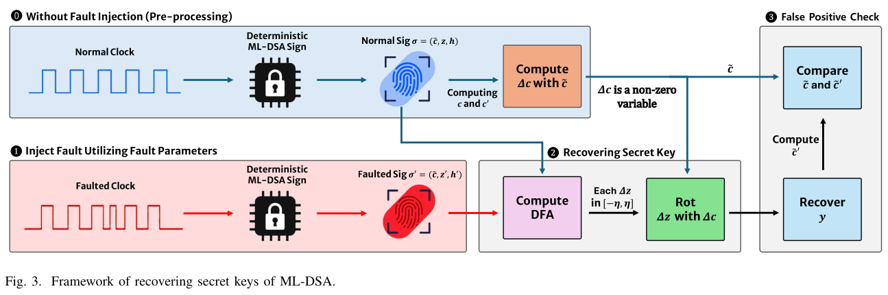

istic value y ′ , from which we compute w ′ and subsequently obtain c̃ ′ 1 . We then compare it with the normal signature c̃. If the obtained c̃ ′ 1 is not equal, we continue this sequence with other faulted candidates. We propose the first attack on c in ML-DSA, where only the seed is publicly revealed. Now that we have recovered s 1 , the signature generations can be forged as in [20].

### IV. EXPERIMENT

A. Simulation

Simulations are conducted to evaluate the success rate of our attack and to analyze the possible outcomes resulting from it. Specifically, we analyze the number of rejection samplings executed as a result of our attack using the publicly available Version 3.0 of HAETAE, ML-DSA implementations 12 and the pqm4 [35] implementations. The simulations assume that the intended fault injection is successful at every rejection sampling procedure, while the real attack is described in Section IV-B. Table I compares the number of rejection sampling iterations for original signatures and those generated by our attack, evaluated with 10k random messages under the same secret key. Match indicates that the number of rejection sampling iterations for the fault-generated signature is identical to that of the original signature, while Less denotes that it requires fewer iterations. Across all security levels and implementa- tions, the approximate average probability of Match is 89.71% and 97.03% for HAETAE and ML-DSA, respectively. This shows our attack rarely changes the iteration count of the rejection sampling, which is suitable for DFA. Further, we investigated cases requiring fewer rejection sampling iterations than the genuine signature. The Less category accounts for non-negligible average probabilities of 4.99% for HAETAE and 1.59% for ML-DSA. Note that the faulted signatures in Less are not used for key recovery. Since this section presents only simulated results, all fault injection results correspond to the intended fault injections. For ML-DSA, the simulated faults are injected at the final iteration of the challenge sampling loop. Table II reports the number

1 HAETAE https://kpqc.cryptolab.co.kr/haetae

2 ML-DSA https://github.com/pq-crystals/dilithium

7

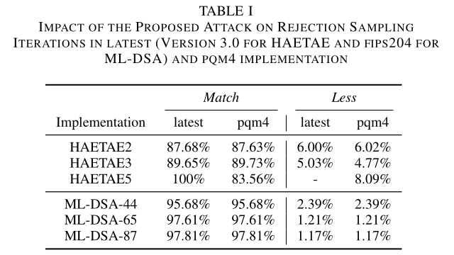

**Table I. Impact of the proposed attack on rejection sampling iterations in latest (Version 3.0 for HAETAE and FIPS 204 for ML-DSA) and pqm4 implementation**

| Implementation | Match · latest | Match · pqm4 | Less · latest | Less · pqm4 |
|---|---:|---:|---:|---:|
| HAETAE2 | 87.68% | 87.63% | 6.00% | 6.02% |
| HAETAE3 | 89.65% | 89.73% | 5.03% | 4.77% |
| HAETAE5 | 100% | 83.56% | — | 8.09% |
| ML-DSA-44 | 95.68% | 95.68% | 2.39% | 2.39% |
| ML-DSA-65 | 97.61% | 97.61% | 1.21% | 1.21% |
| ML-DSA-87 | 97.81% | 97.81% | 1.17% | 1.17% |

of intended faulty signatures required to recover a secret key for signature forgery and the corresponding recovery rate. We compare our attack against the state-of-the-art fault attacks on deterministic ML-DSA [13], [17], [19], which include simulations and real attacks. In this table, the security level is explicitly indicated if prior work does not apply their attack to all ML-DSA. In all cases of our fault model, only a single faulty signature is sufficient, regardless of the security level or the scheme. Prior attacks either require some faulted signatures for successful key recovery or recover the secret key from a single faulted signature at the cost of guessing the rejection sampling counter ctr.

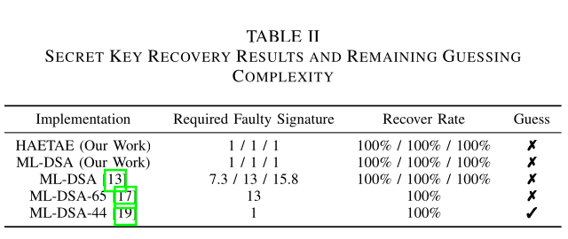

**Table II. Secret key recovery results and remaining guessing complexity**

| Implementation | Required Faulty Signature | Recover Rate | Guess |
|---|---:|---:|:---:|
| HAETAE (Our Work) | 1 / 1 / 1 | 100% / 100% / 100% | ✗ |
| ML-DSA (Our Work) | 1 / 1 / 1 | 100% / 100% / 100% | ✗ |
| ML-DSA [13] | 7.3 / 13 / 15.8 | 100% / 100% / 100% | ✗ |
| ML-DSA-65 [17] | 13 | 100% | ✗ |
| ML-DSA-44 [19] | 1 | 100% | ✓ |

B. Fault Attack

The simulation in Section IV-A only considers intended faults, while real experiments must also consider unexpected faults. Therefore, we conduct real-world fault injection attacks to evaluate the secret-key recovery rate and subsequently

<!-- PDF_PAGE: 8 -->

## PDF page 8

analyze faulty signatures that can arise in ML-DSA and HAETAE. For the experiment, we employed ChipWhisperer- Lite with a target board, CW308T-STM32F415, running at a 30 MHZ clock frequency. All code was compiled with the optimization level -O0. Before conducting the real attacks on signatures, we first searched for clock glitch parameters, offset, width ∈ [−50%, 50%], that trigger loop aborts with a loop-only implementation. We use the clock glitch provided by Chip- Whisperer, where the parameters offset and width represent the relative position and duration within a single clock cycle, re- spectively. With appropriately chosen clock glitch parameters, the loop can be aborted at the desired iteration. We perform an exhaustive search over the offset and width parameters with a step size of 0.4, targeting implementation regions that correspond to approximately four loop iterations. As a result, we identify parameter pairs that enable the skipping of four loop iterations. Among these, we selected a representative pair of offset = −38.67 and width = 10.15, which is used throughout all subsequent experiments. We implemented the deterministic ML-DSA-44/67 and HAETAE-2/3/5 signature generation algorithms. For efficient fault injection, we initially treat any deviation from a correct signature as a successful fault. We then apply the post- processing technique described in Figure 2 and 3 for ML- DSA and HAETAE, respectively. We collected fault injection results by performing five fault injections throughout the entire challenge sampling procedure of the first rejection sampling iteration. Table III reports the number of successful injections, where Total Successes counts all successful fault injections, including duplicates; Success Signature counts unique faulty signatures, and Intended Signature counts the faulty signatures that match the intended fault model used for key recovery. Compared to HAETAE, ML-DSA yields fewer fault injection results that are useful for secret key recovery, as only the results of intended fault injections are exploitable for the attack. Whereas HAETAE allows key recovery with challenges satisfying HW (c) &lt; τ , leading to a higher number of successful cases. Furthermore, HAETAE enables secret-key recovery not only from the intended fault injections but also from various unintended fault outcomes. As observed in the fault injection results for ML-DSA, we identified 35 and 88 unintended faults, respectively. These faults satisfy the first condition (i.e., ∆c ∗ s 1 ∈ [−η, η]) and may be misclassified as intended faults, leading to incorrect key recovery. Also criteria used in prior works, such as check- ing whether ∆c is invertible [20] or whether only c ∗ s 1 lies in small range [13], [14], may not reliably identify intended faults in practical fault injection experiments. Therefore, we apply our false-positive check to determine whether the observed faults are unintended faults. Unlike ML-DSA, HAETAE directly exposes c. As shown in our experimental results, even unintended faults can provide sufficient information for successful key recovery. The initial criterion used to identify fault injections is HW (c ′ ) &lt; τ . However, unintended faults that skip instructions outside our fault model may also satisfy this condition. As a result, our false-positive check enables us to identify successful faults in

8

both HAETAE as well, thereby achieving full key recovery. In our experiments, we recovered the secret key s 1 with a success rate of 100% for ML-DSA-44 and ML-DSA-65. For HAETAE, we recovered both s 1 and s 2 with a success rate of 100% from intended fault injections. In addition, we observed that several unintended faulty signatures in HAETAE also provided sufficient information to recover both s 1 and s 2 .

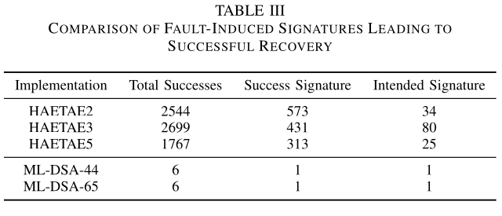

**Table III. Comparison of fault-induced signatures leading to successful recovery**

| Implementation | Total Successes | Success Signature | Intended Signature |
|---|---:|---:|---:|
| HAETAE2 | 2544 | 573 | 34 |
| HAETAE3 | 2699 | 431 | 80 |
| HAETAE5 | 1767 | 313 | 25 |
| ML-DSA-44 | 6 | 1 | 1 |
| ML-DSA-65 | 6 | 1 | 1 |

### V. COUNTERMEASURE

Among existing countermeasures against fault injection attacks, double computation is one of the most commonly used approaches. However, this countermeasure at most doubles the computational overhead since the computation must be performed twice. Therefore, we propose a new countermeasure for our attack. In ML-DSA, only the seed for generating the challenge is returned in the signature, and the challenge itself is not directly exposed. Therefore, the verification of the challenge must be embedded within the sampling process of c. To prevent the proposed attack on c, we propose incorporating a comparison during the rejection sampling to verify that the hamming weight of c satisfies HW (c) = τ . Note that this countermeasure can likewise be incorporated into the sampling phase in HAETAE. Algorithm 9 illustrates our countermeasure on sampling c in HAETAE, requiring only a minor modification to output the loop count iter from the challenge sampling. iter is then compared with N ; if the condition is not satisfied, the rejection sampling is repeated. The overhead of this countermeasure is minimal, as it only requires checking c, while effectively preventing the proposed fault injection. Also, it will not be rejected if there are no fault injections. Meanwhile, HAETAE returns the challenge c as part of the signature, allowing the attacker to distinguish successful fault injections. As the proposed countermeasure aims to prevent such attacks, the verification algorithm should additionally check whether the challenge has been faulted. Therefore, before performing the verification procedure, the algorithm should first check the Hamming weight of the challenge, as shown in Line 8 of Algorithm 9.

### VI. DISCUSSION

Although ML-DSA-87 could not be evaluated on our hardware platform due to implementation constraints, this limitation does not affect the generality of the proposed attack. Regardless of the security level, the challenge sampling function is identical, which we have already evaluated in Section IV-B. Furthermore, as demonstrated in Section IV-A,

<!-- PDF_PAGE: 9 -->

## PDF page 9

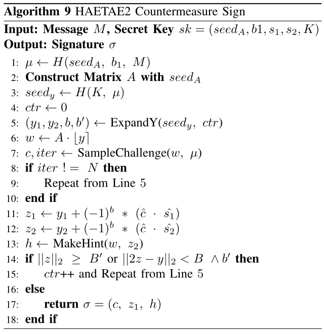

**Algorithm 9 transcription — HAETAE2 Countermeasure Sign**

```text
Input : Message M, Secret Key sk=(seed_A, b1, s₁, s₂, K)
Output: Signature σ
1.  μ ← H(seed_A, b₁, M)
2.  Construct Matrix A with seed_A
3.  seed_y ← H(K, μ)
4.  ctr ← 0
5.  (y₁, y₂, b, b′) ← ExpandY(seed_y, ctr)
6.  w ← A · ⌊y⌉
7.  c, iter ← SampleChallenge(w, μ)
8.  if iter != N then
9.    Repeat from Line 5
10. end if
11. z₁ ← y₁ + (−1)^b * (ĉ · ŝ₁)
12. z₂ ← y₂ + (−1)^b * (ĉ · ŝ₂)
13. h ← MakeHint(w, z₂)
14. if ‖z‖₂ ≥ B′ or ‖2z − y‖₂ < B ∧ b′ then
15.   ctr++ and Repeat from Line 5
16. else
17.   return σ=(c, z₁, h)
18. end if
```

the attack requires only a single successfully faulted signature for secret key recovery. Therefore, the same attack is expected to recover the secret keys of ML-DSA-87. To protect ML-DSA against side-channel attacks, masking countermeasures [36], [37] have been proposed. Most of these approaches focus on masking gadgets that process secret information, such as secret keys. As our proposed attacks target only the public information c rather than secret values, the challenge sampling function remains identical. Moreover, the signatures are not masked and directly contain z, which is sufficient for the proposed attack. Therefore, masking coun- termeasures should be applied to the entire signing procedure rather than only to selected components.

### VII. CONCLUSION

In this paper, we presented fault attacks against the chal- lenge sampling of deterministic ML-DSA and HAETAE. A major obstacle in practical DFA attacks is the presence of rejection sampling, which can alter the relationship between genuine and faulted signatures. To overcome this challenge, we proposed a method for identifying intended fault injections using only publicly available information. Experimental results showed that the proposed method successfully distinguishes intended faults from diverse unintended fault outcomes and achieves a 100% discrimination rate. To the best of our knowl- edge, this work constitutes the first fault attack on HAETAE and the first demonstration of secret-key recovery sufficient for forging HAETAE signatures. The results highlight that challenge sampling remains a critical attack surface in lattice- based signature implementations. To mitigate the attack, we proposed a dedicated countermeasure specifically designed for the presented attack.

9

### REFERENCES

[1] J. Bauwens, P. Ruckebusch, S. Giannoulis, I. Moerman, and E. De Poorter, “Over-the-air software updates in the internet of things: An overview of key principles,” IEEE Communications Magazine, vol. 58, no. 2, pp. 35–41, 2020. [2] IBM, “Best practices for firmware code signing,” Open Compute Project, White Paper, 2018, iBM White Pa- per. [Online]. Available: https://www.opencompute.org/documents/ ibm-white-paper-best-practices-for-firmware-code-signing [3] M. Bellare and P. Rogaway, “The exact security of digital signatures- how to sign with rsa and rabin,” in International conference on the theory and applications of cryptographic techniques. Springer, 1996, pp. 399–416. [4] D. Johnson, A. Menezes, and S. Vanstone, “The elliptic curve digital sig- nature algorithm (ecdsa),” International journal of information security, vol. 1, no. 1, pp. 36–63, 2001. [5] F. Arute, K. Arya, R. Babbush, D. Bacon, J. C. Bardin, R. Barends, R. Biswas, S. Boixo, F. G. Brandao, D. A. Buell et al., “Quantum supremacy using a programmable superconducting processor,” nature, vol. 574, no. 7779, pp. 505–510, 2019. [6] National Institute of Standards and Technology, Module-Lattice-Based Digital Signature Standard, NIST FIPS 204, Aug. 2024. [7] J. H. Cheon, H. Choe, J. Devevey, T. Güneysu, D. Hong, M. Krausz, G. Land, M. Möller, D. Stehlé, and M. Yi, “Haetae: Shorter lattice-based fiat-shamir signatures,” IACR Transactions on Cryptographic Hardware and Embedded Systems, vol. 2024, no. 3, pp. 25–75, 2024. [8] “Selected algorithms from the kpqc competition round 1,” https://kpqc. or.kr/competition 02.html, Korean Post-Quantum Cryptography (KpqC) Competition, accessed: 2026-05-04. [9] N. Bindel, J. Buchmann, and J. Krämer, “Lattice-based signature schemes and their sensitivity to fault attacks,” in 2016 workshop on fault diagnosis and tolerance in cryptography (FDTC). IEEE, 2016, pp. 63–77. [10] A. Calle Viera, A. Berzati, and K. Heydemann, “Fault attacks sensitivity of public parameters in the dilithium verification,” in International Con- ference on Smart Card Research and Advanced Applications. Springer, 2023, pp. 62–83. [11] S. Bauer and F. De Santis, “Forging dilithium and falcon signatures by single fault injection,” in 2023 Workshop on Fault Detection and Tolerance in Cryptography (FDTC). IEEE, 2023, pp. 81–88. [12] P. Ravi, M. P. Jhanwar, J. Howe, A. Chattopadhyay, and S. Bhasin, “Ex- ploiting determinism in lattice-based signatures: practical fault attacks on pqm4 implementations of nist candidates,” in Proceedings of the 2019 ACM Asia Conference on Computer and Communications Security, 2019, pp. 427–440. [13] M. ElGhamrawy, M. Azouaoui, O. Bronchain, J. Renes, T. Schneider, M. Schönauer, O. Seker, and C. van Vredendaal, “From mlwe to rlwe: A differential fault attack on randomized &amp; deterministic dilithium,” IACR Transactions on Cryptographic Hardware and Embedded Systems, vol. 2023, no. 4, pp. 262–286, 2023. [14] H. Yuan, Y. Liu, J. Ming, and Y. Zhou, “Diverse fault attacks on dilithium and variant implementation: Skipping, aborting and zeroing,” in 2025 IEEE 24th International Conference on Trust, Security and Privacy in Computing and Communications (TrustCom). IEEE, 2025, pp. 2986–2993. [15] E. Krahmer, P. Pessl, G. Land, and T. Güneysu, “Correction fault attacks on randomized crystals-dilithium,” IACR Transactions on Cryptographic Hardware and Embedded Systems, vol. 2024, no. 3, pp. 174–199, 2024. [16] S. Islam, K. Mus, R. Singh, P. Schaumont, and B. Sunar, “Signature correction attack on dilithium signature scheme,” in 2022 IEEE 7th European symposium on security and privacy (euroS&amp;p). IEEE, 2022, pp. 647–663. [17] P. Ravi, B. Yang, S. Bhasin, F. Zhang, and A. Chattopadhyay, “Fiddling the twiddle constants-fault injection analysis of the number theoretic transform,” IACR Transactions on Cryptographic Hardware and Em- bedded Systems, 2023. [18] H. K. Valsaraj, P. Ravi, and S. Bhasin, “When randomness isn’t random: Practical fault attack on post-quantum lattice standards,” Cryptology ePrint Archive, 2025. [19] Y. Wang, J. Yu, S. Qu, X. Zhang, X. Li, C. Zhang, and D. Gu, “Mind the faulty keccak: A practical fault injection attack scheme apply to all phases of ml-kem and ml-dsa,” IEEE Transactions on Information Forensics and Security, 2025. [20] L. G. Bruinderink and P. Pessl, “Differential fault attacks on determin- istic lattice signatures,” IACR Transactions on Cryptographic Hardware and Embedded Systems, vol. 2018, no. 3, pp. 21–43, 2018.

<!-- PDF_PAGE: 10 -->

## PDF page 10

[21] L. Ducas, E. Kiltz, T. Lepoint, V. Lyubashevsky, P. Schwabe, G. Seiler, and D. Stehlé, “Crystals-dilithium: A lattice-based digital signature scheme,” IACR Transactions on Cryptographic Hardware and Embedded Systems, pp. 238–268, 2018. [22] A. Barenghi, L. Breveglieri, I. Koren, and D. Naccache, “Fault injection attacks on cryptographic devices: Theory, practice, and countermea- sures,” Proceedings of the IEEE, vol. 100, no. 11, pp. 3056–3076, 2012. [23] C. Aumüller, P. Bier, W. Fischer, P. Hofreiter, and J.-P. Seifert, “Fault attacks on rsa with crt: Concrete results and practical countermeasures,” in International Workshop on Cryptographic Hardware and Embedded Systems. Springer, 2002, pp. 260–275. [24] J. Breier and X. Hou, “How practical are fault injection attacks, really?” IEEE Access, vol. 10, pp. 113 122–113 130, 2022. [25] J. Balasch, B. Gierlichs, and I. Verbauwhede, “An in-depth and black- box characterization of the effects of clock glitches on 8-bit mcus,” in 2011 Workshop on Fault Diagnosis and Tolerance in Cryptography. IEEE, 2011, pp. 105–114. [26] N. Moro, A. Dehbaoui, K. Heydemann, B. Robisson, and E. Encrenaz, “Electromagnetic fault injection: Towards a fault model on a 32-bit microcontroller,” in 2013 Workshop on Fault Diagnosis and Tolerance in Cryptography (FDTC). IEEE, 2013, pp. 77–88. [27] S. P. Skorobogatov and R. J. Anderson, “Optical fault induction attacks,” in International workshop on cryptographic hardware and embedded systems. Springer, 2002, pp. 2–12. [28] L. Zussa, J.-M. Dutertre, J. Clédière, and B. Robisson, “Investigation of timing constraints violation as a fault injection means,” in 2012 27th Conference on Design of Circuits and Integrated Systems (DCIS). IEEE, 2012, pp. 1–6. [29] T. Korak and M. Hoefler, “On the effects of clock and power supply tampering on two microcontroller platforms,” in 2014 Workshop on Fault Diagnosis and Tolerance in Cryptography. IEEE, 2014, pp. 8–17. [30] C. Spensky, A. Machiry, N. Burow, H. Okhravi, R. Housley, Z. Gu, H. Jamjoom, C. Kruegel, and G. Vigna, “Glitching demystified: Ana- lyzing control-flow-based glitching attacks and defenses,” in 2021 51st Annual IEEE/IFIP International Conference on Dependable Systems and Networks (DSN). IEEE, 2021, pp. 236–248. [31] Z. Kazemi, A. Papadimitriou, I. Souvatzoglou, E. Aerabi, M. M. Ahmed, D. Hely, and V. Beroulle, “On a low cost fault injection framework for security assessment of cyber-physical systems: Clock glitch attacks,” in 2019 IEEE 4th International Verification and Security Workshop (IVSW). IEEE, 2019, pp. 7–12. [32] S. Endo, T. Sugawara, N. Homma, T. Aoki, and A. Satoh, “An on-chip glitchy-clock generator for testing fault injection attacks,” Journal of Cryptographic Engineering, vol. 1, no. 4, pp. 265–270, 2011. [33] A. Maldini, N. Samwel, S. Picek, D. Jakobovic, and N. Mentens, “Ge- netic algorithm-based electromagnetic fault injection,” in 2018 Workshop on Fault Diagnosis and Tolerance in Cryptography (FDTC). IEEE, 2018, pp. 1–10. [34] V. Werner, L. Maingault, and M.-L. Potet, “Fast calibration of fault injection equipment with hyperparameter optimization techniques,” in Smart Card Research and Advanced Applications. Springer, 2021, pp. 121–138. [35] M. J. Kannwischer, R. Petri, J. Rijneveld, P. Schwabe, and K. Stoffelen, “PQM4: Post-quantum crypto library for the ARM Cortex-M4,” https: //github.com/mupq/pqm4. [36] V. Migliore, B. Gérard, M. Tibouchi, and P.-A. Fouque, “Masking dilithium: Efficient implementation and side-channel evaluation,” in In- ternational Conference on Applied Cryptography and Network Security. Springer, 2019, pp. 344–362. [37] J.-S. Coron, F. Gérard, M. Trannoy, and R. Zeitoun, “Improved gadgets for the high-order masking of dilithium,” IACR Transactions on Cryp- tographic Hardware and Embedded Systems, vol. 2023, no. 4, 2023.

10


WonGeun Shin is a Ph.D. candidate at Depart- ment of Cyber Security, College of Science and Technology, Korea University. His research interests include side-channel countermeasures, hardware se- curity, and physical fault injection.


SeungHyeon Jeon received the B.S. degree in AI Cyber Security from Korea University, South Korea, where he is currently pursuing the M.S. degree in Cyber Security. His research interests include side- channel analysis, physical fault injection, and deep learning-based security analysis.


Daehyeon Bae is a Ph.D. candidate at the School of Cybersecurity, Korea University, Seoul, South Ko- rea. He is also affiliated with the Institute of Cyber Security &amp; Privacy (ICSP, formerly CIST), Korea University. His research interests include hardware security, side-channel analysis, and physical fault injection.


Sujin Park is a Ph.D. student at the School of Cybersecurity, Korea University, Seoul, Republic of Korea. Her research interests include side-channel analysis on deep neural networks and its counter- measures, hardware security, anomaly detection, and cyber-physical systems.


HeeSeok Kim received the B.S. degree in mathe- matics from Yonsei University, Seoul, South Korea, in 2006, and the M.S. and Ph.D. degrees in engineer- ing and information security from Korea University, Seoul, in 2008 and 2011, respectively. He was a Postdoctoral Researcher with the University of Bris- tol, U.K., from 2011 to 2012. From 2013 to 2016, he was a Senior Researcher with the Korea Institute of Science and Technology Information (KISTI). Since 2016, he has been with Korea University. His research interests include side-channel attacks, cryptography, and network security.
